# Design Document - Sistema de Autenticação EVO

## Overview

O sistema de autenticação da plataforma EVO implementa uma arquitetura híbrida que combina AWS Cognito para autenticação básica com controles locais para MFA e WebAuthn. Esta abordagem garante flexibilidade máxima e controle total sobre políticas de segurança.

## Architecture

### High-Level Architecture

```mermaid
graph TB
    User[👤 User] --> Frontend[🌐 Frontend React]
    Frontend --> Cognito[🔐 AWS Cognito]
    Frontend --> API[🚀 API Gateway]
    API --> Lambda[⚡ Lambda Functions]
    Lambda --> DB[(🗄️ PostgreSQL)]
    Lambda --> Cognito
    
    subgraph "Local MFA Control"
        DB --> MFATable[mfa_settings]
        DB --> WebAuthnTable[webauthn_credentials]
        DB --> UserTable[users]
    end
    
    subgraph "Cognito Integration"
        Cognito --> UserPool[User Pool]
        Cognito --> JWT[JWT Tokens]
    end
```



### Authentication Flow


## Components and Interfaces

### Frontend Components

#### 1. Auth-simple.tsx
- **Purpose**: Página principal de login
- **Features**: 
  - Login básico com Cognito
  - Detecção automática de challenges
  - Redirecionamento para MFA/WebAuthn
  - Tratamento de erros user-friendly

#### 2. NewPasswordRequired.tsx
- **Purpose**: Tela para NEW_PASSWORD_REQUIRED challenge
- **Features**:
  - Validação de senha em tempo real
  - Políticas de segurança visuais
  - Confirmação de senha
  - Integração com Cognito challenges

#### 3. MFASetup.tsx / MFAVerify.tsx
- **Purpose**: Configuração e verificação de MFA local
- **Features**:
  - Geração de QR codes TOTP
  - Validação de códigos
  - Backup codes
  - Gerenciamento de dispositivos

#### 4. WebAuthnSetup.tsx / WebAuthnAuth.tsx
- **Purpose**: Configuração e uso de WebAuthn
- **Features**:
  - Registro de chaves de segurança
  - Autenticação WebAuthn
  - Gerenciamento de múltiplas chaves
  - Fallback para MFA

### Backend Components

#### 1. Authentication Service
```typescript
interface AuthService {
  signIn(email: string, password: string): Promise<SignInResult>;
  handleChallenge(challengeName: string, session: string, response: any): Promise<AuthSession>;
  validateSession(token: string): Promise<boolean>;
  refreshToken(refreshToken: string): Promise<AuthSession>;
}
```

#### 2. MFA Service (Local Control)
```typescript
interface MFAService {
  setupMFA(userId: string): Promise<{ secret: string; qrCode: string }>;
  verifyTOTP(userId: string, code: string): Promise<boolean>;
  isMFARequired(userId: string): Promise<boolean>;
  generateBackupCodes(userId: string): Promise<string[]>;
}
```

#### 3. WebAuthn Service
```typescript
interface WebAuthnService {
  startRegistration(userId: string): Promise<PublicKeyCredentialCreationOptions>;
  finishRegistration(userId: string, credential: any): Promise<boolean>;
  startAuthentication(email: string): Promise<PublicKeyCredentialRequestOptions>;
  finishAuthentication(credential: any): Promise<AuthSession>;
}
```

## Data Models

### MFA Settings Table
```sql
CREATE TABLE mfa_settings (
  id UUID PRIMARY KEY DEFAULT gen_random_uuid(),
  user_id UUID NOT NULL REFERENCES users(id),
  organization_id UUID NOT NULL,
  is_enabled BOOLEAN DEFAULT false,
  totp_secret TEXT,
  backup_codes TEXT[],
  created_at TIMESTAMP DEFAULT NOW(),
  updated_at TIMESTAMP DEFAULT NOW()
);
```

### WebAuthn Credentials Table
```sql
CREATE TABLE webauthn_credentials (
  id UUID PRIMARY KEY DEFAULT gen_random_uuid(),
  user_id UUID NOT NULL REFERENCES users(id),
  organization_id UUID NOT NULL,
  credential_id TEXT NOT NULL UNIQUE,
  public_key TEXT NOT NULL,
  counter BIGINT DEFAULT 0,
  device_name TEXT,
  created_at TIMESTAMP DEFAULT NOW(),
  last_used_at TIMESTAMP
);
```

### User Sessions Table
```sql
CREATE TABLE user_sessions (
  id UUID PRIMARY KEY DEFAULT gen_random_uuid(),
  user_id UUID NOT NULL REFERENCES users(id),
  organization_id UUID NOT NULL,
  session_token TEXT NOT NULL,
  expires_at TIMESTAMP NOT NULL,
  mfa_verified BOOLEAN DEFAULT false,
  webauthn_verified BOOLEAN DEFAULT false,
  created_at TIMESTAMP DEFAULT NOW()
);
```

## Correctness Properties

*A property is a characteristic or behavior that should hold true across all valid executions of a system-essentially, a formal statement about what the system should do. Properties serve as the bridge between human-readable specifications and machine-verifiable correctness guarantees.*

### Property 1: MFA Local Control Enforcement
*For any* user authentication attempt, when MFA is enabled locally, the system should require MFA verification regardless of Cognito MFA settings
**Validates: Requirements 2.1, 2.6**

### Property 2: Organization Isolation
*For any* authenticated user, all data access should be filtered by the user's organization_id from the JWT token
**Validates: Requirements 6.1, 6.2, 6.3**

### Property 3: WebAuthn Enforcement
*For any* user with registered WebAuthn credentials, the system should require WebAuthn authentication and not allow password-only login
**Validates: Requirements 3.2, 3.4**

### Property 4: Session Consistency
*For any* user session, reloading the page should maintain the same authentication context without requiring re-login
**Validates: Requirements 5.2, 10.4**

### Property 5: Challenge Flow Completion
*For any* Cognito challenge response, completing the challenge should result in successful authentication or clear error messaging
**Validates: Requirements 4.1, 4.2, 4.4**

### Property 6: Password Policy Enforcement
*For any* password input, the system should validate all security requirements before allowing submission
**Validates: Requirements 8.1, 8.2, 8.3, 8.4, 8.5**

### Property 7: Token Validation Consistency
*For any* JWT token, validation should be consistent across all protected routes and components
**Validates: Requirements 1.4, 5.3, 5.4**

### Property 8: Error Message Clarity
*For any* authentication error, the system should provide user-friendly messages that guide the user toward resolution
**Validates: Requirements 9.1, 9.2, 9.3, 9.4**

## Error Handling

### Authentication Errors
- **Invalid Credentials**: Clear message with retry option
- **Account Not Confirmed**: Link to resend confirmation
- **Too Many Attempts**: Temporary lockout with timer
- **Network Errors**: Retry mechanism with exponential backoff

### MFA Errors
- **Invalid TOTP Code**: Clear validation with time sync tips
- **Expired Code**: Automatic refresh of input
- **Setup Errors**: Step-by-step troubleshooting guide
- **Backup Code Usage**: Clear instructions and remaining count

### WebAuthn Errors
- **Device Not Supported**: Fallback to MFA with explanation
- **User Cancelled**: Option to retry or use alternative method
- **Verification Failed**: Clear steps to troubleshoot
- **Multiple Devices**: Device selection interface

## Testing Strategy

### Unit Tests
- Authentication service methods
- MFA TOTP generation and validation
- WebAuthn credential management
- JWT token validation
- Error handling scenarios

### Property-Based Tests
- **Authentication Flow**: Test with random valid/invalid credentials
- **MFA Validation**: Test TOTP codes with various time windows
- **Organization Isolation**: Test data access with different org IDs
- **Session Management**: Test session persistence across page reloads
- **Challenge Handling**: Test various Cognito challenge scenarios

### Integration Tests
- Complete authentication flows
- MFA setup and verification
- WebAuthn registration and authentication
- Password recovery flows
- Multi-device scenarios

### Security Tests
- Token tampering attempts
- Organization ID manipulation
- MFA bypass attempts
- Session hijacking scenarios
- Brute force protection

## Implementation Notes

### Critical Security Considerations
1. **MFA Control**: Always use local database, never rely on Cognito MFA settings
2. **Organization Isolation**: Validate UUID format and filter all queries
3. **Token Security**: Implement proper JWT validation with revocation checks
4. **WebAuthn rpId**: Always use "evo.nuevacore.com" as the relying party identifier
5. **Session Management**: Secure storage with automatic cleanup of expired sessions

### Performance Optimizations
1. **Async Loading**: Load user context synchronously to prevent UI flicker
2. **Token Caching**: Cache valid tokens with appropriate TTL
3. **Database Indexing**: Index frequently queried fields (user_id, organization_id)
4. **Connection Pooling**: Efficient database connection management

### Monitoring and Logging
1. **Authentication Events**: Log all login attempts with outcomes
2. **MFA Usage**: Track MFA setup and verification events
3. **WebAuthn Activity**: Monitor device registration and usage
4. **Error Tracking**: Detailed error logs for debugging
5. **Security Alerts**: Real-time alerts for suspicious activities