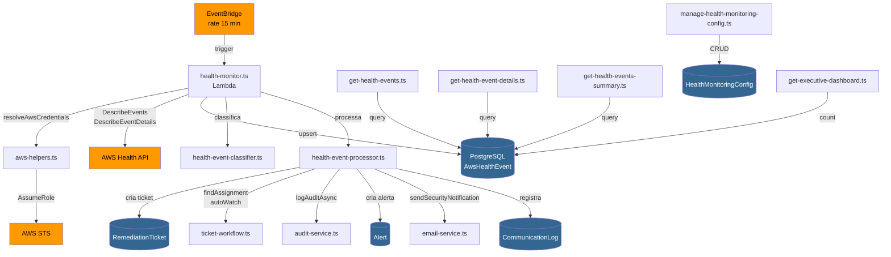
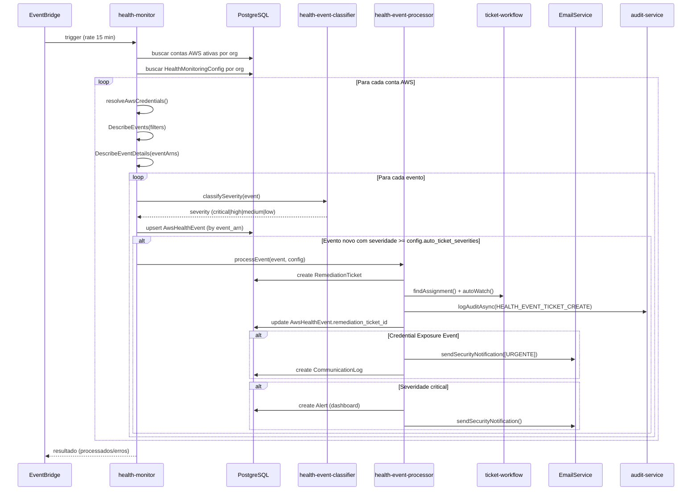

# Design — AWS Health Events Monitoring

## Visão Geral

Esta feature integra a AWS Health API à plataforma EVO para monitoramento contínuo de eventos de saúde das contas AWS cadastradas, com foco especial em eventos de segurança relacionados a credenciais expostas. O sistema opera como um job agendado via EventBridge que consulta periodicamente a API, classifica eventos por severidade, persiste no PostgreSQL, e dispara ações automáticas (criação de tickets, alertas no dashboard, notificações por email).

A arquitetura segue os padrões já estabelecidos na plataforma:
- **Job agendado**: Padrão `scheduled-scan-executor.ts` (EventBridge → Lambda → Prisma → processamento)
- **Tickets**: Reutiliza `RemediationTicket`, `findAssignment()`, `autoWatch()`, `logAuditAsync()`
- **Notificações**: Reutiliza `EmailService.sendSecurityNotification()` e modelo `CommunicationLog`
- **Dashboard**: Estende `SecurityPosture` existente com contagem de Health Events
- **Credenciais**: Reutiliza `resolveAwsCredentials()` e `assumeRole()` com cache

### Diagrama de Arquitetura



## Arquitetura

### Fluxo Principal — Polling e Processamento



### Decisões de Design

1. **Polling vs EventBridge Events**: Optamos por polling da AWS Health API (via `DescribeEvents`) em vez de receber eventos via EventBridge Rules da AWS porque cada conta do cliente tem suas próprias credenciais e a plataforma EVO precisa consultar múltiplas contas de múltiplas organizações. O padrão de polling já é estabelecido no `scheduled-scan-executor.ts`.

2. **Upsert por event_arn**: A AWS Health API pode retornar o mesmo evento em múltiplas consultas (especialmente eventos `open`). Usamos upsert por `event_arn + organization_id` para deduplicação, atualizando apenas campos mutáveis (`status_code`, `end_time`, `description`).

3. **Classificação determinística**: O `health-event-classifier.ts` é uma função pura que mapeia `typeCode` + `category` + `statusCode` para severidade. Isso garante idempotência e testabilidade.

4. **Ticket único por evento**: O campo `remediation_ticket_id` no `AwsHealthEvent` garante que não criamos tickets duplicados. Se o campo já está preenchido, o processador ignora o evento.

5. **Configuração por organização**: Cada organização pode configurar quais severidades geram tickets e a frequência de polling, permitindo customização sem afetar outras organizações.

## Componentes e Interfaces

### 1. health-event-classifier.ts (Lib)

Localização: `backend/src/lib/health-event-classifier.ts`

```typescript
// Tipos de entrada/saída
interface HealthEventInput {
  typeCode: string;
  category: string;      // 'accountNotification' | 'issue' | 'scheduledChange'
  statusCode: string;     // 'open' | 'closed' | 'upcoming'
}

type Severity = 'critical' | 'high' | 'medium' | 'low';

// Interface pública
function classifySeverity(event: HealthEventInput): Severity;
function isCredentialExposure(typeCode: string): boolean;
```

**Regras de classificação (em ordem de prioridade)**:
1. `typeCode` contém `RISK_CREDENTIALS_EXPOSED` ou `RISK_CREDENTIALS_COMPROMISED` → `critical`
2. `typeCode` contém `RISK` e `category === 'accountNotification'` → `high`
3. `category === 'issue'` e `statusCode === 'open'` → `medium`
4. Qualquer outro caso → `low`

### 2. health-event-processor.ts (Lib)

Localização: `backend/src/lib/health-event-processor.ts`

```typescript
interface ProcessableEvent {
  id: string;                    // ID do AwsHealthEvent no DB
  eventArn: string;
  typeCode: string;
  category: string;
  region: string;
  description: string;
  severity: Severity;
  isCredentialExposure: boolean;
  awsAccountId: string;
  organizationId: string;
  remediationTicketId: string | null;
}

interface ProcessingConfig {
  autoTicketSeverities: string[];  // ex: ['critical', 'high']
  organizationId: string;
}

interface ProcessingResult {
  ticketCreated: boolean;
  ticketId: string | null;
  alertCreated: boolean;
  emailSent: boolean;
}

// Interface pública
async function processHealthEvent(
  prisma: PrismaClient,
  event: ProcessableEvent,
  config: ProcessingConfig
): Promise<ProcessingResult>;
```

**Responsabilidades**:
- Verificar se evento já tem ticket (skip se `remediationTicketId !== null`)
- Verificar se severidade está na lista de `autoTicketSeverities`
- Criar `RemediationTicket` com título `[AWS Health] {typeCode} - {region} ({awsAccountId})`
- Executar `findAssignment()` e `autoWatch()`
- Para credential exposure: definir prioridade `urgent`, `business_impact` fixo, incluir instruções de remediação
- Para severidade `critical`: criar `Alert` no dashboard
- Para severidade `critical` ou `high`: enviar email via `EmailService.sendSecurityNotification()`
- Para credential exposure: registrar `CommunicationLog`
- Registrar audit log via `logAuditAsync()`
- Atualizar `AwsHealthEvent.remediation_ticket_id`

### 3. health-monitor.ts (Handler — Job Agendado)

Localização: `backend/src/handlers/monitoring/health-monitor.ts`

```typescript
// EventBridge scheduled event (mesmo padrão do scheduled-scan-executor.ts)
interface ScheduledEvent {
  'detail-type'?: string;
  source?: string;
  time?: string;
}

// Resultado por organização
interface OrgProcessingResult {
  organizationId: string;
  accountsProcessed: number;
  eventsFound: number;
  eventsNew: number;
  eventsUpdated: number;
  ticketsCreated: number;
  errors: string[];
}

export async function handler(
  event: ScheduledEvent,
  context: LambdaContext
): Promise<APIGatewayProxyResultV2>;
```

**Fluxo interno**:
1. Buscar todas as organizações com `HealthMonitoringConfig.enabled = true`
2. Para cada organização, buscar contas AWS ativas (`AwsCredential` com `is_active = true`)
3. Para cada conta, resolver credenciais via `resolveAwsCredentials()`
4. Chamar `DescribeEvents` com filtros de categoria (`accountNotification`, `issue`)
5. Chamar `DescribeEventDetails` para eventos retornados
6. Classificar via `classifySeverity()` e marcar `isCredentialExposure`
7. Upsert no `AwsHealthEvent`
8. Para eventos novos, chamar `processHealthEvent()`
9. Continuar processando demais contas/orgs em caso de erro individual

### 4. Handlers de API

#### get-health-events.ts
- **Rota**: `POST /api/functions/get-health-events`
- **Body params**: `limit` (default 20, max 100), `offset` (default 0), `severity`, `status_code`, `aws_account_id`, `is_credential_exposure`
- **Resposta**: `{ events: AwsHealthEvent[], total: number, limit: number, offset: number }`
- **Filtro obrigatório**: `organization_id` do usuário autenticado

#### get-health-event-details.ts
- **Rota**: `POST /api/functions/get-health-event-details`
- **Body params**: `id` (UUID do AwsHealthEvent)
- **Resposta**: `{ event: AwsHealthEvent, ticket: RemediationTicket | null }`
- **Inclui**: `RemediationTicket` associado via `remediation_ticket_id` (se existir)
- **Filtro obrigatório**: `organization_id` do usuário autenticado

#### get-health-events-summary.ts
- **Rota**: `POST /api/functions/get-health-events-summary`
- **Resposta**:
```typescript
{
  bySeverity: { critical: number; high: number; medium: number; low: number };
  openEvents: number;
  totalTicketsCreated: number;
  credentialExposures: number;
  total: number;
}
```
- **Filtro obrigatório**: `organization_id` do usuário autenticado

#### manage-health-monitoring-config.ts
- **Rota**: `POST /api/functions/manage-health-monitoring-config`
- **Body action GET**: `{ "action": "get" }` — retorna config da organização
- **Body action PUT**: `{ "action": "update", ... }` — atualiza config
- **Body update**:
```typescript
{
  enabled?: boolean;
  autoTicketSeverities?: string[];   
  // default: ['critical', 'high']
  pollingFrequencyMinutes?: number;  // default: 15
}
```
- **Audit log**: `HEALTH_MONITORING_CONFIG_UPDATE` em toda alteração
- **Filtro obrigatório**: `organization_id` do usuário autenticado
- **Criação automática**: Se não existir config para a org, cria com defaults no primeiro GET

### 5. Modificação — get-executive-dashboard.ts

Adicionar campo `healthEvents` à interface `SecurityPosture` (campo separado, ao lado de `findings`):

```typescript
interface SecurityPosture {
  score: number;
  findings: {
    critical: number;
    high: number;
    medium: number;
    low: number;
    total: number;
  };
  healthEvents: {           // NOVO — campo separado de findings
    critical: number;
    high: number;
    medium: number;
    low: number;
    total: number;
  };
  trend: {
    newLast7Days: number;
    resolvedLast7Days: number;
    netChange: number;
  };
  mttr: Record<string, number>;
  lastScanDate: string | null;
}
```

Na função `getSecurityData()`, adicionar query:
```sql
SELECT severity, COUNT(*) FROM aws_health_events
WHERE organization_id = $1 AND status_code = 'open'
GROUP BY severity
```

### 6. Criação de Alert para eventos críticos

Ao criar um `Alert` no dashboard para eventos `critical`, preencher os campos do modelo existente:

```typescript
await prisma.alert.create({
  data: {
    organization_id: event.organizationId,
    severity: 'critical',
    title: `[AWS Health] ${event.typeCode} - ${event.region} (${event.awsAccountId})`,
    message: event.description || 'Evento crítico detectado no AWS Health',
    metadata: {
      source: 'aws-health-monitor',
      event_arn: event.eventArn,
      aws_account_id: event.awsAccountId,
      region: event.region,
      type_code: event.typeCode,
      remediation_ticket_id: ticketId,
      detected_at: new Date().toISOString(),
    },
  },
});
```

**Nota**: O campo `rule_id` fica `null` pois o alerta é gerado automaticamente pelo Health Monitor, não por uma `AlertRule`.

## Modelos de Dados

### AwsHealthEvent (Novo)

```prisma
model AwsHealthEvent {
  id                      String    @id @default(uuid()) @db.Uuid
  organization_id         String    @db.Uuid
  event_arn               String    // ARN único do evento na AWS Health
  type_code               String    // ex: AWS_RISK_CREDENTIALS_EXPOSED
  category                String    // accountNotification, issue, scheduledChange
  region                  String    // ex: us-east-1, global
  start_time              DateTime  @db.Timestamptz(6)
  end_time                DateTime? @db.Timestamptz(6)
  status_code             String    // open, closed, upcoming
  description             String?   @db.Text
  aws_account_id          String    // ID da conta AWS afetada
  severity                String    // critical, high, medium, low
  is_credential_exposure  Boolean   @default(false)
  remediation_ticket_id   String?   @db.Uuid
  metadata                Json?     // Dados adicionais do evento
  created_at              DateTime  @default(now()) @db.Timestamptz(6)
  updated_at              DateTime  @updatedAt @db.Timestamptz(6)

  organization            Organization @relation(fields: [organization_id], references: [id], onDelete: Cascade)

  @@unique([event_arn, organization_id])
  @@index([organization_id])
  @@index([severity])
  @@index([status_code])
  @@index([aws_account_id])
  @@index([is_credential_exposure])
  @@index([organization_id, status_code])
  @@index([organization_id, severity])
  @@map("aws_health_events")
}
```

### HealthMonitoringConfig (Novo)

```prisma
model HealthMonitoringConfig {
  id                        String   @id @default(uuid()) @db.Uuid
  organization_id           String   @unique @db.Uuid
  enabled                   Boolean  @default(true)
  auto_ticket_severities    String[] @default(["critical", "high"])
  polling_frequency_minutes Int      @default(15)
  created_at                DateTime @default(now()) @db.Timestamptz(6)
  updated_at                DateTime @updatedAt @db.Timestamptz(6)

  organization              Organization @relation(fields: [organization_id], references: [id], onDelete: Cascade)

  @@index([organization_id])
  @@map("health_monitoring_configs")
}
```

### Modelos Existentes Utilizados (sem alteração)

| Modelo | Uso |
|--------|-----|
| `RemediationTicket` | Tickets criados automaticamente com `category: 'security'`, `metadata` contendo event_arn/typeCode/conta/região |
| `Alert` | Alertas de severidade `critical` visíveis no dashboard executivo |
| `CommunicationLog` | Registro de emails enviados para credential exposure events |
| `AuditLog` | Registro de ações `HEALTH_EVENT_TICKET_CREATE` e `HEALTH_MONITORING_CONFIG_UPDATE` |

### Adições ao SAM Template (production-lambdas-only.yaml)

**Nota sobre imports**: Todos os novos handlers devem usar `import { logger } from '../../lib/logger.js'` (não `logging.js`). O arquivo `logging.ts` é apenas um re-export para backward compatibility — o módulo real é `logger.ts`, usado por todos os handlers existentes.

**Nota sobre rotas**: As rotas seguem o padrão existente `/api/functions/{handler-name}` com método POST (padrão do monorepo), não REST puro. O frontend já sabe lidar com esse padrão.

```yaml
  # ==================== HEALTH MONITORING ====================
  
  HealthMonitorFunction:
    Type: AWS::Serverless::Function
    Properties:
      FunctionName: !Sub '${ProjectName}-${Environment}-health-monitor'
      CodeUri: ../backend/src/handlers/monitoring/
      Handler: health-monitor.handler
      Role: !GetAtt LambdaExecutionRole.Arn
      Timeout: 300
      MemorySize: 512
      Events:
        Api:
          Type: HttpApi
          Properties:
            ApiId: !Ref HttpApi
            Path: /api/functions/health-monitor
            Method: POST
        HealthMonitorSchedule:
          Type: Schedule
          Properties:
            Schedule: rate(15 minutes)
            Description: Poll AWS Health API for new events
            Enabled: true
    Metadata:
      BuildMethod: esbuild
      BuildProperties:
        Minify: true
        Target: es2022
        Sourcemap: false
        EntryPoints:
          - health-monitor.ts
        External:
          - '@prisma/client'
          - '.prisma/client'

  GetHealthEventsFunction:
    Type: AWS::Serverless::Function
    Properties:
      FunctionName: !Sub '${ProjectName}-${Environment}-get-health-events'
      CodeUri: ../backend/src/handlers/monitoring/
      Handler: get-health-events.handler
      Role: !GetAtt LambdaExecutionRole.Arn
      Timeout: 30
      MemorySize: 256
      Events:
        Api:
          Type: HttpApi
          Properties:
            ApiId: !Ref HttpApi
            Path: /api/functions/get-health-events
            Method: POST
    Metadata:
      BuildMethod: esbuild
      BuildProperties:
        Minify: true
        Target: es2022
        Sourcemap: false
        EntryPoints:
          - get-health-events.ts
        External:
          - '@prisma/client'
          - '.prisma/client'

  GetHealthEventDetailsFunction:
    Type: AWS::Serverless::Function
    Properties:
      FunctionName: !Sub '${ProjectName}-${Environment}-get-health-event-details'
      CodeUri: ../backend/src/handlers/monitoring/
      Handler: get-health-event-details.handler
      Role: !GetAtt LambdaExecutionRole.Arn
      Timeout: 30
      MemorySize: 256
      Events:
        Api:
          Type: HttpApi
          Properties:
            ApiId: !Ref HttpApi
            Path: /api/functions/get-health-event-details
            Method: POST
    Metadata:
      BuildMethod: esbuild
      BuildProperties:
        Minify: true
        Target: es2022
        Sourcemap: false
        EntryPoints:
          - get-health-event-details.ts
        External:
          - '@prisma/client'
          - '.prisma/client'

  GetHealthEventsSummaryFunction:
    Type: AWS::Serverless::Function
    Properties:
      FunctionName: !Sub '${ProjectName}-${Environment}-get-health-events-summary'
      CodeUri: ../backend/src/handlers/monitoring/
      Handler: get-health-events-summary.handler
      Role: !GetAtt LambdaExecutionRole.Arn
      Timeout: 30
      MemorySize: 256
      Events:
        Api:
          Type: HttpApi
          Properties:
            ApiId: !Ref HttpApi
            Path: /api/functions/get-health-events-summary
            Method: POST
    Metadata:
      BuildMethod: esbuild
      BuildProperties:
        Minify: true
        Target: es2022
        Sourcemap: false
        EntryPoints:
          - get-health-events-summary.ts
        External:
          - '@prisma/client'
          - '.prisma/client'

  ManageHealthMonitoringConfigFunction:
    Type: AWS::Serverless::Function
    Properties:
      FunctionName: !Sub '${ProjectName}-${Environment}-manage-health-monitoring-config'
      CodeUri: ../backend/src/handlers/monitoring/
      Handler: manage-health-monitoring-config.handler
      Role: !GetAtt LambdaExecutionRole.Arn
      Timeout: 30
      MemorySize: 256
      Events:
        Api:
          Type: HttpApi
          Properties:
            ApiId: !Ref HttpApi
            Path: /api/functions/manage-health-monitoring-config
            Method: POST
    Metadata:
      BuildMethod: esbuild
      BuildProperties:
        Minify: true
        Target: es2022
        Sourcemap: false
        EntryPoints:
          - manage-health-monitoring-config.ts
        External:
          - '@prisma/client'
          - '.prisma/client'
```


## Propriedades de Corretude

*Uma propriedade é uma característica ou comportamento que deve ser verdadeiro em todas as execuções válidas de um sistema — essencialmente, uma declaração formal sobre o que o sistema deve fazer. Propriedades servem como ponte entre especificações legíveis por humanos e garantias de corretude verificáveis por máquina.*

### Propriedade 1: Corretude da classificação de severidade

*Para qualquer* evento de saúde AWS com `typeCode`, `category` e `statusCode` arbitrários, `classifySeverity()` deve retornar:
- `critical` se typeCode contém `RISK_CREDENTIALS_EXPOSED` ou `RISK_CREDENTIALS_COMPROMISED`
- `high` se typeCode contém `RISK` e category é `accountNotification` (e não é credential exposure)
- `medium` se category é `issue` e statusCode é `open` (e não se enquadra nas regras anteriores)
- `low` em todos os outros casos

O resultado deve ser sempre exatamente um dos quatro valores: `critical`, `high`, `medium`, `low`.

**Validates: Requirements 2.1, 2.2, 2.3, 2.4, 2.5**

### Propriedade 2: Idempotência da classificação

*Para qualquer* evento de saúde AWS, chamar `classifySeverity(event)` duas vezes com o mesmo input deve produzir exatamente o mesmo resultado. Ou seja, `classifySeverity(e) === classifySeverity(e)` para todo `e`.

**Validates: Requirements 2.6**

### Propriedade 3: Idempotência do upsert de eventos

*Para qualquer* evento de saúde AWS, fazer upsert do mesmo evento (mesmo `event_arn` e `organization_id`) duas vezes deve resultar em exatamente um registro no banco de dados, com os campos mutáveis (`status_code`, `end_time`, `description`) refletindo os valores mais recentes.

**Validates: Requirements 1.4, 1.5**

### Propriedade 4: Criação de ticket para eventos qualificados

*Para qualquer* evento de saúde AWS com severidade presente na lista `autoTicketSeverities` da configuração e sem `remediation_ticket_id` existente, o processamento deve criar um `RemediationTicket` com `category = 'security'`, `status = 'open'`, e prioridade correspondente à severidade do evento.

**Validates: Requirements 3.1**

### Propriedade 5: Corretude do conteúdo do ticket

*Para qualquer* ticket criado automaticamente a partir de um evento de saúde AWS, o título deve seguir o formato `[AWS Health] {typeCode} - {region} ({awsAccountId})` e o campo `metadata` deve conter: `event_arn`, `typeCode`, conta AWS afetada, região e descrição do evento.

**Validates: Requirements 3.2, 3.3**

### Propriedade 6: Não duplicação de tickets

*Para qualquer* evento de saúde AWS que já possui `remediation_ticket_id` preenchido, processar o evento novamente não deve criar um novo ticket. O número de tickets associados ao evento deve permanecer exatamente 1.

**Validates: Requirements 3.5**

### Propriedade 7: Tratamento especial de credential exposure

*Para qualquer* evento de saúde AWS com `typeCode` contendo `RISK_CREDENTIALS_EXPOSED` ou `RISK_CREDENTIALS_COMPROMISED`, o sistema deve: (a) marcar `is_credential_exposure = true` no `AwsHealthEvent`, (b) criar ticket com `priority = 'urgent'` e `business_impact` contendo "Credenciais AWS potencialmente expostas", (c) incluir instruções de remediação (rotacionar credenciais, revogar sessões, verificar CloudTrail) no `description` do ticket.

**Validates: Requirements 3.6, 7.1, 7.3**

### Propriedade 8: Alerta no dashboard para eventos críticos

*Para qualquer* evento de saúde AWS com severidade `critical`, o processamento deve criar um registro na tabela `Alert` contendo: severidade, título do evento, conta AWS afetada, horário de detecção e ID do `RemediationTicket` associado.

**Validates: Requirements 4.1, 4.2**

### Propriedade 9: Corretude da contagem de healthEvents no dashboard

*Para qualquer* conjunto de `AwsHealthEvent` com `status_code = 'open'` de uma organização, o campo `healthEvents` retornado pelo endpoint `get-executive-dashboard` deve conter contagens corretas por severidade (`critical`, `high`, `medium`, `low`) e o `total` deve ser igual à soma das quatro contagens.

**Validates: Requirements 4.3**

### Propriedade 10: Paginação e isolamento multi-tenant na listagem

*Para qualquer* requisição ao endpoint `get-health-events` com parâmetros de paginação (`limit`, `offset`) e filtros válidos, os resultados devem: (a) conter no máximo `limit` registros, (b) conter apenas eventos da `organization_id` do usuário autenticado, (c) nunca retornar eventos de outras organizações.

**Validates: Requirements 5.1, 5.2**

### Propriedade 11: Corretude do resumo agregado

*Para qualquer* conjunto de `AwsHealthEvent` de uma organização, o endpoint `get-health-events-summary` deve retornar: (a) `bySeverity` com contagens corretas por severidade, (b) `openEvents` igual ao número de eventos com `status_code = 'open'`, (c) `totalTicketsCreated` igual ao número de eventos com `remediation_ticket_id` não nulo, (d) `credentialExposures` igual ao número de eventos com `is_credential_exposure = true`.

**Validates: Requirements 5.4**

### Propriedade 12: Persistência da configuração de monitoramento

*Para qualquer* configuração válida com `autoTicketSeverities` (subconjunto de `['critical', 'high', 'medium', 'low']`) e `pollingFrequencyMinutes` (inteiro positivo), salvar e depois ler a configuração deve retornar os mesmos valores (round-trip).

**Validates: Requirements 6.1, 6.2**

### Propriedade 13: Resiliência a erros — continuidade do processamento

*Para qualquer* conjunto de contas AWS onde uma ou mais falham ao consultar a AWS Health API, o Health Monitor deve continuar processando as contas restantes. O número de contas processadas com sucesso deve ser igual ao total menos as que falharam.

**Validates: Requirements 1.7**

## Tratamento de Erros

### health-monitor.ts (Job Agendado)

| Cenário | Tratamento | Impacto |
|---------|-----------|---------|
| Falha ao resolver credenciais de uma conta | `logger.error()`, skip conta, continua próxima | Conta não monitorada neste ciclo |
| AWS Health API retorna erro/timeout | `logger.error()`, skip conta, continua próxima | Conta não monitorada neste ciclo |
| Falha ao persistir evento (DB) | `logger.error()`, skip evento, continua próximo | Evento será capturado no próximo ciclo |
| Falha ao criar ticket | `logger.error()`, evento persiste sem ticket | Ticket será criado no próximo ciclo (se evento ainda sem ticket) |
| Falha ao enviar email | `logger.warn()`, não bloqueia fluxo | Email não enviado, ticket já criado |
| Falha ao criar Alert (dashboard) | `logger.warn()`, não bloqueia fluxo | Alerta não visível, ticket já criado |
| HealthMonitoringConfig não existe para org | Cria config com defaults | Org monitorada com configuração padrão |
| Nenhuma conta AWS ativa na org | Skip org, log info | Org sem monitoramento (esperado) |

### Handlers de API

| Cenário | Tratamento | HTTP Status |
|---------|-----------|-------------|
| Usuário não autenticado | `error('Unauthorized', 401)` | 401 |
| Organization não encontrada | `error('Unauthorized', 401)` | 401 |
| Evento não encontrado (detail) | `error('Not found', 404)` | 404 |
| Evento de outra organização | `error('Not found', 404)` | 404 |
| Parâmetros de paginação inválidos | `badRequest('Invalid params')` | 400 |
| Config update com valores inválidos | `badRequest('Invalid config')` | 400 |
| Erro interno do banco | `error('Internal error', 500)` | 500 |

### Princípios Gerais

1. **Falhas isoladas**: Erro em uma conta/evento/org nunca interrompe o processamento das demais
2. **Idempotência**: Upsert por `event_arn` garante que reprocessamento é seguro
3. **Audit trail**: Todas as ações de modificação são registradas via `logAuditAsync()`
4. **Fire-and-forget para side effects**: Email, audit log e alertas de dashboard não bloqueiam o fluxo principal

## Estratégia de Testes

### Padrões UDS Aplicados

- **Framework**: Vitest (já configurado em `backend/vitest.config.ts`)
- **PBT**: fast-check v4.5.3 (já instalado em `backend/package.json`)
- **Padrão**: AAA (Arrange, Act, Assert)
- **Naming**: Given-When-Then descritivo (`describe('ComponentName') > describe('methodName') > it('should X when Y')`)
- **Cobertura mínima**: 80% linhas, 70% branches
- **Quality gates**: ≥80% coverage, >98% tests passing, 100% regression automated
- **Mocks**: Apenas para dependências externas (AWS SDK, Prisma, EmailService) — lógica pura testada sem mocks
- **Dados de teste**: Factories com fast-check arbitraries — nunca hardcoded
- **Independência**: Cada teste é isolado, sem dependência de ordem

### Abordagem Dual: Testes Unitários + Testes de Propriedade

- **Testes unitários**: Exemplos específicos, edge cases, condições de erro — capturam bugs concretos
- **Testes de propriedade (PBT)**: Propriedades universais com inputs gerados aleatoriamente — verificam corretude geral
- **Mínimo de iterações PBT**: 100 por propriedade
- **Tag de referência**: `Feature: aws-health-events-monitoring, Property {N}: {texto}`

### Factories e Arbitraries (fast-check)

```typescript
// backend/tests/factories/health-event.factory.ts
import fc from 'fast-check';

// Arbitrary para typeCode com distribuição realista
export const typeCodeArb = fc.oneof(
  fc.constant('AWS_RISK_CREDENTIALS_EXPOSED'),
  fc.constant('AWS_RISK_CREDENTIALS_COMPROMISED'),
  fc.constant('AWS_RISK_IAM_POLICY_CHANGE'),
  fc.constant('AWS_EC2_OPERATIONAL_ISSUE'),
  fc.constant('AWS_RDS_MAINTENANCE'),
  fc.stringMatching(/^AWS_[A-Z_]{5,30}$/)
);

export const categoryArb = fc.oneof(
  fc.constant('accountNotification'),
  fc.constant('issue'),
  fc.constant('scheduledChange')
);

export const statusCodeArb = fc.oneof(
  fc.constant('open'),
  fc.constant('closed'),
  fc.constant('upcoming')
);

export const healthEventInputArb = fc.record({
  typeCode: typeCodeArb,
  category: categoryArb,
  statusCode: statusCodeArb,
});

export const severityArb = fc.oneof(
  fc.constant('critical' as const),
  fc.constant('high' as const),
  fc.constant('medium' as const),
  fc.constant('low' as const)
);

export const uuidArb = fc.uuid();

export const processableEventArb = fc.record({
  id: uuidArb,
  eventArn: fc.stringMatching(/^arn:aws:health:[a-z-]+::\d{12}:event\/[A-Za-z0-9_-]+$/),
  typeCode: typeCodeArb,
  category: categoryArb,
  region: fc.oneof(fc.constant('us-east-1'), fc.constant('eu-west-1'), fc.constant('global')),
  description: fc.string({ minLength: 1, maxLength: 500 }),
  severity: severityArb,
  isCredentialExposure: fc.boolean(),
  awsAccountId: fc.stringMatching(/^\d{12}$/),
  organizationId: uuidArb,
  remediationTicketId: fc.option(uuidArb, { nil: null }),
});

export const monitoringConfigArb = fc.record({
  autoTicketSeverities: fc.subarray(['critical', 'high', 'medium', 'low'], { minLength: 1 }),
  pollingFrequencyMinutes: fc.integer({ min: 1, max: 1440 }),
});
```

### Testes de Propriedade (PBT)

| Propriedade | Componente | Gerador | Validação |
|-------------|-----------|---------|-----------|
| P1: Corretude da classificação | `health-event-classifier.ts` | `healthEventInputArb` | Resultado correto para cada combinação typeCode/category/statusCode |
| P2: Idempotência da classificação | `health-event-classifier.ts` | `healthEventInputArb` | `classify(e) === classify(e)` para todo `e` |
| P3: Idempotência do upsert | `health-monitor.ts` | Eventos com mesmo `event_arn`, campos mutáveis variados | Exatamente 1 registro no DB após N upserts |
| P5: Conteúdo do ticket | `health-event-processor.ts` | `processableEventArb` com severidade qualificada | Título formato correto, metadata completa |
| P6: Não duplicação de tickets | `health-event-processor.ts` | `processableEventArb` com `remediationTicketId` preenchido | Nenhum ticket criado |
| P7: Credential exposure handling | `health-event-processor.ts` | Eventos com typeCodes de credential exposure | priority=urgent, business_impact correto, instruções presentes |
| P9: Contagem healthEvents dashboard | `get-executive-dashboard.ts` | Conjuntos de AwsHealthEvent com severidades variadas | Contagens por severidade corretas, total = soma |
| P10: Paginação e multi-tenant | `get-health-events.ts` | limit/offset variados, múltiplas orgs | Max `limit` resultados, apenas org do usuário |
| P11: Resumo agregado | `get-health-events-summary.ts` | Conjuntos de eventos com status/severidade variados | Contagens corretas por categoria |
| P12: Config round-trip | `manage-health-monitoring-config.ts` | `monitoringConfigArb` | Salvar + ler = mesmos valores |
| P13: Resiliência a erros | `health-monitor.ts` | N contas, K falham aleatoriamente | Processadas = N - K |

### Testes Unitários (AAA Pattern)

| Cenário (it should...) | Componente | Tipo |
|------------------------|-----------|------|
| classify `AWS_RISK_CREDENTIALS_EXPOSED` as critical | `health-event-classifier.ts` | Exemplo |
| classify `RISK_CREDENTIALS_COMPROMISED` as critical | `health-event-classifier.ts` | Exemplo |
| classify `RISK` + `accountNotification` as high | `health-event-classifier.ts` | Exemplo |
| classify `issue` + `open` as medium | `health-event-classifier.ts` | Exemplo |
| classify `scheduledChange` as low | `health-event-classifier.ts` | Exemplo |
| return true for credential exposure typeCodes | `health-event-classifier.ts` | Exemplo |
| create ticket with correct title format | `health-event-processor.ts` | Exemplo |
| set priority=urgent for credential exposure | `health-event-processor.ts` | Exemplo |
| include remediation instructions for credential exposure | `health-event-processor.ts` | Exemplo |
| skip ticket creation when event already has ticket | `health-event-processor.ts` | Exemplo |
| create Alert with correct fields for critical events | `health-event-processor.ts` | Exemplo |
| send email notification for critical/high events | `health-event-processor.ts` | Exemplo |
| register CommunicationLog for credential exposure | `health-event-processor.ts` | Exemplo |
| return 400 when limit=0 | `get-health-events.ts` | Edge case |
| return 400 when offset is negative | `get-health-events.ts` | Edge case |
| return 404 when event belongs to different org | `get-health-event-details.ts` | Edge case |
| return 400 when severity is invalid | `manage-health-monitoring-config.ts` | Edge case |
| return 400 when polling_frequency_minutes <= 0 | `manage-health-monitoring-config.ts` | Edge case |
| create default config on first GET | `manage-health-monitoring-config.ts` | Exemplo |
| register audit log on config update | `manage-health-monitoring-config.ts` | Exemplo |
| continue processing when one account fails | `health-monitor.ts` | Edge case |
| skip org with no active AWS accounts | `health-monitor.ts` | Edge case |
| return zero counts when no events exist | `get-health-events-summary.ts` | Edge case |
| include RemediationTicket in event details | `get-health-event-details.ts` | Exemplo |

### Estrutura de Arquivos de Teste

```
backend/tests/
  factories/
    health-event.factory.ts              # Arbitraries e factories fast-check
  unit/
    lib/
      health-event-classifier.test.ts    # Unitários + PBT (P1, P2)
      health-event-processor.test.ts     # Unitários + PBT (P5, P6, P7)
    handlers/
      monitoring/
        health-monitor.test.ts           # Unitários + PBT (P3, P13)
        get-health-events.test.ts        # Unitários + PBT (P10)
        get-health-event-details.test.ts # Unitários
        get-health-events-summary.test.ts # Unitários + PBT (P11)
        manage-health-monitoring-config.test.ts # Unitários + PBT (P12)
  integration/
    monitoring/
      health-events-dashboard.test.ts    # PBT (P9) — integração com dashboard
```

**Nota**: A estrutura segue o padrão do vitest.config.ts que inclui `tests/**/*.test.ts`. Os testes de propriedade ficam no mesmo arquivo dos unitários do componente correspondente, separados por `describe` blocks.