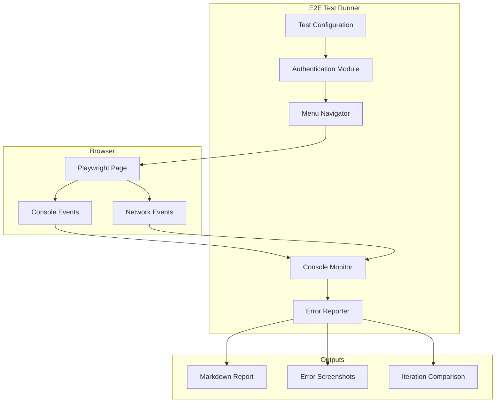

# Design Document: Browser E2E Testing

## Overview

This document describes the design for an automated end-to-end browser testing system for the EVO UDS platform. The system uses Playwright to automate browser interactions, systematically navigate through all application menus, capture console errors, and generate comprehensive reports. The goal is to iteratively test and fix issues until the application is error-free.

## Architecture



## Components and Interfaces

### 1. Test Configuration (TestConfig)

```typescript
interface TestConfig {
  baseUrl: string;                    // Application URL
  credentials: {
    email: string;
    password: string;
  };
  browser: {
    headless: boolean;
    timeout: number;                  // Page load timeout (ms)
    actionTimeout: number;            // Element interaction timeout (ms)
  };
  menus?: string[];                   // Optional: specific menus to test
  waitBetweenActions: number;         // Delay between actions (ms)
  verbose: boolean;                   // Enable detailed logging
  screenshotOnError: boolean;         // Capture screenshots on errors
  outputDir: string;                  // Directory for reports/screenshots
}
```

### 2. Console Monitor (ConsoleMonitor)

```typescript
enum ErrorCategory {
  API_ERROR = 'API_ERROR',
  JS_ERROR = 'JS_ERROR',
  NETWORK_ERROR = 'NETWORK_ERROR',
  CORS_ERROR = 'CORS_ERROR',
  AUTH_ERROR = 'AUTH_ERROR',
  UNKNOWN = 'UNKNOWN'
}

interface CapturedError {
  id: string;                         // Unique error ID
  timestamp: Date;
  pageUrl: string;
  menuItem: string;                   // Which menu was being tested
  category: ErrorCategory;
  message: string;
  stack?: string;
  screenshotPath?: string;
  isNew: boolean;                     // New in this iteration
}

interface ConsoleMonitor {
  start(page: Page): void;
  stop(): void;
  getErrors(): CapturedError[];
  getWarnings(): CapturedError[];
  clear(): void;
  categorizeError(message: string): ErrorCategory;
}
```

### 3. Menu Navigator (MenuNavigator)

```typescript
interface MenuItem {
  name: string;
  value: string;
  route: string;
  hasSubItems: boolean;
  subItems?: MenuItem[];
  requiresSuperAdmin: boolean;
}

interface NavigationResult {
  menuItem: string;
  success: boolean;
  loadTime: number;                   // Page load time (ms)
  errors: CapturedError[];
  warnings: CapturedError[];
  hasDataTable: boolean;
  hasForms: boolean;
  hasActionButtons: boolean;
}

interface MenuNavigator {
  getMenuItems(): MenuItem[];
  navigateTo(menuItem: MenuItem): Promise<NavigationResult>;
  testPageFunctionality(page: Page): Promise<FunctionalityResult>;
  expandSubMenu(menuItem: MenuItem): Promise<void>;
}
```

### 4. Error Reporter (ErrorReporter)

```typescript
interface TestIterationResult {
  iteration: number;
  timestamp: Date;
  duration: number;                   // Total test duration (ms)
  menusTestedCount: number;
  totalErrors: number;
  totalWarnings: number;
  errorsByCategory: Record<ErrorCategory, number>;
  errorsByPage: Record<string, CapturedError[]>;
  newErrors: CapturedError[];
  fixedErrors: CapturedError[];       // Errors from previous iteration not seen now
  screenshots: string[];
}

interface ErrorReporter {
  generateReport(result: TestIterationResult): string;
  compareIterations(current: TestIterationResult, previous: TestIterationResult): ComparisonResult;
  saveReport(report: string, filename: string): void;
  getProgressSummary(iterations: TestIterationResult[]): ProgressSummary;
}
```

### 5. E2E Test Runner (E2ETestRunner)

```typescript
interface E2ETestRunner {
  config: TestConfig;
  browser: Browser;
  page: Page;
  monitor: ConsoleMonitor;
  navigator: MenuNavigator;
  reporter: ErrorReporter;
  
  initialize(): Promise<void>;
  authenticate(): Promise<boolean>;
  runIteration(): Promise<TestIterationResult>;
  runUntilClean(maxIterations: number): Promise<TestIterationResult[]>;
  cleanup(): Promise<void>;
}
```

## Data Models

### Menu Items Definition

Based on the application's AppSidebar.tsx, the complete menu structure:

```typescript
const MENU_ITEMS: MenuItem[] = [
  { name: 'Executive Dashboard', value: 'executive', route: '/app', hasSubItems: false, requiresSuperAdmin: false },
  { 
    name: 'Cost Analysis', value: 'costs', route: '/app?tab=costs', hasSubItems: true, requiresSuperAdmin: false,
    subItems: [
      { name: 'Detailed Analysis', value: 'cost-analysis', route: '/app?tab=cost-analysis', hasSubItems: false, requiresSuperAdmin: false },
      { name: 'Monthly Invoices', value: 'invoices', route: '/app?tab=invoices', hasSubItems: false, requiresSuperAdmin: false },
    ]
  },
  { name: 'Copilot AI', value: 'copilot', route: '/copilot-ai', hasSubItems: false, requiresSuperAdmin: false },
  {
    name: 'ML Predictions', value: 'ml', route: '/predictive-incidents', hasSubItems: true, requiresSuperAdmin: false,
    subItems: [
      { name: 'Predictive Incidents', value: 'ml', route: '/predictive-incidents', hasSubItems: false, requiresSuperAdmin: false },
      { name: 'Anomaly Detection', value: 'anomalies', route: '/anomaly-detection', hasSubItems: false, requiresSuperAdmin: false },
    ]
  },
  {
    name: 'Monitoring', value: 'monitoring', route: '/app?tab=monitoring', hasSubItems: true, requiresSuperAdmin: false,
    subItems: [
      { name: 'Endpoints', value: 'endpoint-monitoring', route: '/endpoint-monitoring', hasSubItems: false, requiresSuperAdmin: false },
      { name: 'AWS Resources', value: 'resource-monitoring', route: '/resource-monitoring', hasSubItems: false, requiresSuperAdmin: false },
      { name: 'Edge/LB/CF/WAF', value: 'edge-monitoring', route: '/edge-monitoring', hasSubItems: false, requiresSuperAdmin: false },
    ]
  },
  { name: 'Attack Detection', value: 'attack-detection', route: '/attack-detection', hasSubItems: false, requiresSuperAdmin: false },
  {
    name: 'Analysis & Scans', value: 'scans', route: '/security-scans', hasSubItems: true, requiresSuperAdmin: false,
    subItems: [
      { name: 'Security Scans', value: 'scans', route: '/security-scans', hasSubItems: false, requiresSuperAdmin: false },
      { name: 'CloudTrail Audit', value: 'cloudtrail-audit', route: '/cloudtrail-audit', hasSubItems: false, requiresSuperAdmin: false },
      { name: 'Compliance', value: 'compliance', route: '/compliance', hasSubItems: false, requiresSuperAdmin: false },
      { name: 'Well-Architected', value: 'well-architected', route: '/well-architected', hasSubItems: false, requiresSuperAdmin: false },
      { name: 'AWS Security Analysis', value: 'security-analysis', route: '/app?tab=security-analysis', hasSubItems: false, requiresSuperAdmin: false },
    ]
  },
  {
    name: 'Optimization', value: 'optimization', route: '/app?tab=optimization', hasSubItems: true, requiresSuperAdmin: false,
    subItems: [
      { name: 'Cost Optimization', value: 'advanced', route: '/cost-optimization', hasSubItems: false, requiresSuperAdmin: false },
      { name: 'RI & Savings Plans', value: 'risp', route: '/ri-savings-plans', hasSubItems: false, requiresSuperAdmin: false },
      { name: 'Waste Detection', value: 'waste', route: '/app?tab=waste', hasSubItems: false, requiresSuperAdmin: false },
    ]
  },
  { name: 'Intelligent Alerts', value: 'alerts', route: '/intelligent-alerts', hasSubItems: false, requiresSuperAdmin: false },
  { name: 'Security Posture', value: 'security', route: '/security-posture', hasSubItems: false, requiresSuperAdmin: false },
  { name: 'Remediation Tickets', value: 'tickets', route: '/remediation-tickets', hasSubItems: false, requiresSuperAdmin: false },
  { name: 'Knowledge Base', value: 'knowledge-base', route: '/knowledge-base', hasSubItems: false, requiresSuperAdmin: false },
  { name: 'TV Dashboards', value: 'tv-dashboards', route: '/tv', hasSubItems: false, requiresSuperAdmin: false },
  { name: 'Audit', value: 'audit', route: '/app?tab=audit', hasSubItems: false, requiresSuperAdmin: false },
  { name: 'Communication Center', value: 'communication-center', route: '/communication-center', hasSubItems: false, requiresSuperAdmin: false },
  { name: 'License', value: 'license', route: '/license-management', hasSubItems: false, requiresSuperAdmin: false },
  { name: 'AWS Settings', value: 'aws-settings', route: '/aws-settings', hasSubItems: false, requiresSuperAdmin: false },
  { name: 'Manage Users', value: 'users', route: '/app?tab=users', hasSubItems: false, requiresSuperAdmin: false },
  { name: 'Organizations', value: 'organizations', route: '/app?tab=organizations', hasSubItems: false, requiresSuperAdmin: true },
  { name: 'Scheduled Jobs', value: 'scheduled-jobs', route: '/background-jobs', hasSubItems: false, requiresSuperAdmin: true },
  { name: 'Dev Tools', value: 'devtools', route: '/bedrock-test', hasSubItems: false, requiresSuperAdmin: true },
  { name: 'Setup', value: 'setup', route: '/app?tab=setup', hasSubItems: false, requiresSuperAdmin: false },
];
```

### Error Categorization Rules

```typescript
function categorizeError(message: string): ErrorCategory {
  const lowerMessage = message.toLowerCase();
  
  if (lowerMessage.includes('cors') || lowerMessage.includes('access-control')) {
    return ErrorCategory.CORS_ERROR;
  }
  if (lowerMessage.includes('401') || lowerMessage.includes('unauthorized') || lowerMessage.includes('authentication')) {
    return ErrorCategory.AUTH_ERROR;
  }
  if (lowerMessage.includes('fetch') || lowerMessage.includes('network') || lowerMessage.includes('failed to load')) {
    return ErrorCategory.NETWORK_ERROR;
  }
  if (lowerMessage.includes('api') || lowerMessage.includes('500') || lowerMessage.includes('502') || lowerMessage.includes('503')) {
    return ErrorCategory.API_ERROR;
  }
  if (lowerMessage.includes('typeerror') || lowerMessage.includes('referenceerror') || lowerMessage.includes('syntaxerror')) {
    return ErrorCategory.JS_ERROR;
  }
  
  return ErrorCategory.UNKNOWN;
}
```

## Correctness Properties

*A property is a characteristic or behavior that should hold true across all valid executions of a system—essentially, a formal statement about what the system should do. Properties serve as the bridge between human-readable specifications and machine-verifiable correctness guarantees.*

### Property 1: Error Capture Completeness

*For any* browser event (console.error, console.warn, uncaught exception, or network failure with 4xx/5xx status), the Console_Monitor SHALL capture it in the errors or warnings collection.

**Validates: Requirements 3.1, 3.2, 3.3, 3.4**

### Property 2: Error Metadata Completeness

*For any* captured error in the Console_Monitor, it SHALL have a non-empty pageUrl, a valid timestamp, a non-empty message, and exactly one ErrorCategory assigned.

**Validates: Requirements 3.5, 3.6**

### Property 3: Menu Navigation Completeness

*For any* menu item in the MENU_ITEMS list (including sub-items), clicking it SHALL result in a page that reaches a loaded state (document.readyState === 'complete') within the configured timeout.

**Validates: Requirements 4.1, 4.2, 4.3, 4.5**

### Property 4: Interactive Element Functionality

*For any* page with interactive elements (data tables, form fields, action buttons), those elements SHALL be visible and enabled (not disabled) after page load.

**Validates: Requirements 5.1, 5.2, 5.3**

### Property 5: Report Structure Completeness

*For any* generated error report, it SHALL contain: (a) errors grouped by page/menu item, (b) error count, type, and message for each error, (c) screenshot paths for pages with errors, (d) new vs. previously-seen status for each error, and (e) a summary with totals by category.

**Validates: Requirements 6.2, 6.3, 6.4, 6.5, 6.6**

### Property 6: Progress Tracking Accuracy

*For any* sequence of test iterations, the system SHALL accurately track: (a) which errors are new vs. fixed between iterations, (b) output success confirmation when error count reaches zero, and (c) maintain correct iteration count.

**Validates: Requirements 7.3, 7.4, 7.5**

### Property 7: Screenshot on Error

*For any* page that has at least one captured error, a screenshot file SHALL exist in the output directory with a filename containing the page identifier.

**Validates: Requirements 1.5, 6.4**

## Error Handling

### Authentication Failures

- Retry login up to 3 times with exponential backoff (1s, 2s, 4s)
- Capture screenshot on final failure
- Log detailed error message including response status
- Exit test run if authentication cannot be established

### Page Load Timeouts

- Wait up to 30 seconds for page load
- Capture screenshot if timeout occurs
- Log the menu item and URL that timed out
- Continue to next menu item (don't abort entire test)

### Element Not Found

- Wait up to 10 seconds for elements
- Log warning if element not found
- Continue testing other elements on page
- Include in report as potential issue

### Network Errors

- Capture all failed requests (4xx, 5xx)
- Include request URL, method, and status in error
- Categorize appropriately (API_ERROR, CORS_ERROR, etc.)
- Continue test execution

## Testing Strategy

### Unit Tests

Unit tests will verify individual components in isolation:

1. **Error Categorization**: Test that `categorizeError()` correctly classifies error messages
2. **Report Generation**: Test that report markdown is correctly formatted
3. **Menu Item Parsing**: Test that menu structure is correctly parsed

### Property-Based Tests

Property-based tests will use fast-check to verify correctness properties:

1. **Property 1 Test**: Generate random console events and verify all are captured
2. **Property 2 Test**: Generate random errors and verify all have complete metadata
3. **Property 5 Test**: Generate random error sets and verify report structure
4. **Property 6 Test**: Generate random iteration sequences and verify tracking accuracy

### Integration Tests

Integration tests will verify the complete flow:

1. **Authentication Flow**: Test login with valid/invalid credentials
2. **Menu Navigation**: Test navigation to each menu item
3. **Error Capture**: Test that real console errors are captured
4. **Report Generation**: Test end-to-end report generation

### Test Configuration

```typescript
// vitest.config.ts additions for E2E tests
export default defineConfig({
  test: {
    include: ['tests/e2e/**/*.test.ts'],
    testTimeout: 120000,  // 2 minutes per test
    hookTimeout: 60000,   // 1 minute for setup/teardown
  }
});
```

### Property Test Configuration

- Minimum 100 iterations per property test
- Use fast-check for property-based testing
- Tag format: **Feature: browser-e2e-testing, Property {number}: {property_text}**
