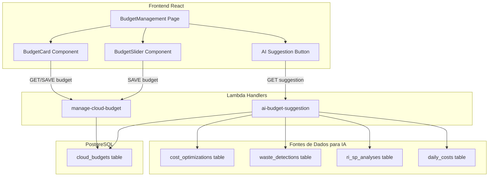

# Design: Redesign da Gestão de Orçamento

## Visão Geral

O redesign substitui a tela de orçamento mês-a-mês por uma interface simplificada com um único indicador de orçamento. O backend é refatorado para suportar o conceito de "orçamento vigente" (registro mais recente) e um novo endpoint de sugestão por IA que agrega dados de cost-optimization, waste-detection e RI/SP analysis para propor um orçamento realista.

A arquitetura mantém o padrão existente: Lambda handlers em TypeScript (CommonJS), Prisma/PostgreSQL, e frontend React com shadcn/ui.

## Arquitetura



## Componentes e Interfaces

### Backend

#### 1. Handler: `manage-cloud-budget` (refatorado)

Refatorar o handler existente para suportar o novo modelo de orçamento único:

- **action: "get_current"** (nova): Retorna o orçamento vigente (registro mais recente por org+provider) junto com o MTD spend do mês corrente
- **action: "save"** (existente, ajustado): Salva o orçamento sempre com year_month do mês corrente. Remove a necessidade de receber year_month do frontend
- **action: "list"** (manter para compatibilidade): Mantém o comportamento atual para não quebrar o dashboard executivo

```typescript
// GET_CURRENT response
interface BudgetCurrentResponse {
  budget: {
    id: string;
    amount: number;
    currency: string;
    source: string; // 'manual' | 'ai_suggestion' | 'auto'
    year_month: string;
    cloud_provider: string;
    updated_at: string;
  } | null;
  mtd_spend: number;
  utilization_percentage: number; // (mtd_spend / amount) * 100
  is_over_budget: boolean;
}

// SAVE request (simplificado)
interface BudgetSaveRequest {
  action: 'save';
  provider: string;
  amount: number;
  source?: string; // 'manual' | 'ai_suggestion'
}
```

#### 2. Handler: `ai-budget-suggestion` (novo)

Novo Lambda handler em `backend/src/handlers/cost/ai-budget-suggestion.ts` que calcula a sugestão de orçamento:

```typescript
interface AISuggestionRequest {
  provider?: string; // 'AWS' | 'AZURE', default 'AWS'
}

interface AISuggestionResponse {
  suggested_amount: number;
  previous_month_spend: number;
  total_proposed_savings: number;
  realization_factor: number; // 0.75
  savings_breakdown: {
    cost_optimization: number;
    waste_detection: number;
    ri_sp_optimization: number;
  };
  calculation: string; // Fórmula legível: "spend - (savings × 0.75)"
  data_available: boolean;
}
```

**Lógica de cálculo:**

```
1. Obter gasto total do mês anterior fechado (daily_costs aggregation)
2. Obter savings propostos:
   a. cost_optimizations: SUM(savings) WHERE org_id AND created recente
   b. waste_detections: SUM(monthly_savings) WHERE org_id AND created recente  
   c. ri_sp_analyses: SUM(potential_waste) WHERE org_id AND created recente
3. total_savings = cost_opt + waste + ri_sp
4. suggested = previous_spend - (total_savings × 0.75)
5. Se suggested <= 0, usar previous_spend × 0.85 como fallback
```

### Frontend

#### 3. Componente: `BudgetManagement` (redesign completo)

Layout simplificado com três seções:

```
┌─────────────────────────────────────────────────┐
│  Gestão de Orçamento                            │
├─────────────────────────────────────────────────┤
│                                                 │
│  ┌──────────┐  ┌──────────┐  ┌──────────┐     │
│  │ Orçamento│  │  Gasto   │  │Utilização│     │
│  │  Atual   │  │   MTD    │  │    %     │     │
│  │ $12,500  │  │ $8,340   │  │   67%    │     │
│  └──────────┘  └──────────┘  └──────────┘     │
│                                                 │
│  ████████████████████░░░░░░░░  67%             │
│                                                 │
│  ┌─────────────────────────────────────────┐   │
│  │  Definir Orçamento                       │   │
│  │                                          │   │
│  │  $ [___12500___]    [🤖 Sugestão IA]    │   │
│  │                                          │   │
│  │  ○────────────●──────────○  $0 - $50k   │   │
│  │                                          │   │
│  └─────────────────────────────────────────┘   │
│                                                 │
│  ┌─────────────────────────────────────────┐   │
│  │  Detalhes da Sugestão IA (expandível)    │   │
│  │  Gasto mês anterior: $15,200             │   │
│  │  Savings propostos: $3,600               │   │
│  │    - Cost Optimization: $1,800           │   │
│  │    - Waste Detection: $1,200             │   │
│  │    - RI/SP Optimization: $600            │   │
│  │  Fator de realização: 75%                │   │
│  │  Sugestão: $15,200 - ($3,600 × 0.75)    │   │
│  │          = $12,500                       │   │
│  └─────────────────────────────────────────┘   │
└─────────────────────────────────────────────────┘
```

**Componentes React:**

- `BudgetSummaryCards`: Cards com orçamento atual, gasto MTD e % utilização
- `BudgetProgressBar`: Barra de progresso com indicação visual de over-budget
- `BudgetInput`: Input numérico + Slider sincronizados
- `AISuggestionButton`: Botão que chama o endpoint e preenche o input
- `AISuggestionDetails`: Painel expandível com breakdown da sugestão

## Modelos de Dados

### Tabela `cloud_budgets` (sem alteração de schema)

```sql
-- Schema existente mantido:
-- id, organization_id, cloud_provider, year_month, amount, currency, source, created_by, created_at, updated_at
-- @@unique([organization_id, cloud_provider, year_month])

-- Mudança semântica:
-- O frontend agora grava SEMPRE com year_month = mês corrente
-- O "orçamento vigente" é o registro com year_month mais recente
-- source ganha novo valor: 'ai_suggestion'
```

### Consulta do Orçamento Vigente

```sql
SELECT * FROM cloud_budgets
WHERE organization_id = $1
  AND cloud_provider = $2
ORDER BY year_month DESC
LIMIT 1;
```

### Dados para Sugestão IA

```sql
-- Gasto do mês anterior
SELECT COALESCE(SUM(cost), 0) as total
FROM daily_costs
WHERE organization_id = $1
  AND date >= first_day_prev_month
  AND date <= last_day_prev_month
  AND (cloud_provider = $2 OR cloud_provider IS NULL);

-- Savings de cost_optimizations (mais recentes)
SELECT COALESCE(SUM(savings), 0) as total
FROM cost_optimizations
WHERE organization_id = $1
  AND created_at >= now() - interval '30 days';

-- Savings de waste (scan mais recente)  
-- Agregar monthly_savings dos resultados do último scan
```


## Propriedades de Corretude

*Uma propriedade é uma característica ou comportamento que deve ser verdadeiro em todas as execuções válidas de um sistema — essencialmente, uma declaração formal sobre o que o sistema deve fazer. Propriedades servem como ponte entre especificações legíveis por humanos e garantias de corretude verificáveis por máquina.*

### Property 1: Orçamento vigente é o mais recente

*Para qualquer* conjunto de registros de orçamento de uma organização e provedor, a consulta do orçamento vigente (get_current) deve retornar o registro com o year_month mais recente.

**Validates: Requirements 1.2, 6.3, 6.4**

### Property 2: Save persiste com year_month corrente

*Para qualquer* operação de save de orçamento, o registro resultante na tabela cloud_budgets deve ter year_month igual ao mês corrente (formato YYYY-MM) e o amount igual ao valor enviado.

**Validates: Requirements 1.2, 5.5, 6.2**

### Property 3: Source tracking por origem

*Para qualquer* orçamento salvo, se a origem for input manual o source deve ser "manual", e se a origem for sugestão IA o source deve ser "ai_suggestion".

**Validates: Requirements 1.3, 3.6**

### Property 4: Fórmula da sugestão IA

*Para qualquer* valor de gasto do mês anterior (> 0) e qualquer conjunto de savings (cost_optimization, waste_detection, ri_sp) todos >= 0, o valor sugerido deve ser igual a: gasto_anterior - ((cost_opt + waste + ri_sp) × 0.75), e o resultado deve ser sempre maior que zero.

**Validates: Requirements 3.3, 3.4, 3.8**

### Property 5: Cálculo de utilização do orçamento

*Para qualquer* orçamento com amount > 0 e qualquer valor de gasto MTD >= 0, o percentual de utilização deve ser igual a (mtd_spend / amount) × 100, e is_over_budget deve ser true se e somente se mtd_spend > amount.

**Validates: Requirements 4.3, 4.4**

### Property 6: Isolamento multi-tenant

*Para qualquer* par de organizações distintas, consultar o orçamento de uma organização não deve retornar dados da outra, mesmo que ambas tenham orçamentos para o mesmo provedor e mês.

**Validates: Requirements 5.1, 5.2**

### Property 7: Sincronização bidirecional input/slider

*Para qualquer* valor numérico válido (>= 0), alterar o input deve resultar no slider refletindo o mesmo valor, e mover o slider deve resultar no input exibindo o valor correspondente.

**Validates: Requirements 2.3, 2.4**

### Property 8: Rejeição de valores negativos

*Para qualquer* valor negativo submetido ao endpoint de save, a operação deve ser rejeitada com erro 400 e o orçamento existente deve permanecer inalterado.

**Validates: Requirements 2.6**

### Property 9: Orçamento inexistente retorna null

*Para qualquer* organização sem registros de orçamento para um dado provedor, a consulta get_current deve retornar budget: null sem criar registros automáticos.

**Validates: Requirements 1.5**

## Tratamento de Erros

| Cenário | Comportamento |
|---------|---------------|
| Sem dados de custo do mês anterior | Sugestão IA retorna `data_available: false` com mensagem explicativa |
| Valor negativo no save | Retorna HTTP 400 com mensagem "Amount must be >= 0" |
| Organização em modo demo | Bloqueia writes, retorna dados demo para reads |
| Falha na agregação de savings | Sugestão IA usa fallback (85% do gasto anterior) |
| Sem credenciais cloud configuradas | Exibe estado vazio com orientação para configurar conta |
| Erro de banco de dados | Retorna HTTP 500 com mensagem genérica, loga detalhes |

## Estratégia de Testes

### Testes Unitários

- Validação de input (valores negativos, zero, limites)
- Cálculo da fórmula de sugestão IA com valores conhecidos
- Cálculo de utilização e flag over-budget
- Lógica de busca do orçamento vigente (mais recente)
- Formatação de year_month

### Testes de Propriedade (Property-Based)

Biblioteca: **fast-check** (TypeScript)

Cada propriedade do design será implementada como um teste de propriedade com mínimo 100 iterações. Cada teste será anotado com:

```
// Feature: budget-management-redesign, Property N: [título]
// Validates: Requirements X.Y
```

Propriedades a testar:
- Property 1: Orçamento vigente é o mais recente
- Property 2: Save persiste com year_month corrente
- Property 3: Source tracking por origem
- Property 4: Fórmula da sugestão IA
- Property 5: Cálculo de utilização do orçamento
- Property 7: Sincronização bidirecional input/slider
- Property 8: Rejeição de valores negativos
- Property 9: Orçamento inexistente retorna null

Property 6 (isolamento multi-tenant) será validada via teste de integração com banco de dados real.

### Testes de Integração

- Fluxo completo: salvar orçamento → consultar vigente → verificar persistência
- Sugestão IA com dados reais de cost_optimizations e daily_costs
- Isolamento multi-tenant com duas organizações
