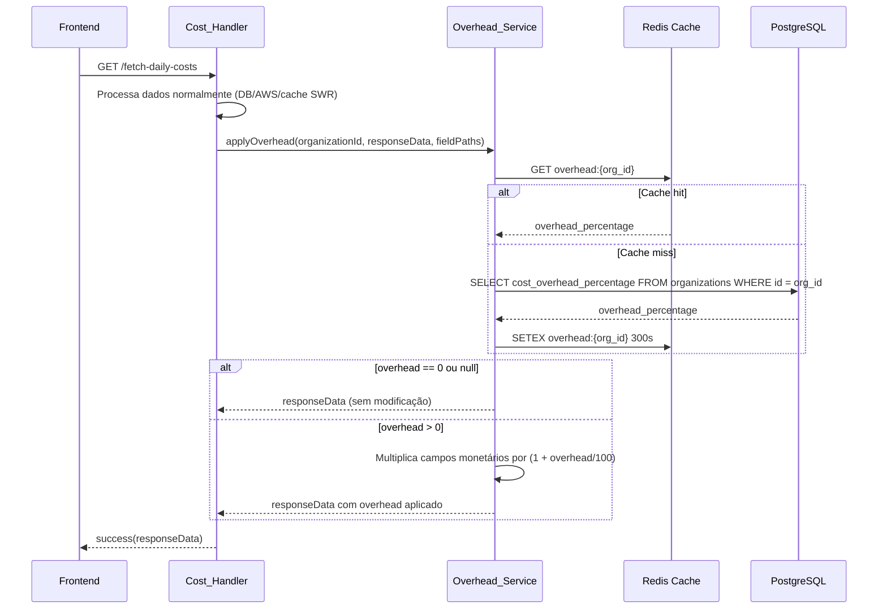
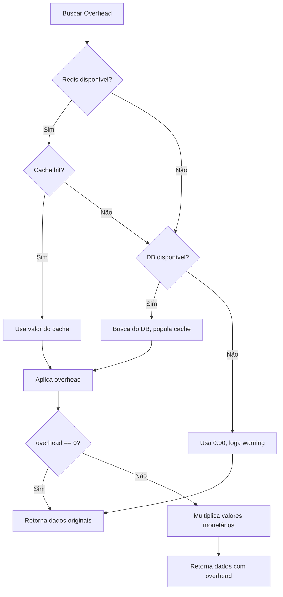

# Design — Cost Overhead

## Visão Geral

O sistema de Cost Overhead permite que o super admin configure um percentual de acréscimo por organização, aplicado de forma transparente em todos os valores monetários retornados pelos Cost_Handlers. A arquitetura é baseada em uma lib centralizada (`Overhead_Service`) que intercepta as respostas da API na camada de saída, sem modificar dados persistidos no banco ou no cache SWR.

### Decisões de Design

1. **Overhead na camada de resposta, não no banco**: O overhead é aplicado sobre os dados já prontos para retorno, preservando a integridade dos dados originais (AWS/Azure Cost Explorer). Isso permite alterar o overhead retroativamente sem reprocessar dados históricos.

2. **Lib centralizada vs middleware**: Optamos por uma função utilitária importada explicitamente em cada Cost_Handler em vez de um middleware Lambda. Isso dá controle granular sobre quais campos recebem overhead e evita complexidade de middleware chain.

3. **Cache dedicado para overhead**: O percentual de overhead tem cache Redis próprio (`overhead:{org_id}`) com TTL de 300s, separado do cache SWR de custos. Isso evita queries ao banco em cada requisição de custo.

4. **Short-circuit para overhead zero**: Quando o overhead é `0.00` ou não configurado, a função retorna os dados sem nenhuma transformação, sem custo computacional adicional.

## Arquitetura

### Diagrama de Fluxo



### Diagrama de Componentes

```mermaid
graph TD
    subgraph "API Layer"
        A[manage-cost-overhead Handler] -->|GET/PUT| B[organizations table]
        A -->|PUT| C[Redis: invalidate overhead + cost caches]
    end

    subgraph "Cost Handlers (14+)"
        D[fetch-daily-costs]
        E[get-executive-dashboard]
        F[budget-forecast]
        G[azure-fetch-costs]
        H[... outros cost handlers]
    end

    subgraph "Overhead Service (lib)"
        I[getOverheadPercentage]
        J[applyOverhead]
        K[applyOverheadToFields]
        L[invalidateOverheadCache]
    end

    D --> J
    E --> J
    F --> J
    G --> J
    H --> J

    J --> I
    I --> M[Redis: overhead:{org_id}]
    I --> B

    style I fill:#f9f,stroke:#333
    style J fill:#f9f,stroke:#333
```

## Componentes e Interfaces

### 1. Overhead Service (`backend/src/lib/cost-overhead.ts`)

Lib centralizada responsável por buscar, cachear e aplicar o overhead.

```typescript
// Busca o overhead da organização (cache Redis → fallback DB)
export async function getOverheadPercentage(organizationId: string): Promise<number>;

// Aplica overhead em um objeto de resposta, percorrendo os fieldPaths especificados
export async function applyOverhead<T extends Record<string, any>>(
  organizationId: string,
  data: T,
  fieldPaths: OverheadFieldConfig[]
): Promise<T>;

// Aplica multiplicador em campos numéricos de um array de objetos
export function applyMultiplierToArray<T extends Record<string, any>>(
  items: T[],
  fields: string[],
  multiplier: number
): T[];

// Aplica multiplicador em campos numéricos de um objeto
export function applyMultiplierToObject<T extends Record<string, any>>(
  obj: T,
  fields: string[],
  multiplier: number
): T;

// Invalida cache do overhead e caches SWR de custo da organização
export async function invalidateOverheadCache(organizationId: string): Promise<void>;

// Configuração de quais campos recebem overhead
export interface OverheadFieldConfig {
  path: string;       // Caminho no objeto (ex: "costs[].cost", "summary.totalCost")
  type: 'array' | 'object' | 'value'; // Tipo do campo
  fields?: string[];  // Campos numéricos dentro do array/objeto
}
```

### 2. Manage Cost Overhead Handler (`backend/src/handlers/cost/manage-cost-overhead.ts`)

Handler Lambda para GET/PUT do overhead por organização. Restrito a `super_admin`.

```typescript
// GET: Retorna o overhead atual da organização
// PUT: Atualiza o overhead, invalida caches, registra audit log
export async function handler(
  event: AuthorizedEvent,
  context: LambdaContext
): Promise<APIGatewayProxyResultV2>;
```

**Endpoints:**
- `GET /manage-cost-overhead?organizationId={uuid}` — Retorna `{ cost_overhead_percentage: number }`
- `PUT /manage-cost-overhead` — Body: `{ organizationId: string, overhead_percentage: number }` — Atualiza e invalida caches

### 3. Integração com Cost Handlers Existentes

Cada Cost_Handler que retorna valores monetários importará a função `applyOverhead` e a chamará antes de retornar a resposta. Exemplo de integração:

```typescript
// Em fetch-daily-costs.ts, antes do return success(responseData):
import { applyOverhead } from '../../lib/cost-overhead.js';

const responseWithOverhead = await applyOverhead(organizationId, responseData, [
  { path: 'costs', type: 'array', fields: ['cost'] },
  { path: 'data.dailyCosts', type: 'array', fields: ['cost'] },
  { path: 'summary', type: 'object', fields: ['totalCost'] },
]);
return success(responseWithOverhead);
```

Cada handler define seus próprios `OverheadFieldConfig[]` conforme a estrutura de resposta específica.


### 4. Lista de Cost Handlers a Integrar

| Handler | Diretório | Campos Monetários |
|---------|-----------|-------------------|
| `fetch-daily-costs` | `cost/` | `costs[].cost`, `data.dailyCosts[].cost`, `summary.totalCost` |
| `get-executive-dashboard` | `dashboard/` | Custos agregados, totais por serviço/conta |
| `get-executive-dashboard-public` | `dashboard/` | Mesma estrutura do executive dashboard |
| `budget-forecast` | `cost/` | Valores de forecast, budget amounts |
| `generate-cost-forecast` | `cost/` | Valores de previsão de custo |
| `cost-optimization` | `cost/` | Savings estimados, custos atuais |
| `ai-budget-suggestion` | `cost/` | Sugestões de budget com valores monetários |
| `ml-waste-detection` | `cost/` | Valores de waste detectado |
| `get-ri-sp-data` | `cost/` | Custos de RI/SP, savings |
| `get-ri-sp-analysis` | `cost/` | Análise com valores monetários |
| `list-ri-sp-history` | `cost/` | Histórico com valores monetários |
| `ri-sp-analyzer` | `cost/` | Análise detalhada RI/SP |
| `azure-fetch-costs` | `azure/` | `costs[].cost`, totais |
| `azure-detect-anomalies` | `azure/` | Valores de anomalias detectadas |

## Modelo de Dados

### Alteração no Schema Prisma

Adicionar campo `cost_overhead_percentage` ao modelo `Organization`:

```prisma
model Organization {
  // ... campos existentes ...
  
  // Cost Overhead - Percentual de acréscimo nos custos exibidos
  cost_overhead_percentage Decimal @default(0.00) @db.Decimal(5, 2)
  
  // ... relações existentes ...
}
```

**Detalhes:**
- Tipo: `Decimal(5, 2)` — suporta valores de `0.00` a `999.99`, com validação na aplicação para `0.00` a `100.00`
- Default: `0.00` — organizações sem overhead configurado não são afetadas
- Não nullable — simplifica a lógica (sem necessidade de checar `NULL`, apenas `== 0`)

### Migração SQL

```sql
ALTER TABLE organizations 
ADD COLUMN cost_overhead_percentage DECIMAL(5,2) NOT NULL DEFAULT 0.00;

-- Constraint de validação
ALTER TABLE organizations 
ADD CONSTRAINT chk_overhead_percentage 
CHECK (cost_overhead_percentage >= 0.00 AND cost_overhead_percentage <= 100.00);
```

### Estrutura de Cache Redis

| Chave | Valor | TTL | Descrição |
|-------|-------|-----|-----------|
| `overhead:{organization_id}` | `"3.50"` (string do decimal) | 300s | Cache do percentual de overhead |
| `cost:*:{organization_id}:*` | Dados SWR de custo | Variável | Caches SWR existentes (invalidados no PUT) |

### Schema de Validação (Zod)

```typescript
export const manageCostOverheadSchema = z.object({
  organizationId: z.string().uuid(),
  overhead_percentage: z.number()
    .min(0, 'Overhead deve ser >= 0.00')
    .max(100, 'Overhead deve ser <= 100.00')
    .multipleOf(0.01, 'Overhead deve ter no máximo 2 casas decimais'),
});
```


## Propriedades de Corretude

*Uma propriedade é uma característica ou comportamento que deve ser verdadeiro em todas as execuções válidas de um sistema — essencialmente, uma declaração formal sobre o que o sistema deve fazer. Propriedades servem como ponte entre especificações legíveis por humanos e garantias de corretude verificáveis por máquina.*

### Property 1: Fórmula de overhead é multiplicativa

*Para qualquer* valor monetário `v >= 0` e qualquer percentual de overhead `p` onde `0 <= p <= 100`, o resultado de `applyOverhead(v, p)` deve ser igual a `v * (1 + p / 100)`, com precisão de 2 casas decimais.

**Validates: Requirements 3.1**

### Property 2: Overhead zero é identidade

*Para qualquer* objeto de resposta de custo e qualquer organização com `cost_overhead_percentage = 0.00`, aplicar o overhead deve retornar um objeto idêntico ao original (deep equality).

**Validates: Requirements 1.2, 3.6, 4.2**

### Property 3: Validação de intervalo rejeita valores inválidos

*Para qualquer* valor numérico `v` onde `v < 0` ou `v > 100`, a tentativa de configurar o overhead deve ser rejeitada com erro de validação. *Para qualquer* valor `v` onde `0 <= v <= 100` com no máximo 2 casas decimais, a configuração deve ser aceita.

**Validates: Requirements 1.3, 2.4**

### Property 4: Round-trip PUT/GET do overhead

*Para qualquer* organização e qualquer valor de overhead válido `v`, após um PUT com `v`, um GET subsequente deve retornar exatamente `v`.

**Validates: Requirements 2.1, 2.2**

### Property 5: RBAC restringe acesso a super_admin

*Para qualquer* usuário com role diferente de `super_admin`, qualquer requisição (GET ou PUT) à API de overhead deve retornar status 403.

**Validates: Requirements 2.3**

### Property 6: Preservação estrutural da resposta

*Para qualquer* objeto de resposta de custo e qualquer percentual de overhead `p > 0`, após aplicar o overhead: (a) todas as chaves do JSON original devem existir no resultado, (b) arrays devem manter o mesmo comprimento, (c) campos não-monetários devem permanecer inalterados, (d) nenhum campo novo revelando o overhead deve ser adicionado.

**Validates: Requirements 6.1, 6.2**

### Property 7: Dados persistidos não são alterados pelo overhead

*Para qualquer* organização com overhead configurado, após uma requisição de custo que aplica overhead na resposta, os registros de `DailyCost` no banco de dados devem permanecer com os valores originais (sem overhead).

**Validates: Requirements 3.5**

### Property 8: Isolamento de cache por organização

*Para quaisquer* duas organizações distintas `org_a` e `org_b` com overheads diferentes, a chave de cache de `org_a` (`overhead:{org_a}`) nunca deve conter o valor de overhead de `org_b`, e vice-versa.

**Validates: Requirements 4.3**

### Property 9: Invalidação completa de cache no update

*Para qualquer* organização, após atualizar o overhead, a chave `overhead:{org_id}` deve ser removida do Redis, e todas as chaves SWR de custo matching `cost:*:{org_id}:*` devem ser invalidadas.

**Validates: Requirements 5.1, 5.2**

### Property 10: Overhead atualizado reflete na próxima requisição

*Para qualquer* organização, se o overhead é alterado de `p1` para `p2`, a próxima requisição de custo deve retornar valores calculados com `p2` (não `p1`).

**Validates: Requirements 5.3**

### Property 11: Consistência cross-provider no total consolidado

*Para qualquer* organização com contas AWS e Azure e overhead `p`, o total consolidado de custos com overhead deve ser igual ao total original * `(1 + p / 100)`, independentemente da distribuição entre provedores.

**Validates: Requirements 7.1, 7.3**

### Property 12: Audit log contém todos os campos obrigatórios

*Para qualquer* atualização de overhead, o audit log gerado deve conter: `organization_id`, `user_id`, ação (`OVERHEAD_CREATED` ou `OVERHEAD_UPDATED`), valor anterior, novo valor, `ip_address` e `user_agent`, com `resourceType = 'organization_overhead'`.

**Validates: Requirements 2.5, 8.1, 8.2**

### Property 13: Degradação graciosa em falha

*Para qualquer* falha de Redis ou banco de dados durante a busca do overhead, o serviço deve tratar o overhead como `0.00` e retornar os custos originais sem modificação (sem lançar exceção).

**Validates: Requirements 4.4**

## Tratamento de Erros

| Cenário | Comportamento | Código HTTP |
|---------|---------------|-------------|
| Redis indisponível ao buscar overhead | Fallback para DB; se DB também falhar, usa `0.00` | 200 (custos originais) |
| Usuário não-super_admin acessa API de overhead | Retorna erro 403 | 403 |
| Valor de overhead fora do intervalo [0, 100] | Retorna erro 400 com mensagem descritiva | 400 |
| Valor de overhead com mais de 2 casas decimais | Retorna erro 400 com mensagem descritiva | 400 |
| `organizationId` inválido ou inexistente | Retorna erro 400/404 | 400/404 |
| Falha ao invalidar cache SWR no PUT | Loga warning, retorna sucesso (overhead foi salvo no DB) | 200 |
| Overhead aplicado resulta em valor > Number.MAX_SAFE_INTEGER | Improvável com overhead <= 100%, mas arredonda para 2 casas | 200 |

### Estratégia de Fallback



## Estratégia de Testes

### Abordagem Dual: Unit Tests + Property-Based Tests

O projeto utilizará **fast-check** como biblioteca de property-based testing (PBT) para TypeScript/Node.js.

### Unit Tests

Focados em exemplos específicos, edge cases e integração:

1. **Overhead Service**
   - `applyOverhead` com overhead 0 retorna dados inalterados
   - `applyOverhead` com overhead 10% em valor 100.00 retorna 110.00
   - `getOverheadPercentage` com cache hit retorna valor do cache
   - `getOverheadPercentage` com cache miss busca do DB e popula cache
   - `invalidateOverheadCache` remove chave overhead e chaves SWR

2. **Manage Cost Overhead Handler**
   - PUT com super_admin atualiza overhead e retorna sucesso
   - PUT com usuário comum retorna 403
   - PUT com valor -5 retorna 400
   - PUT com valor 150 retorna 400
   - GET retorna overhead atual

3. **Integração com Cost Handlers**
   - `fetch-daily-costs` retorna valores com overhead aplicado
   - Estrutura da resposta preservada após overhead

### Property-Based Tests (fast-check)

Cada property test deve rodar no mínimo 100 iterações e referenciar a propriedade do design.

```typescript
// Exemplo de configuração
import fc from 'fast-check';

// Feature: cost-overhead, Property 1: Fórmula de overhead é multiplicativa
fc.assert(
  fc.property(
    fc.double({ min: 0, max: 1_000_000, noNaN: true }),  // valor monetário
    fc.double({ min: 0, max: 100, noNaN: true }),          // overhead %
    (value, overhead) => {
      const result = applyMultiplier(value, overhead);
      const expected = value * (1 + overhead / 100);
      return Math.abs(result - expected) < 0.01;
    }
  ),
  { numRuns: 100 }
);
```

### Mapeamento Properties → Tests

| Property | Tipo de Teste | Tag |
|----------|--------------|-----|
| 1: Fórmula multiplicativa | PBT | `Feature: cost-overhead, Property 1: Fórmula de overhead é multiplicativa` |
| 2: Overhead zero é identidade | PBT | `Feature: cost-overhead, Property 2: Overhead zero é identidade` |
| 3: Validação de intervalo | PBT | `Feature: cost-overhead, Property 3: Validação de intervalo rejeita valores inválidos` |
| 4: Round-trip PUT/GET | PBT | `Feature: cost-overhead, Property 4: Round-trip PUT/GET do overhead` |
| 5: RBAC super_admin | PBT | `Feature: cost-overhead, Property 5: RBAC restringe acesso a super_admin` |
| 6: Preservação estrutural | PBT | `Feature: cost-overhead, Property 6: Preservação estrutural da resposta` |
| 7: Dados persistidos intactos | PBT | `Feature: cost-overhead, Property 7: Dados persistidos não são alterados` |
| 8: Isolamento de cache | PBT | `Feature: cost-overhead, Property 8: Isolamento de cache por organização` |
| 9: Invalidação de cache | Unit | `Feature: cost-overhead, Property 9: Invalidação completa de cache` |
| 10: Overhead atualizado reflete | Unit + PBT | `Feature: cost-overhead, Property 10: Overhead atualizado reflete na próxima requisição` |
| 11: Consistência cross-provider | PBT | `Feature: cost-overhead, Property 11: Consistência cross-provider no total consolidado` |
| 12: Audit log completo | Unit | `Feature: cost-overhead, Property 12: Audit log contém todos os campos obrigatórios` |
| 13: Degradação graciosa | Unit | `Feature: cost-overhead, Property 13: Degradação graciosa em falha` |

### Configuração de Testes

- **Biblioteca PBT**: `fast-check` (npm package)
- **Runner**: Jest ou Vitest (conforme projeto existente)
- **Iterações mínimas**: 100 por property test
- **Cada property do design = 1 property-based test**
- **Tag obrigatória**: `Feature: cost-overhead, Property {N}: {título}`
