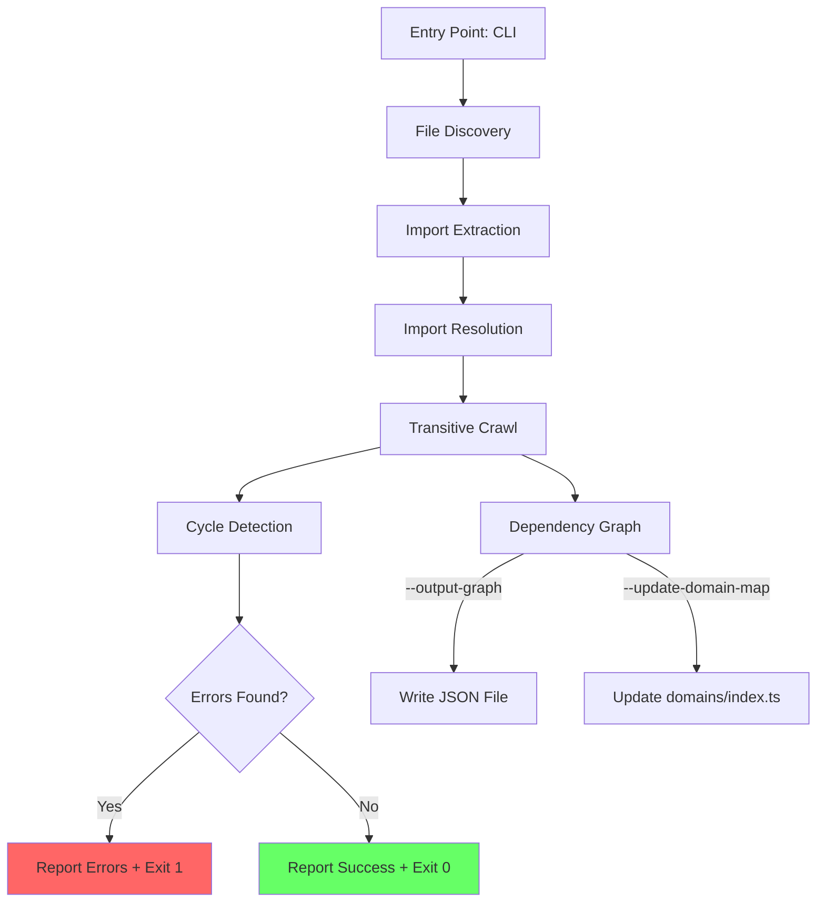

# Design Document: Lambda Import Safety

## Overview

The Import Validator is a single TypeScript script (`scripts/validate-lambda-imports.ts`) that statically analyzes all handler source files under `backend/src/handlers/` to build a complete dependency graph, detect broken imports and circular dependencies, and optionally update the domain map. It integrates into the CI/CD pipeline as a pre-build gate and is also runnable locally by developers.

The script operates entirely on TypeScript source files (not compiled `.js`), uses Node.js `fs` APIs for file resolution, and requires no external dependencies beyond `tsx` for execution.

## Architecture



### Data Flow

1. **File Discovery**: Recursively find all `.ts` files under `backend/src/handlers/` (or a single handler if `--handler` is specified).
2. **Import Extraction**: Parse each file with regex to extract relative import paths (`../../lib/...`, `../../types/...`).
3. **Import Resolution**: For each import path, resolve `.js` → `.ts`, check for `index.ts` in directories, verify file existence.
4. **Transitive Crawl**: For each resolved lib/type file, repeat extraction + resolution recursively. Track visited files to avoid re-processing.
5. **Cycle Detection**: Run DFS on the built graph to find back-edges (cycles).
6. **Reporting**: Output broken imports, cycles, and summary statistics.

## Components and Interfaces

### 1. CLI Entry Point

Parses command-line flags and orchestrates the pipeline.

```typescript
interface CLIOptions {
  handler?: string;        // --handler <path> - validate single handler
  outputGraph?: string;    // --output-graph <path> - write dependency graph JSON
  updateDomainMap?: boolean; // --update-domain-map - update domains/index.ts
}
```

### 2. FileDiscovery

Finds handler `.ts` files to scan.

```typescript
function discoverHandlers(basePath: string, singleHandler?: string): string[]
```

- If `singleHandler` is provided, returns only that file (validated to exist).
- Otherwise, recursively walks `backend/src/handlers/` collecting all `.ts` files, excluding `_templates/`.

### 3. ImportExtractor

Extracts import paths from a TypeScript source file.

```typescript
interface ImportInfo {
  sourcePath: string;   // absolute path of the file containing the import
  importPath: string;   // raw import string (e.g., '../../lib/response.js')
  line: number;         // line number in source file
}

function extractImports(filePath: string): ImportInfo[]
```

Uses regex to match:
- `import ... from '...'`
- `import ... from "..."`
- `require('...')`

Filters to only relative imports (starting with `./` or `../`). Ignores npm packages and Node.js built-ins.

### 4. ImportResolver

Resolves a raw import path to an actual file on disk.

```typescript
interface ResolvedImport {
  sourcePath: string;
  importPath: string;
  resolvedPath: string | null;  // null if broken
  line: number;
  exists: boolean;
}

function resolveImport(sourceDir: string, importPath: string): string | null
```

Resolution strategy:
1. Replace `.js` extension with `.ts`
2. If no extension, try `.ts`, then `/index.ts`
3. Check file existence with `fs.existsSync`
4. Return absolute resolved path or `null` if broken

### 5. DependencyGraphBuilder

Builds the full transitive dependency graph.

```typescript
interface DependencyGraph {
  [handlerPath: string]: string[];  // handler → all transitive lib/type deps
}

interface BrokenImport {
  sourcePath: string;
  importPath: string;
  resolvedAttempt: string;
  line: number;
  chain: string[];  // import chain from handler to broken import
}

function buildDependencyGraph(
  handlers: string[],
  basePath: string
): { graph: DependencyGraph; brokenImports: BrokenImport[] }
```

Uses BFS/DFS from each handler, tracking visited files to avoid cycles during crawl. Records broken imports with the full chain.

### 6. CycleDetector

Detects circular imports in the graph.

```typescript
interface Cycle {
  path: string[];  // e.g., ['A.ts', 'B.ts', 'C.ts', 'A.ts']
}

function detectCycles(adjacencyMap: Map<string, string[]>): Cycle[]
```

Standard DFS with coloring (white/gray/black) to detect back-edges. Reports each unique cycle.

### 7. DomainMapUpdater

Updates `backend/src/domains/index.ts` with actual lib dependencies.

```typescript
function updateDomainMap(
  graph: DependencyGraph,
  domainMapPath: string
): void
```

- Reads the current domain map file
- For each domain, collects all handlers matching the domain's handler globs
- From the dependency graph, collects all unique libs used by those handlers
- Replaces the `sharedLibs` arrays using string replacement (preserves file structure)
- Writes the updated file

### 8. Reporter

Formats and outputs results.

```typescript
interface ValidationResult {
  handlersScanned: number;
  uniqueLibs: number;
  brokenImports: BrokenImport[];
  cycles: Cycle[];
}

function reportResults(result: ValidationResult): void
function writeGraphJson(graph: DependencyGraph, outputPath: string): void
```

## Data Models

### Dependency Graph JSON Schema

```json
{
  "metadata": {
    "generatedAt": "2025-01-15T10:30:00Z",
    "handlersScanned": 194,
    "uniqueLibs": 65,
    "brokenImports": 0,
    "circularDependencies": 0
  },
  "handlers": {
    "backend/src/handlers/security/waf-setup-monitoring.ts": {
      "directImports": [
        "backend/src/lib/middleware.ts",
        "backend/src/types/lambda.ts",
        "backend/src/lib/response.ts"
      ],
      "transitiveImports": [
        "backend/src/lib/middleware.ts",
        "backend/src/types/lambda.ts",
        "backend/src/lib/response.ts",
        "backend/src/lib/environment-config.ts"
      ]
    }
  }
}
```

### Broken Import Report Format

```
❌ BROKEN IMPORTS FOUND:

  backend/src/handlers/security/waf-setup-monitoring.ts:14
    import '../../lib/nonexistent.js'
    → resolved to: backend/src/lib/nonexistent.ts (FILE NOT FOUND)
    chain: waf-setup-monitoring.ts → middleware.ts → nonexistent.ts

  Total: 1 broken import(s) across 1 handler(s)
```

### Cycle Report Format

```
🔄 CIRCULAR IMPORTS DETECTED:

  Cycle 1: auth.ts → database.ts → auth.ts
  Cycle 2: middleware.ts → logging.ts → middleware.ts

  Total: 2 circular dependency cycle(s)
```


## Correctness Properties

*A property is a characteristic or behavior that should hold true across all valid executions of a system — essentially, a formal statement about what the system should do. Properties serve as the bridge between human-readable specifications and machine-verifiable correctness guarantees.*

### Property 1: Import extraction filters correctly

*For any* TypeScript file content containing a mix of relative imports (`../`, `./`) and non-relative imports (npm packages, Node.js built-ins), the `extractImports` function SHALL return exactly the relative imports and none of the non-relative ones.

**Validates: Requirements 1.2, 1.4**

### Property 2: .js to .ts resolution mapping

*For any* import path string ending in `.js`, the resolver SHALL produce a path ending in `.ts` with the same base name and directory structure.

**Validates: Requirements 1.3**

### Property 3: Broken import record completeness

*For any* import that does not resolve to an existing file, the resulting `BrokenImport` record SHALL contain a non-empty `sourcePath`, the original `importPath`, and the `resolvedAttempt` path.

**Validates: Requirements 2.3**

### Property 4: Broken import report completeness

*For any* list of `BrokenImport` records, the formatted report string SHALL contain the source file path and line number of every broken import in the list.

**Validates: Requirements 2.4**

### Property 5: Transitive closure completeness

*For any* directed acyclic graph of file imports, the dependency graph built for a handler SHALL contain every file reachable from that handler through any chain of imports (i.e., it equals the transitive closure of the handler's direct imports).

**Validates: Requirements 3.1, 3.2**

### Property 6: Transitive broken import chain reporting

*For any* broken import found at depth > 1 in the import graph, the reported `chain` array SHALL contain the full path from the root handler to the file containing the broken import, and every consecutive pair in the chain SHALL represent an actual import edge.

**Validates: Requirements 3.3**

### Property 7: Cycle detection completeness

*For any* directed graph containing cycles, the cycle detector SHALL report at least one cycle for every strongly connected component of size ≥ 2.

**Validates: Requirements 4.1**

### Property 8: Cycle path validity

*For any* reported cycle, the first and last elements of the path SHALL be the same node, and every consecutive pair of nodes in the path SHALL represent an actual edge in the import graph.

**Validates: Requirements 4.2**

### Property 9: Dependency graph serialization round-trip

*For any* valid `DependencyGraph` object, serializing it to JSON and then parsing the JSON back SHALL produce an object equivalent to the original.

**Validates: Requirements 5.1, 5.2**

### Property 10: Summary statistics accuracy

*For any* `ValidationResult`, the summary output SHALL contain numbers that exactly match `handlersScanned`, `uniqueLibs`, `brokenImports.length`, and `cycles.length` from the result object.

**Validates: Requirements 5.3**

### Property 11: Domain map libs match dependency graph

*For any* dependency graph and domain configuration, the computed `sharedLibs` for each domain SHALL equal the union of all lib paths used by handlers belonging to that domain (as determined by the domain's handler glob patterns).

**Validates: Requirements 7.1, 7.2**

### Property 12: Domain map update preserves structure

*For any* domain map file, after running the update, the domain names, descriptions, and handler glob arrays SHALL remain identical to the original. Only the `sharedLibs` arrays SHALL differ.

**Validates: Requirements 7.3**

### Property 13: Single handler validation is subset of full

*For any* handler, running validation with `--handler` SHALL produce a dependency set that is a subset of the full dependency graph's entry for that same handler.

**Validates: Requirements 8.3**

## Error Handling

| Error Scenario | Handling Strategy |
|---|---|
| Handler file cannot be read (permissions, encoding) | Log warning with file path, skip file, continue scanning. Include in summary as "skipped". |
| Import path resolves outside `backend/src/` | Ignore the import (treat as external). Do not flag as broken. |
| Circular import during transitive crawl | Track visited files set per crawl. When revisiting, stop recursion (don't infinite loop). Cycles are reported separately by CycleDetector. |
| `--output-graph` target directory doesn't exist | Create parent directories with `mkdirSync({ recursive: true })`. If still fails, report error and exit 1. |
| `--update-domain-map` file not writable | Report error with path and OS error message, exit 1. |
| `--handler` flag points to non-existent file | Report error immediately, exit 1. |
| Regex fails to parse unusual import syntax (dynamic imports, template literals) | Silently skip. The regex targets static `import ... from` and `require()` patterns only. |
| Empty handler directory | Report 0 handlers scanned, exit 0 (no errors). |

## Testing Strategy

### Property-Based Testing

Library: **fast-check** (TypeScript property-based testing library)

Each correctness property from the design will be implemented as a property-based test with minimum 100 iterations. Tests will use `fast-check` arbitraries to generate:

- Random TypeScript file contents with mixed import types
- Random directory structures (as in-memory maps, not actual filesystem)
- Random directed graphs for cycle detection testing
- Random `ValidationResult` objects for summary/report testing

Tag format: **Feature: lambda-import-safety, Property {N}: {title}**

### Unit Testing

Framework: **vitest**

Unit tests will cover:
- Specific examples of import resolution (`.js` → `.ts`, directory → `index.ts`)
- Edge cases: empty files, files with no imports, files with only npm imports
- Exit code behavior: 0 for clean, 1 for broken/cycles
- CLI flag parsing
- Integration test: run validator against the actual `backend/src/handlers/` directory

### Test Organization

Tests will live in `scripts/__tests__/validate-lambda-imports.test.ts` alongside the script, following the project convention of colocated tests.

### Key Testing Decisions

- **No mocks for filesystem in property tests**: Use in-memory representations of file graphs. The actual filesystem interaction is tested via integration tests against the real codebase.
- **Graph algorithms tested in isolation**: `CycleDetector` and transitive closure logic are pure functions over adjacency maps, making them ideal for property-based testing without filesystem dependencies.
- **Integration test against real codebase**: One test runs the full validator against `backend/src/handlers/` to verify it works end-to-end. This catches regressions when new handlers/libs are added.
