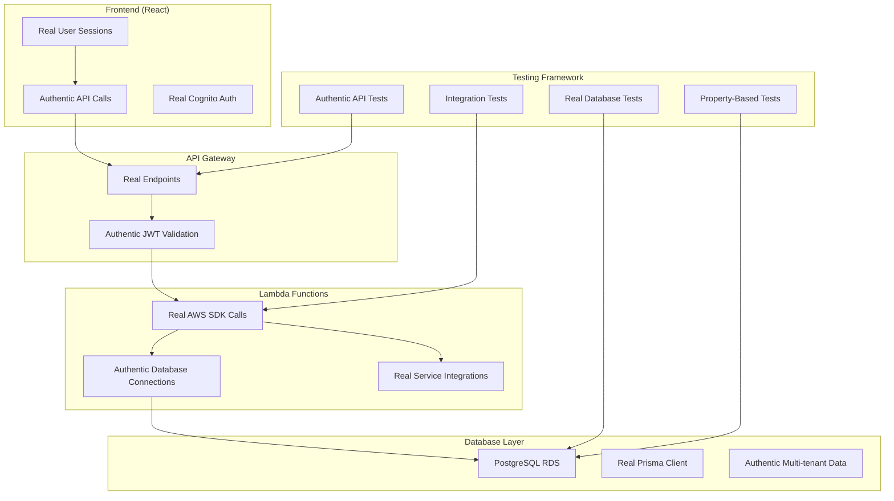

# Design Document: No Mock Data Policy

## Overview

This design establishes a comprehensive system-wide policy and enforcement mechanism to ensure that the AI system never uses simulated, mocked, or fake data in any circumstance. The design covers all aspects of the system including testing frameworks, database interactions, API integrations, and data validation processes.

The system operates on a multi-tenant AWS infrastructure with PostgreSQL database, Lambda functions, and React frontend. All components must adhere to strict real-data-only policies to maintain data integrity and ensure accurate system behavior validation.

## Architecture

### Core Principles

1. **Real Data Only**: All system operations must use authentic data from legitimate sources
2. **No Mocking Layer**: Complete elimination of mocking, stubbing, or simulation layers
3. **Authentic Testing**: All tests must validate against real system components and actual data
4. **Multi-Tenant Isolation**: Real data access must respect organization boundaries
5. **Production Parity**: Development and testing environments must mirror production data patterns

### System Components



## Components and Interfaces

### 1. Data Validation Engine

**Purpose**: Ensures all data sources are authentic and legitimate

**Interface**:
```typescript
interface DataValidator {
  validateDataSource(source: DataSource): ValidationResult;
  verifyAuthenticity(data: any, context: ValidationContext): boolean;
  rejectMockData(data: any): void;
  enforceRealDataPolicy(): void;
}

interface DataSource {
  type: 'database' | 'api' | 'file' | 'user_input';
  origin: string;
  credentials?: AuthCredentials;
  metadata: Record<string, any>;
}

interface ValidationResult {
  isValid: boolean;
  isAuthentic: boolean;
  source: DataSource;
  violations: PolicyViolation[];
}
```

### 2. Testing Framework Enforcer

**Purpose**: Ensures all tests use real data and authentic system components

**Interface**:
```typescript
interface TestingEnforcer {
  validateTestSetup(testConfig: TestConfiguration): void;
  ensureRealDatabaseConnection(): DatabaseConnection;
  verifyAuthenticAPIEndpoints(endpoints: string[]): void;
  rejectMockImplementations(testCode: string): void;
}

interface TestConfiguration {
  framework: 'jest' | 'vitest';
  environment: 'unit' | 'integration';
  dataSource: DataSource;
  mockingDisabled: boolean;
}
```

### 3. Database Connection Manager

**Purpose**: Manages authentic database connections and prevents mock database usage

**Interface**:
```typescript
interface DatabaseManager {
  getAuthenticConnection(): PrismaClient;
  validateConnection(connection: any): boolean;
  enforceMultiTenantIsolation(organizationId: string): void;
  rejectInMemoryDatabases(): void;
}
```

### 4. AWS Service Authenticator

**Purpose**: Ensures all AWS service calls use real credentials and authentic endpoints

**Interface**:
```typescript
interface AWSAuthenticator {
  validateCredentials(credentials: AWSCredentials): boolean;
  ensureRealServiceEndpoints(service: string): void;
  rejectMockSDKResponses(): void;
  verifyServiceAuthenticity(response: any): boolean;
}
```

### 5. User Session Validator

**Purpose**: Ensures all user sessions and authentication are real and legitimate

**Interface**:
```typescript
interface SessionValidator {
  validateCognitoSession(token: string): CognitoUser;
  ensureRealUserContext(userId: string): UserContext;
  rejectFakeAuthentication(): void;
  verifyOrganizationMembership(userId: string, orgId: string): boolean;
}
```

## Data Models

### Policy Violation Tracking

```typescript
interface PolicyViolation {
  id: string;
  type: 'mock_data_detected' | 'fake_authentication' | 'simulated_service';
  severity: 'critical' | 'high' | 'medium' | 'low';
  description: string;
  source: string;
  timestamp: Date;
  organizationId?: string;
  remediation: string;
}
```

### Data Authenticity Record

```typescript
interface DataAuthenticityRecord {
  id: string;
  dataSource: DataSource;
  validationTimestamp: Date;
  isAuthentic: boolean;
  validationMethod: string;
  organizationId: string;
  metadata: Record<string, any>;
}
```

### Test Execution Record

```typescript
interface TestExecutionRecord {
  id: string;
  testName: string;
  testType: 'unit' | 'integration' | 'property';
  usedRealData: boolean;
  dataSourcesUsed: DataSource[];
  executionTime: Date;
  organizationId?: string;
  violations: PolicyViolation[];
}
```

## Correctness Properties

*A property is a characteristic or behavior that should hold true across all valid executions of a system-essentially, a formal statement about what the system should do. Properties serve as the bridge between human-readable specifications and machine-verifiable correctness guarantees.*

After analyzing all acceptance criteria, I've identified several key properties that can be consolidated to eliminate redundancy while maintaining comprehensive coverage:

### Property Reflection

Many of the individual acceptance criteria can be grouped into broader, more comprehensive properties that capture the essential behaviors while avoiding redundant testing:

- **Data Source Authenticity**: Multiple criteria about using real data can be combined into a single comprehensive property
- **Testing Framework Integrity**: All testing-related criteria can be consolidated into properties about test authenticity
- **Service Integration Authenticity**: AWS and external service criteria can be combined
- **Authentication and Authorization Integrity**: User session and permission criteria can be unified
- **System Behavior Validation**: Error handling, performance, and monitoring criteria can be grouped

### Core Properties

**Property 1: Universal Real Data Enforcement**
*For any* data operation performed by the AI system, the data source must be authentic and legitimate, never mocked, simulated, or artificially generated.
**Validates: Requirements 1.1, 1.2, 1.5, 8.3**

**Property 2: Testing Framework Authenticity**
*For any* test execution (unit, integration, or property-based), the test must use real database connections, authentic API endpoints, and legitimate service instances, never mocks or stubs.
**Validates: Requirements 2.1, 2.2, 2.3, 2.4, 2.5**

**Property 3: Database Connection Integrity**
*For any* database operation, the system must use the real PostgreSQL connection via Prisma with authentic multi-tenant isolation, never in-memory databases or mock responses.
**Validates: Requirements 3.1, 3.2, 3.3, 3.4, 3.5**

**Property 4: AWS Service Authentication**
*For any* AWS service interaction, the system must use real AWS credentials, authentic service endpoints, and legitimate responses, never mocked SDK responses or simulated cloud behavior.
**Validates: Requirements 4.1, 4.2, 4.3, 4.4, 4.5**

**Property 5: User Session Authenticity**
*For any* user authentication or authorization operation, the system must use real Cognito users, authentic JWT tokens, and legitimate organization memberships, never fake sessions or simulated authentication.
**Validates: Requirements 5.1, 5.2, 5.3, 5.4, 5.5**

**Property 6: Error and Edge Case Reality**
*For any* error condition or edge case testing, the system must trigger real error scenarios using actual system constraints and authentic boundary conditions, never simulated failures or mock error responses.
**Validates: Requirements 6.1, 6.2, 6.3, 6.4, 6.5**

**Property 7: Performance Testing Authenticity**
*For any* performance or scalability testing, the system must use real database queries, authentic data volumes, and legitimate user interaction patterns, never simulated metrics or mock resource usage.
**Validates: Requirements 7.1, 7.2, 7.3, 7.4, 7.5**

**Property 8: Data Migration Integrity**
*For any* data migration or transformation operation, the system must use real source data, authentic transformation rules, and legitimate validation criteria, never synthetic data or simulated migration processes.
**Validates: Requirements 8.1, 8.2, 8.4, 8.5**

**Property 9: Monitoring System Reality**
*For any* monitoring, alerting, or metrics operation, the system must use real CloudWatch data, authentic system thresholds, and legitimate notification channels, never fake metrics or simulated monitoring events.
**Validates: Requirements 9.1, 9.2, 9.3, 9.4, 9.5**

**Property 10: Compliance and Audit Authenticity**
*For any* compliance checking or audit trail generation, the system must use real regulatory requirements, authentic business processes, and legitimate user actions, never fake audit entries or simulated compliance events.
**Validates: Requirements 10.1, 10.2, 10.3, 10.4, 10.5**

**Property 11: AI Request Rejection**
*For any* request to create mocked implementations, fake data generators, or simulated system components, the AI system must reject the request and provide guidance toward real data alternatives.
**Validates: Requirements 1.4**

**Property 12: Test Code Generation Integrity**
*For any* test code generated by the AI system, the code must validate functionality against actual system components and real data, never against mocked or stubbed implementations.
**Validates: Requirements 1.3**

## Error Handling

### Policy Violation Detection

The system must detect and handle various types of policy violations:

1. **Mock Data Detection**: Identify when mock, fake, or simulated data is being used
2. **Fake Authentication Detection**: Detect simulated user sessions or authentication tokens
3. **Service Mocking Detection**: Identify when external services are being mocked or stubbed
4. **Database Simulation Detection**: Detect in-memory databases or mock database responses

### Violation Response Strategy

```typescript
interface ViolationHandler {
  detectViolation(operation: SystemOperation): PolicyViolation[];
  handleViolation(violation: PolicyViolation): ViolationResponse;
  preventViolation(operation: SystemOperation): void;
  reportViolation(violation: PolicyViolation): void;
}

enum ViolationResponse {
  BLOCK_OPERATION = 'block',
  REDIRECT_TO_REAL_DATA = 'redirect',
  REQUEST_USER_GUIDANCE = 'request_guidance',
  LOG_AND_CONTINUE = 'log_continue'
}
```

### Error Recovery Procedures

1. **Data Source Redirection**: When mock data is detected, redirect to authentic data sources
2. **Service Reconnection**: When service mocking is detected, establish real service connections
3. **User Notification**: Inform users when operations are blocked due to policy violations
4. **Alternative Suggestions**: Provide guidance on how to achieve goals using real data

## Testing Strategy

### Dual Testing Approach

The system requires both unit tests and property-based tests to ensure comprehensive coverage:

- **Unit tests**: Verify specific examples, edge cases, and error conditions using real data
- **Property tests**: Verify universal properties across all inputs using authentic data sources
- Both approaches are complementary and necessary for complete validation

### Property-Based Testing Configuration

- **Framework**: Jest with fast-check for property-based testing
- **Minimum iterations**: 100 per property test to ensure comprehensive coverage
- **Test tagging**: Each property test must reference its design document property
- **Tag format**: `Feature: no-mock-data-policy, Property {number}: {property_text}`

### Testing Implementation Requirements

1. **Real Database Testing**: All database tests must connect to actual PostgreSQL instance
2. **Authentic API Testing**: All API tests must call real deployed endpoints
3. **Legitimate Service Testing**: All external service tests must use real service instances
4. **Multi-tenant Testing**: All tests must respect real organization boundaries
5. **Performance Testing**: All performance tests must use real workloads and authentic data

### Test Data Management

- **Real Data Sources**: Tests must use production-like data from legitimate sources
- **Data Anonymization**: When using real data, ensure proper anonymization for privacy
- **Tenant Isolation**: Ensure test data respects multi-tenant boundaries
- **Data Cleanup**: Implement proper cleanup procedures for test data

### Continuous Validation

- **Pre-commit Hooks**: Validate that no mocking libraries are introduced
- **CI/CD Pipeline**: Ensure all tests use real data sources
- **Runtime Monitoring**: Continuously monitor for policy violations during execution
- **Audit Logging**: Log all data source usage for compliance verification

Now I'll use the prework tool to analyze the acceptance criteria before writing the correctness properties:

<function_calls>
<invoke name="prework">
<parameter name="featureName">no-mock-data-policy