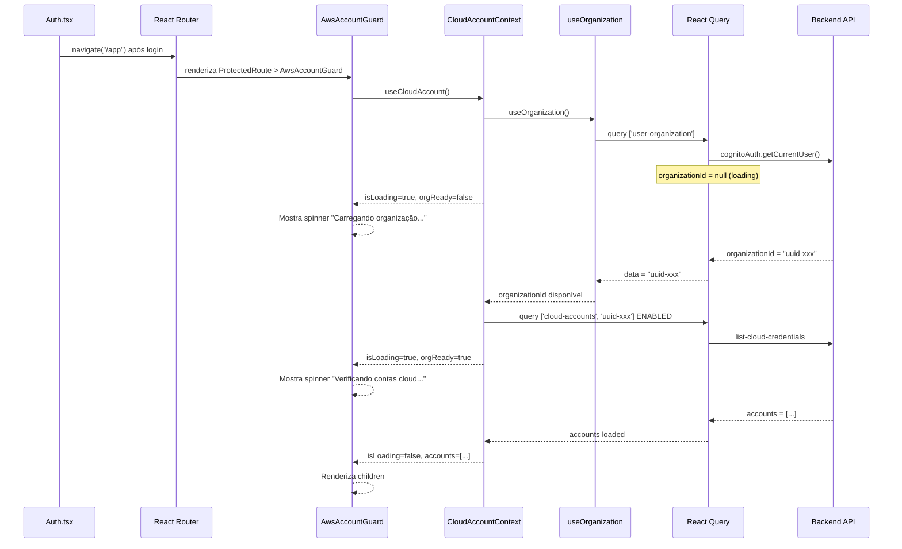

# Design: Correção de Carregamento de Contas Pós-Login

## Visão Geral

Este design aborda a race condition entre o carregamento assíncrono do `organizationId` (via Cognito) e as queries de contas cloud que dependem desse ID. A correção é inteiramente no frontend (React 18 + TanStack Query), sem alterações no backend.

A estratégia central é garantir que o React Query reaja corretamente à transição do `organizationId` de `null` para um valor válido, e que o `AwsAccountGuard` distinga entre "ainda carregando" e "sem contas".

## Arquitetura



## Componentes e Interfaces

### 1. CloudAccountContext — Correção da Reatividade da Query

**Problema atual:** A query usa `enabled: !!organizationId`, mas quando `organizationId` transiciona de `null` para um valor válido após o login, o React Query nem sempre re-dispara a query automaticamente.

**Solução:** Adicionar um `useEffect` que chama `refetch()` explicitamente quando `organizationId` transiciona de `null/undefined` para um valor válido. Também expor `orgLoading` separadamente para que consumidores possam distinguir os estados.

```typescript
// CloudAccountContext.tsx — mudanças

// Rastrear transição do organizationId
const prevOrgIdRef = useRef<string | null | undefined>(undefined);

useEffect(() => {
  const prevVal = prevOrgIdRef.current;
  prevOrgIdRef.current = organizationId;
  
  // Se organizationId transitou de null/undefined para um valor válido, forçar refetch
  if (!prevVal && organizationId && !isPublicPage) {
    refetch();
  }
}, [organizationId, isPublicPage, refetch]);

// Expor estado granular
interface CloudAccountContextType {
  // ... campos existentes ...
  orgLoading: boolean;  // NOVO: organização ainda carregando
}
```

### 2. AwsAccountContext — Mesma Correção de Reatividade

**Problema atual:** Mesmo padrão de `enabled: !!organizationId` sem refetch explícito na transição.

**Solução:** Aplicar a mesma lógica de refetch na transição do `organizationId`.

```typescript
// AwsAccountContext.tsx — mudanças

const prevOrgIdRef = useRef<string | null | undefined>(undefined);

useEffect(() => {
  const prevVal = prevOrgIdRef.current;
  prevOrgIdRef.current = organizationId;
  
  if (!prevVal && organizationId) {
    refetch();
  }
}, [organizationId, refetch]);
```

### 3. AwsAccountGuard — Proteção contra Redirecionamento Prematuro

**Problema atual:** O guard verifica `accounts.length > 0` sem distinguir entre "organização ainda carregando" (accounts vazio porque query nem rodou) e "sem contas" (query rodou e retornou vazio).

**Solução:** Usar `orgLoading` do CloudAccountContext para bloquear a avaliação de redirecionamento até que a organização esteja carregada.

```typescript
// AwsAccountGuard.tsx — mudanças

const { accounts, isLoading: accountsLoading, orgLoading, error } = useCloudAccount();

useEffect(() => {
  if (isExemptPath) return;
  
  // Aguardar organização carregar ANTES de avaliar contas
  if (orgLoading) return;
  
  if (licenseLoading || accountsLoading || demoLoading || error) return;
  
  // ... resto da lógica existente
}, [orgLoading, /* ... deps existentes */]);

// Loading state também considera orgLoading
if (licenseLoading || orgLoading || accountsLoading || demoLoading || !effectiveDemoVerified) {
  return (
    <div className="...">
      <p className="text-slate-300">
        {licenseLoading ? 'Verificando licença...' : 
         orgLoading ? 'Carregando organização...' :
         demoLoading || !effectiveDemoVerified ? 'Verificando modo de demonstração...' :
         'Verificando contas cloud...'}
      </p>
    </div>
  );
}
```

### 4. Auth.tsx — Invalidação de Cache Pós-Login

**Problema atual:** Após login bem-sucedido, o cache do React Query pode conter dados stale de uma sessão anterior ou estado vazio.

**Solução:** Invalidar queries de contas cloud antes de navegar para `/app`.

```typescript
// Auth.tsx — mudanças no handleLogin e handleMFAVerified

const queryClient = useQueryClient();

// Antes de navigate("/app"):
queryClient.invalidateQueries({ queryKey: ['cloud-accounts'] });
queryClient.invalidateQueries({ queryKey: ['aws-accounts'] });
```

## Modelos de Dados

Não há alterações em modelos de dados. As interfaces existentes (`CloudAccount`, `AwsAccount`, `CloudAccountContextType`) são mantidas, com a adição de um campo `orgLoading: boolean` ao `CloudAccountContextType`.

```typescript
// Adição ao CloudAccountContextType existente
interface CloudAccountContextType {
  // ... todos os campos existentes permanecem ...
  orgLoading: boolean;  // true enquanto useOrganization está carregando
}
```


## Propriedades de Corretude

*Uma propriedade é uma característica ou comportamento que deve ser verdadeiro em todas as execuções válidas de um sistema — essencialmente, uma declaração formal sobre o que o sistema deve fazer. Propriedades servem como ponte entre especificações legíveis por humanos e garantias de corretude verificáveis por máquina.*

### Property 1: Reatividade da query na transição do organizationId

*Para qualquer* context de contas cloud (CloudAccountContext ou AwsAccountContext), quando o organizationId transiciona de null/undefined para um UUID válido, a query de contas DEVE ser disparada (refetch chamado).

**Validates: Requirements 1.1, 4.1**

### Property 2: Query desabilitada enquanto organizationId é null

*Para qualquer* estado onde organizationId é null ou undefined, a query de contas cloud DEVE estar desabilitada (enabled=false) e o resultado NÃO DEVE ser tratado como "sem contas".

**Validates: Requirements 1.2**

### Property 3: Invariante do isLoading

*Para qualquer* combinação de estados orgLoading e accountsLoading, o isLoading do CloudAccountContext DEVE ser igual a (orgLoading OR accountsLoading). Quando ambos são false, isLoading é false. Quando qualquer um é true, isLoading é true.

**Validates: Requirements 2.1, 2.2, 2.3**

### Property 4: Guard não redireciona durante loading

*Para qualquer* estado onde isLoading é true (seja por orgLoading ou accountsLoading), o AwsAccountGuard NÃO DEVE chamar navigate() para /cloud-credentials e DEVE renderizar um indicador de loading.

**Validates: Requirements 3.1, 3.2, 5.1**

### Property 5: Guard renderiza children quando carregado com contas

*Para qualquer* array de contas não-vazio, quando isLoading é false e a licença é válida, o AwsAccountGuard DEVE renderizar os componentes filhos.

**Validates: Requirements 3.3**

### Property 6: Context propaga resultados da API

*Para qualquer* conjunto de contas retornado pela API, o CloudAccountContext DEVE expor exatamente essas contas (após normalização) no seu estado `accounts`.

**Validates: Requirements 1.3**

## Tratamento de Erros

| Cenário | Comportamento |
|---------|--------------|
| useOrganization falha (sessão expirada) | useOrganization redireciona para /auth via useEffect existente. AwsAccountGuard NÃO redireciona para /cloud-credentials. |
| Account query falha | React Query faz retry até 2x. Após falhas, error é exposto no context. Guard mostra loading durante retries. |
| organizationId nunca chega (timeout) | O guard continua mostrando spinner. O timeout de 10s do demo mode eventualmente desbloqueia o fluxo não-demo. |
| Cache stale após login | Auth.tsx invalida queries de cloud-accounts e aws-accounts antes de navegar para /app. |
| Request abortado (navegação) | Handlers existentes de ERR_ABORTED retornam array vazio sem erro. Query será re-disparada na próxima montagem. |

## Estratégia de Testes

### Abordagem

Esta correção é inteiramente frontend (React hooks e contexts). Os testes usarão:

- **Vitest** como test runner
- **React Testing Library** para renderização de componentes
- **fast-check** como biblioteca de property-based testing
- **Mock do React Query** para simular estados de loading/success/error

### Testes Unitários (exemplos específicos)

1. **Cache invalidation pós-login**: Verificar que `queryClient.invalidateQueries` é chamado com as keys corretas após login bem-sucedido (Req 5.2)
2. **Guard redireciona quando sem contas**: Quando loading completo e accounts=[], verificar redirect para /cloud-credentials (Req 3.4)
3. **Guard delega erro de org ao auth flow**: Quando useOrganization falha, guard não redireciona para /cloud-credentials (Req 3.5)
4. **Retry configuração**: Verificar que a query tem retry=2 para erros não-auth (Req 1.4)
5. **Cache hit no refresh**: Quando sessão Cognito existe, useOrganization retorna do cache (Req 5.3)

### Testes de Propriedade (property-based)

Cada propriedade de corretude será implementada como um único teste de propriedade usando `fast-check`:

- Mínimo 100 iterações por teste
- Cada teste referencia a propriedade do design: `// Feature: post-login-account-loading-fix, Property N: <título>`
- Generators criarão combinações aleatórias de estados (orgLoading, accountsLoading, accounts[], organizationId)

### Cobertura de Requisitos

| Requisito | Tipo de Teste |
|-----------|--------------|
| 1.1, 4.1 | Property 1 |
| 1.2 | Property 2 |
| 1.3 | Property 6 |
| 1.4 | Unit test |
| 2.1, 2.2, 2.3 | Property 3 |
| 2.4 | Verificação de interface (code review) |
| 3.1, 3.2, 5.1 | Property 4 |
| 3.3 | Property 5 |
| 3.4 | Unit test |
| 3.5 | Unit test |
| 4.2 | Code review |
| 4.3 | Coberto por Property 3 |
| 5.2 | Unit test |
| 5.3 | Unit test |
