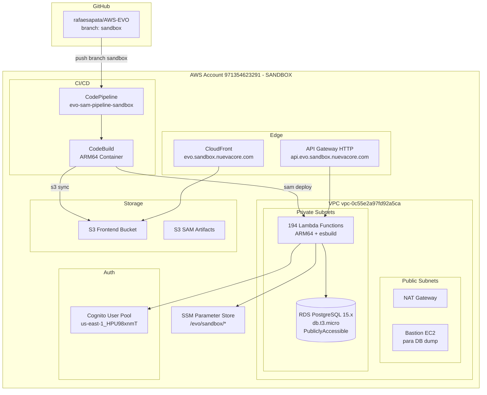

# Design — Sandbox Environment Deployment

## Overview

Este design detalha a criação de um ambiente SANDBOX completo na conta AWS `971354623291` que replica o ambiente de produção (`523115032346`). A abordagem é baseada em scripts de infraestrutura (CloudFormation/SAM) já existentes, parametrizados por ambiente, com ajustes para redução de custos e correção de domínios hardcoded.

A estratégia principal é:
1. Provisionar infraestrutura base (VPC, RDS, Cognito) via CloudFormation ou manualmente via CLI
2. Corrigir o `buildspec-sam.yml` para usar domínios corretos no sandbox
3. Corrigir defaults hardcoded no SAM template
4. Configurar SSM Parameters para o sandbox
5. Configurar CI/CD pipeline na branch `sandbox`
6. Fazer dump/restore do banco de produção
7. Configurar DNS e custom domains
8. Validar o ambiente completo

### Decisões de Design

- **Não usar CDK para sandbox**: O CDK (`infra/`) está configurado para `development` e `production`. O sandbox já existe parcialmente (VPC, Cognito, RDS) conforme documentado em `infrastructure.md`. Vamos usar os recursos existentes e scripts CLI/CloudFormation.
- **SAM template compartilhado**: O mesmo `sam/production-lambdas-only.yaml` é usado para ambos ambientes, parametrizado via `Environment` parameter.
- **Buildspec compartilhado**: O mesmo `cicd/buildspec-sam.yml` já tem lógica condicional para sandbox vs production. Precisamos corrigir os domínios hardcoded.
- **Pipeline separado**: Cada ambiente tem seu próprio CodePipeline, criado via `cicd/cloudformation/sam-pipeline-stack.yaml`.

## Arquitetura



## Componentes e Interfaces

### 1. Correção do Buildspec (`cicd/buildspec-sam.yml`)

O buildspec atual tem domínios hardcoded para produção no bloco `else` (sandbox). Precisa ser corrigido:

**Mudanças necessárias no bloco sandbox:**
```yaml
# ANTES (incorreto - usa domínios de produção):
export AZURE_OAUTH_REDIRECT_URI="https://evo.nuevacore.com/azure/callback"
export APP_DOMAIN="evo.nuevacore.com"
export API_DOMAIN="api.evo.nuevacore.com"
# ...
export VITE_API_BASE_URL=https://igyifo56v7.execute-api.us-east-1.amazonaws.com/prod

# DEPOIS (correto - usa domínios de sandbox):
export AZURE_OAUTH_REDIRECT_URI="https://evo.sandbox.nuevacore.com/azure/callback"
export APP_DOMAIN="evo.sandbox.nuevacore.com"
export API_DOMAIN="api.evo.sandbox.nuevacore.com"
# ...
export VITE_API_BASE_URL=https://api.evo.sandbox.nuevacore.com
```

**Mudança no bloco de custom domain mapping (post_build):**
Adicionar lógica para sandbox custom domain mapping, similar à de produção.

### 2. Correção do SAM Template (`sam/production-lambdas-only.yaml`)

Os defaults dos parâmetros `AppDomain`, `ApiDomain` e `AzureOAuthRedirectUri` apontam para produção. Devem ser removidos ou tornados vazios para forçar passagem explícita via buildspec:

```yaml
# ANTES:
AzureOAuthRedirectUri:
  Default: 'https://evo.nuevacore.com/azure/callback'
AppDomain:
  Default: 'evo.nuevacore.com'
ApiDomain:
  Default: 'api.evo.nuevacore.com'

# DEPOIS (sem defaults de produção):
AzureOAuthRedirectUri:
  Default: ''
AppDomain:
  Default: ''
ApiDomain:
  Default: ''
```

### 3. SSM Parameters Setup Script

Criar script `scripts/setup-sandbox-ssm.sh` para configurar todos os parâmetros SSM necessários:

```bash
#!/bin/bash
# Parâmetros a criar em /evo/sandbox/:
# - token-encryption-key (SecureString) - gerar novo com openssl
# - azure-oauth-client-secret (SecureString) - copiar de produção ou gerar novo
# - webauthn-rp-id (String) = "nuevacore.com"
# - webauthn-rp-name (String) = "EVO Platform (Sandbox)"
```

### 4. Database Dump/Restore Script

Criar script `scripts/sandbox-db-restore.sh` para:
1. Conectar ao bastion de produção via SSH
2. Executar `pg_dump` no RDS de produção
3. Transferir o dump para o sandbox
4. Executar `pg_restore` no RDS do sandbox

```
Produção RDS: evo-uds-v3-prod-postgres.cib8kysoo015.us-east-1.rds.amazonaws.com
Sandbox RDS:  evo-uds-v3-sandbox-postgres.c070y4ceohf7.us-east-1.rds.amazonaws.com
Database:     evouds
User:         evoadmin
```

### 5. Pipeline Stack Deploy

Usar o template existente `cicd/cloudformation/sam-pipeline-stack.yaml` com parâmetros para sandbox:

```bash
aws cloudformation deploy \
  --template-file cicd/cloudformation/sam-pipeline-stack.yaml \
  --stack-name evo-sam-pipeline-sandbox \
  --parameter-overrides \
    Environment=sandbox \
    GitHubOwner=rafaesapata \
    GitHubRepo=AWS-EVO \
    GitHubBranch=sandbox \
    GitHubConnectionArn=<connection-arn> \
  --capabilities CAPABILITY_NAMED_IAM \
  --profile EVO_SANDBOX
```

### 6. Custom Domain Setup

**API Gateway Custom Domain:**
- Domínio: `api.evo.sandbox.nuevacore.com`
- Certificado: Wildcard `*.sandbox.nuevacore.com` ou `*.nuevacore.com` (já existente)
- Tipo: REGIONAL
- Mapeamento: API Gateway HTTP API → Stage `prod`

**CloudFront Custom Domain:**
- Domínio: `evo.sandbox.nuevacore.com`
- Certificado: Mesmo wildcard
- Distribuição: `E93EL7AJZ6QAQ` (já existente)

**DNS (Route53):**
- `evo.sandbox.nuevacore.com` → ALIAS para CloudFront `dikd2ie8x3ihv.cloudfront.net`
- `api.evo.sandbox.nuevacore.com` → ALIAS para API Gateway regional endpoint

### 7. Verificação Script

Criar script `scripts/verify-sandbox.sh` que valida:
- Todas as 194 Lambdas estão Active
- API Gateway responde em `https://api.evo.sandbox.nuevacore.com`
- Frontend carrega em `https://evo.sandbox.nuevacore.com`
- RDS aceita conexões
- Health check retorna 200

## Data Models

### Configuração de Ambiente (Parâmetros)

| Parâmetro | Produção | Sandbox |
|-----------|----------|---------|
| AWS Account | `523115032346` | `971354623291` |
| Environment | `production` | `sandbox` |
| APP_DOMAIN | `evo.nuevacore.com` | `evo.sandbox.nuevacore.com` |
| API_DOMAIN | `api.evo.nuevacore.com` | `api.evo.sandbox.nuevacore.com` |
| AZURE_OAUTH_REDIRECT_URI | `https://evo.nuevacore.com/azure/callback` | `https://evo.sandbox.nuevacore.com/azure/callback` |
| VITE_API_BASE_URL | `https://api.evo.nuevacore.com` | `https://api.evo.sandbox.nuevacore.com` |
| VITE_CLOUDFRONT_DOMAIN | `evo.nuevacore.com` | `evo.sandbox.nuevacore.com` |
| Cognito Pool | `us-east-1_BUJecylbm` | `us-east-1_HPU98xnmT` |
| Cognito Client | `a761ofnfjjo7u5mhpe2r54b7j` | `6gls4r44u96v6o0mkm1l6sbmgd` |
| RDS Instance | `db.t3.medium` | `db.t3.micro` |
| RDS MultiAZ | `true` | `false` |
| RDS Endpoint | `evo-uds-v3-prod-postgres.cib8kysoo015...` | `evo-uds-v3-sandbox-postgres.c070y4ceohf7...` |
| VPC | `vpc-07424c3d1d6fb2dc6` | `vpc-0c55e2a97fd92a5ca` |
| Lambda SG | `sg-066e845f73d46814d` | `sg-0f14fd661fc5c41ba` |
| Private Subnet 1 | `subnet-0494b6594914ba898` | `subnet-0edbe4968ff3a5a9e` |
| Private Subnet 2 | `subnet-0f68017cc0b95edda` | `subnet-01931c820b0b0e864` |
| CloudFront Dist | `E2NW0IZ2OX493I` | `E93EL7AJZ6QAQ` |
| S3 Frontend | `evo-uds-v3-production-frontend-523115032346` | `evo-uds-v3-sandbox-frontend-971354623291` |
| S3 Artifacts | `evo-sam-artifacts-523115032346` | `evo-sam-artifacts-971354623291` |
| WEBAUTHN_RP_ID | `nuevacore.com` | `nuevacore.com` |
| STORAGE_ENCRYPTION_KEY | `evo-uds-v3-production-secure-key-2024` | `evo-uds-v3-sandbox-secure-key-2024` |

### Arquivos a Modificar

| Arquivo | Mudança |
|---------|---------|
| `cicd/buildspec-sam.yml` | Corrigir domínios sandbox, adicionar custom domain mapping |
| `sam/production-lambdas-only.yaml` | Remover defaults hardcoded de domínio |
| `.env.development` | Atualizar VITE_API_BASE_URL para custom domain |
| `scripts/setup-sandbox-ssm.sh` | Novo - configurar SSM parameters |
| `scripts/sandbox-db-restore.sh` | Novo - dump/restore do banco |
| `scripts/verify-sandbox.sh` | Novo - verificação do ambiente |
| `.kiro/steering/infrastructure.md` | Atualizar com informações completas do sandbox |


## Correctness Properties

*Uma propriedade é uma característica ou comportamento que deve ser verdadeiro em todas as execuções válidas de um sistema — essencialmente, uma declaração formal sobre o que o sistema deve fazer. Propriedades servem como ponte entre especificações legíveis por humanos e garantias de correção verificáveis por máquina.*

A maioria dos requisitos deste feature são verificações pontuais de infraestrutura (exemplos), não propriedades universais. As propriedades abaixo capturam as invariantes mais valiosas:

### Property 1: Todas as Lambdas do sandbox estão Active e com arquitetura ARM64

*Para toda* Lambda function com prefixo `evo-uds-v3-sandbox-*` na conta `971354623291`, a função deve estar no estado `Active` e ter arquitetura `arm64`.

**Validates: Requirements 6.1, 6.2, 10.1**

### Property 2: Todas as Lambdas do sandbox estão na VPC correta

*Para toda* Lambda function com prefixo `evo-uds-v3-sandbox-*`, a VPC configuration deve referenciar as subnets privadas do sandbox (`subnet-0edbe4968ff3a5a9e`, `subnet-01931c820b0b0e864`) e o security group `sg-0f14fd661fc5c41ba`.

**Validates: Requirements 6.3**

### Property 3: Nenhuma Lambda do sandbox referencia domínios de produção

*Para toda* Lambda function com prefixo `evo-uds-v3-sandbox-*`, nenhuma variável de ambiente deve conter `evo.nuevacore.com` sem o prefixo `sandbox` (exceto `nuevacore.com` usado como WEBAUTHN_RP_ID). Especificamente, APP_DOMAIN deve ser `evo.sandbox.nuevacore.com` e API_DOMAIN deve ser `api.evo.sandbox.nuevacore.com`.

**Validates: Requirements 6.6, 9.1, 9.2, 9.3, 9.4**

## Error Handling

| Cenário | Tratamento |
|---------|------------|
| Dump de produção falha | Script reporta erro com detalhes, permite retry manual |
| Lambda deploy falha | SAM deploy com `--no-fail-on-empty-changeset`, CloudFormation rollback automático |
| Custom domain já existe | Script verifica existência antes de criar, atualiza mapping se necessário |
| SSM parameter já existe | Usa `--overwrite` flag no `aws ssm put-parameter` |
| Pipeline falha no build | SNS notification via topic `evo-sam-pipeline-notifications-sandbox` |
| RDS conexão falha | Verificar Security Group, VPC config, e DATABASE_URL no script de verificação |
| Cognito User Pool não encontrado | Buildspec falha com mensagem clara indicando Pool ID incorreto |

## Testing Strategy

### Abordagem

Este feature é primariamente de infraestrutura, então a estratégia de testes foca em:

1. **Scripts de verificação** (shell scripts) que validam o estado da infraestrutura via AWS CLI
2. **Property-based tests** para as 3 propriedades identificadas, usando a AWS SDK para listar e verificar Lambdas
3. **Testes manuais** de fluxo end-to-end (login, API calls, frontend)

### Property-Based Tests

Usar `vitest` com `fast-check` para gerar testes que verificam as propriedades sobre todas as Lambdas:

- **Biblioteca PBT**: `fast-check` (já disponível no projeto via vitest)
- **Mínimo 100 iterações**: Não aplicável diretamente pois estamos iterando sobre um conjunto finito (194 Lambdas), mas cada Lambda é verificada
- **Tag format**: `Feature: sandbox-environment-deployment, Property N: <description>`

### Unit Tests

Testes unitários para:
- Script de verificação do buildspec (parsing e validação de domínios)
- Validação de que o SAM template não contém defaults hardcoded
- Validação de que `.env.development` contém os valores corretos

### Verificação Manual

Script `scripts/verify-sandbox.sh` que executa checklist completo:
1. Lista todas as Lambdas e verifica estado
2. Faz HTTP request ao health check
3. Verifica DNS resolution dos custom domains
4. Testa conexão ao RDS
5. Verifica Cognito authentication flow
