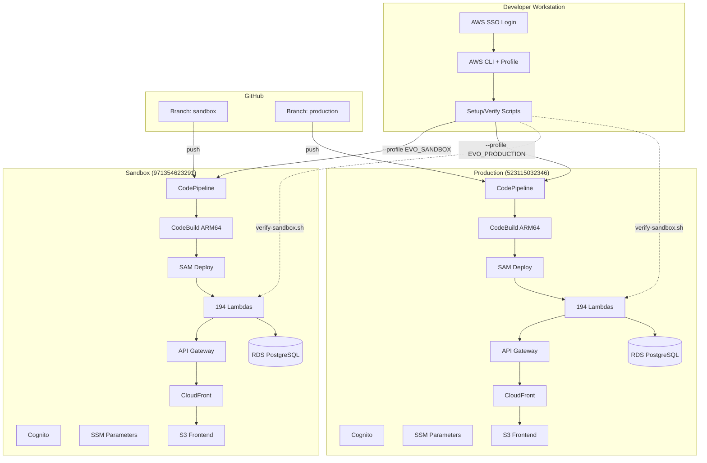
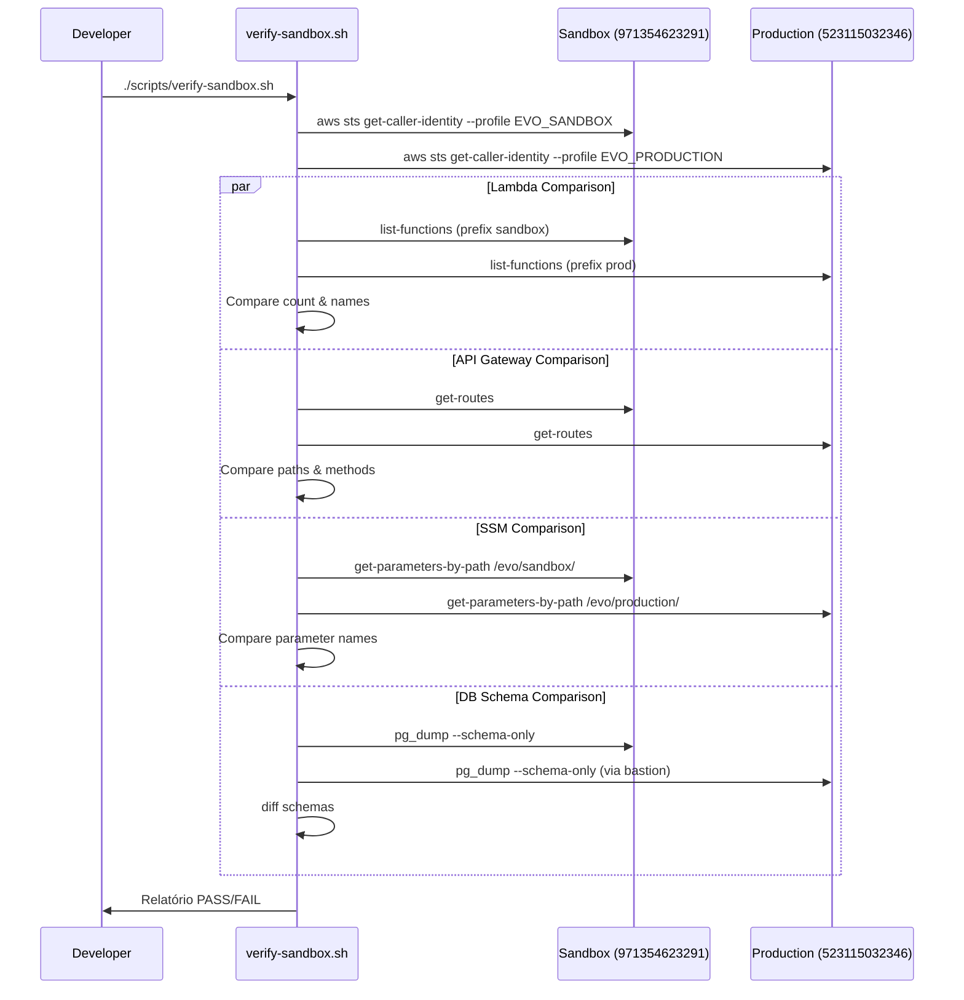

# Design — Sandbox Environment Setup

## Overview

Este design cobre duas frentes: (1) atualização dos steering docs para documentar acesso via AWS SSO e (2) garantia de paridade entre sandbox (`971354623291`) e produção (`523115032346`).

O ambiente sandbox já está provisionado com VPC, RDS, Cognito, CloudFront, API Gateway, Pipeline e Lambda Layer. O foco é validar paridade, corrigir divergências, e documentar o acesso via SSO.

### Decisões de Design

1. **Script de verificação em Bash**: O `verify-sandbox.sh` já existe e usa AWS CLI. O design estende esse script para incluir comparação cross-account (sandbox vs produção), mantendo a mesma linguagem e padrão.
2. **Steering docs como fonte de verdade**: `deployment-rules.md` e `infrastructure.md` são os documentos canônicos. Todas as informações de SSO, paridade e diferenças esperadas ficam neles.
3. **SAM template compartilhado**: O `sam/production-lambdas-only.yaml` é parametrizado por `Environment`. Não há template separado para sandbox.
4. **CI/CD condicional**: O `cicd/buildspec-sam.yml` já possui lógica condicional por `ENVIRONMENT`. O design não altera essa estrutura, apenas documenta.

## Architecture



### Fluxo de Verificação Cross-Account



## Components and Interfaces

### 1. Steering Docs (Documentação)

#### deployment-rules.md
- Nova seção "Acesso via AWS SSO" com comandos de login
- Documentação de `sam deploy --config-env sandbox`
- Novo item na tabela de troubleshooting (ExpiredTokenException)
- Referência aos scripts de setup que requerem SSO

#### infrastructure.md
- Nova seção "Acesso via AWS SSO" com exemplo de `~/.aws/config`
- Comando de verificação de sessão (`aws sts get-caller-identity`)
- Tabela de Resource IDs atualizada
- Tabela de Diferenças Esperadas mantida e documentada

### 2. Script de Verificação (`scripts/verify-sandbox.sh`)

O script existente já verifica 8 checks no sandbox. O design estende para incluir comparação cross-account:

| Check | Atual | Novo |
|-------|-------|------|
| Lambda count & state | ✅ Sandbox only | ✅ + Comparação com produção |
| Lambda ARM64 | ✅ Sandbox only | ✅ (mantém) |
| Lambda VPC config | ✅ Sandbox only | ✅ (mantém) |
| No prod domain refs | ✅ Sandbox only | ✅ (mantém) |
| API Gateway health | ✅ Sandbox only | ✅ + Comparação de rotas |
| CloudFront frontend | ✅ Sandbox only | ✅ (mantém) |
| RDS connectivity | ✅ Sandbox only | ✅ + Comparação de schema |
| SSM parameters | ✅ Sandbox only | ✅ + Comparação com produção |
| Diferenças esperadas | ❌ | ✅ Novo: ignora diferenças documentadas |

#### Interface CLI

```bash
# Verificação somente sandbox (modo atual)
./scripts/verify-sandbox.sh

# Verificação cross-account (novo)
./scripts/verify-sandbox.sh --compare

# Opções existentes mantidas
./scripts/verify-sandbox.sh --dry-run
./scripts/verify-sandbox.sh --verbose
./scripts/verify-sandbox.sh --compare --verbose
```

#### Saída do Relatório

```
[HH:MM:SS] ==========================================
[HH:MM:SS]   Sandbox Environment Verification
[HH:MM:SS] ==========================================
[HH:MM:SS] ✅ PASS — All 194 Lambdas are Active
[HH:MM:SS] ✅ PASS — Lambda count matches production (194/194)
[HH:MM:SS] ✅ PASS — All API routes match production
[HH:MM:SS] ✅ PASS — All SSM parameters have equivalents
[HH:MM:SS] ❌ FAIL — DB schema differs: missing table "new_feature"
[HH:MM:SS] ⏭️  SKIP — Ignoring expected difference: RDS instance size
[HH:MM:SS] ==========================================
[HH:MM:SS]   ✅ 4  ❌ 1  ⏭️ 1  📊 6
[HH:MM:SS] ==========================================
```

### 3. Componentes de Infraestrutura (Paridade)

Todos os componentes abaixo usam o mesmo SAM template parametrizado:

| Componente | Template/Config | Parametrização |
|-----------|----------------|----------------|
| 194 Lambdas | `sam/production-lambdas-only.yaml` | `Environment`, `DatabaseUrl`, `CognitoUserPoolId`, etc. |
| API Gateway | SAM template (HttpApi) | `CognitoUserPoolId`, `CognitoClientId` (JWT Authorizer) |
| Lambda Layer | SAM template (DependenciesLayer) | `ProjectName`, `Environment` |
| IAM Role | SAM template (LambdaExecutionRole) | `ProjectName`, `Environment` |

Componentes fora do SAM (provisionados separadamente):

| Componente | Provisionamento | Script de Setup |
|-----------|----------------|-----------------|
| Cognito User Pool | Manual/CloudFormation | N/A (já existe) |
| RDS PostgreSQL | Manual/CloudFormation | `sandbox-db-restore.sh` |
| CloudFront | Manual/CloudFormation | `setup-sandbox-cloudfront.sh` |
| S3 Frontend | Manual/CloudFormation | N/A (criado com CloudFront) |
| SSM Parameters | Script | `setup-sandbox-ssm.sh` |
| Custom Domain API | Script | `setup-sandbox-api-domain.sh` |
| CI/CD Pipeline | CloudFormation | `setup-sandbox-pipeline.sh` |

## Data Models

### SSM Parameters (Paridade)

Estrutura de parâmetros que devem existir em ambos os ambientes:

| Parâmetro | Sandbox Path | Production Path | Tipo | Valor Compartilhado? |
|-----------|-------------|-----------------|------|---------------------|
| Token Encryption Key | `/evo/sandbox/token-encryption-key` | `/evo/production/token-encryption-key` | SecureString | ❌ Exclusivo por ambiente |
| Azure OAuth Secret | `/evo/sandbox/azure-oauth-client-secret` | `/evo/production/azure-oauth-client-secret` | SecureString | ❌ Exclusivo por ambiente |
| WebAuthn RP ID | `/evo/sandbox/webauthn-rp-id` | `/evo/production/webauthn-rp-id` | String | ✅ `nuevacore.com` |
| WebAuthn RP Name | `/evo/sandbox/webauthn-rp-name` | `/evo/production/webauthn-rp-name` | String | ❌ Diferente (inclui "Sandbox") |
| SES Access Key | `/evo/sandbox/ses-access-key-id` | `/evo/production/ses-access-key-id` | SecureString | Pode compartilhar |
| SES Secret Key | `/evo/sandbox/ses-secret-access-key` | `/evo/production/ses-secret-access-key` | SecureString | Pode compartilhar |
| MemoryDB Endpoint | `/evo-uds/sandbox/memorydb/endpoint` | `/evo-uds/production/memorydb/endpoint` | String | ❌ Exclusivo por ambiente |

### Variáveis de Ambiente Lambda (Diferenças por Ambiente)

| Variável | Sandbox | Production | Origem |
|----------|---------|------------|--------|
| `ENVIRONMENT` | `sandbox` | `production` | Buildspec |
| `DATABASE_URL` | RDS sandbox endpoint | RDS prod endpoint | Buildspec |
| `COGNITO_USER_POOL_ID` | `us-east-1_HPU98xnmT` | `us-east-1_BUJecylbm` | Buildspec |
| `COGNITO_CLIENT_ID` | `6gls4r44u96v6o0mkm1l6sbmgd` | `a761ofnfjjo7u5mhpe2r54b7j` | Buildspec |
| `APP_DOMAIN` | `evo.sandbox.nuevacore.com` | `evo.nuevacore.com` | Buildspec |
| `API_DOMAIN` | `api.evo.sandbox.nuevacore.com` | `api.evo.nuevacore.com` | Buildspec |
| `WEBAUTHN_RP_ID` | `nuevacore.com` | `nuevacore.com` | SSM |
| `WEBAUTHN_ORIGIN` | `https://evo.sandbox.nuevacore.com` | `https://evo.nuevacore.com` | SAM (derivado de AppDomain) |
| `REDIS_URL` | Endpoint sandbox MemoryDB | Endpoint prod MemoryDB | SSM |

### Diferenças Esperadas (Documentadas)

| Configuração | Sandbox | Produção | Justificativa |
|-------------|---------|----------|---------------|
| RDS Instance | `db.t3.micro` | `db.t3.medium` | Custo: sandbox não precisa de performance |
| RDS MultiAZ | Desabilitado | Habilitado | Custo: sandbox não precisa de HA |
| RDS PubliclyAccessible | `true` | `false` | Conveniência: acesso direto para debug |
| NAT Gateways | 1 | 2 | Custo: sandbox não precisa de redundância |
| CloudFront PriceClass | `PriceClass_100` | `PriceClass_All` | Custo: sandbox só precisa NA+EU |
| WAF | Desabilitado | Habilitado | Custo: sandbox não precisa de WAF |
| Performance Insights | 7 dias | Estendida | Custo: retenção padrão suficiente |
| CloudTrail detalhado | Desabilitado | Habilitado | Custo: não necessário em sandbox |

### AWS SSO Config Model

```ini
# ~/.aws/config

[profile EVO_SANDBOX]
sso_start_url = https://nuevacore.awsapps.com/start
sso_region = us-east-1
sso_account_id = 971354623291
sso_role_name = AdministratorAccess
region = us-east-1

[profile EVO_PRODUCTION]
sso_start_url = https://nuevacore.awsapps.com/start
sso_region = us-east-1
sso_account_id = 523115032346
sso_role_name = AdministratorAccess
region = us-east-1
```


## Correctness Properties

*A property is a characteristic or behavior that should hold true across all valid executions of a system — essentially, a formal statement about what the system should do. Properties serve as the bridge between human-readable specifications and machine-verifiable correctness guarantees.*

### Property 1: Lambda Function Parity

*For any* Lambda function defined in the SAM template (`sam/production-lambdas-only.yaml`), the verification script should confirm that the same function exists in sandbox with ARM64 architecture, correct VPC configuration (expected subnets and security group), and Active state. If any function is missing or misconfigured, the script should report the specific divergence.

**Validates: Requirements 4.1, 4.2, 4.4, 4.6**

### Property 2: Lambda Environment Variable Parity

*For any* Lambda function in sandbox, all environment variables should match the production equivalent, except for a known set of environment-specific substitutions (DATABASE_URL, COGNITO_USER_POOL_ID, COGNITO_CLIENT_ID, APP_DOMAIN, API_DOMAIN, AZURE_OAUTH_REDIRECT_URI, WEBAUTHN_ORIGIN, ENVIRONMENT, REDIS_URL). No sandbox Lambda should reference production domains (e.g., `evo.nuevacore.com` without `sandbox.`), with the exception of WEBAUTHN_RP_ID which is `nuevacore.com` in both environments.

**Validates: Requirements 4.3, 7.3**

### Property 3: API Gateway Route Parity

*For any* HTTP route (path + method) defined in the production API Gateway, the same route should exist in the sandbox API Gateway. The verification script should detect and report any routes present in production but missing in sandbox.

**Validates: Requirements 5.1**

### Property 4: Cognito Configuration Parity

*For any* custom attribute defined in the production Cognito User Pool (organization_id, organization_name, roles, tenant_id), the same attribute should exist in the sandbox Cognito User Pool. *For any* group defined in production (admin, user), the same group should exist in sandbox.

**Validates: Requirements 6.1, 6.4**

### Property 5: SSM Parameter Parity

*For any* SSM parameter that exists under `/evo/production/`, an equivalent parameter should exist under `/evo/sandbox/`. The verification script should report any parameter present in production but missing in sandbox.

**Validates: Requirements 7.1, 7.4**

### Property 6: SSM Secret Exclusivity

*For any* SecureString SSM parameter (e.g., token-encryption-key), the sandbox value should be different from the production value, ensuring that compromising one environment's secrets does not compromise the other.

**Validates: Requirements 7.2**

### Property 7: Database Schema Parity

*For any* table, column, index, constraint, or trigger in the production PostgreSQL schema, the same object should exist in the sandbox schema. *For any* Prisma migration in the migrations directory, it should be applied in both environments. The verification script should report any schema differences found.

**Validates: Requirements 10.1, 10.2, 10.3, 10.5**

### Property 8: Verification Script PASS/FAIL Output

*For any* check performed by the verification script, the output should contain exactly one of: PASS, FAIL, or SKIP status, along with a descriptive message. The final summary should contain the correct count of each status.

**Validates: Requirements 11.5**

### Property 9: Expected Differences Ignored

*For any* documented expected difference (RDS instance size, MultiAZ, NAT Gateways, CloudFront PriceClass, WAF, Performance Insights, CloudTrail), the verification script in `--compare` mode should not flag it as a FAIL, but instead report it as SKIP with a reference to the documented justification.

**Validates: Requirements 12.3**

## Error Handling

### Script de Verificação (`verify-sandbox.sh`)

| Cenário | Comportamento |
|---------|--------------|
| Sessão SSO expirada (EVO_SANDBOX) | Script aborta com mensagem clara: "Cannot authenticate with profile EVO_SANDBOX. Run: aws sso login --profile EVO_SANDBOX" |
| Sessão SSO expirada (EVO_PRODUCTION) em modo `--compare` | Script aborta com mensagem: "Cannot authenticate with profile EVO_PRODUCTION. Run: aws sso login --profile EVO_PRODUCTION" |
| Account ID incorreto | Script aborta: "Expected account X but got Y. Aborting." |
| AWS CLI não instalado | Script aborta com mensagem de pré-requisito |
| `psql` não disponível (check de DB) | Check marcado como SKIP, não FAIL |
| `curl` não disponível (health checks) | Checks marcados como SKIP |
| API Gateway retorna 4xx/5xx | Check marcado como FAIL com HTTP status code |
| Lambda function não encontrada | Reportada individualmente no relatório |
| Timeout em chamada AWS API | Retry com backoff (máximo 3 tentativas) |

### Steering Docs

| Cenário | Documentação |
|---------|-------------|
| `ExpiredTokenException` | Tabela de troubleshooting em `deployment-rules.md` com solução: `aws sso login --profile EVO_SANDBOX` |
| Profile não configurado | Seção de SSO em `infrastructure.md` com exemplo completo de `~/.aws/config` |
| `sam deploy` falha no sandbox | Documentar `--config-env sandbox` e verificação de profile ativo |

### CI/CD Pipeline

| Cenário | Comportamento Existente |
|---------|------------------------|
| SSM parameter ausente | WARNING no log, variável fica vazia, Lambda usa fallback |
| Migration falha | WARNING no log, build continua (migrations podem já estar aplicadas) |
| Import validation falha | Build aborta (exit code 1) |
| SAM deploy falha | Build falha, pipeline reporta erro |

## Testing Strategy

### Abordagem

Este feature é predominantemente de infraestrutura e documentação. A estratégia de testes foca em:

1. **Testes de unidade (unit tests)**: Validar lógica do script de verificação com dados mockados
2. **Testes de propriedade (property-based tests)**: Validar invariantes do script de verificação
3. **Testes de integração**: Execução real do script contra os ambientes AWS (manual, requer SSO)

### Unit Tests

Foco em funções isoláveis do script de verificação:

| Teste | Descrição |
|-------|-----------|
| Parse Lambda list output | Dado output do `aws lambda list-functions`, extrair nomes corretamente |
| Detect production domain refs | Dado um JSON de env vars, detectar referências a domínios de produção (exceto WEBAUTHN_RP_ID) |
| Compare SSM parameter lists | Dadas duas listas de parâmetros, identificar ausentes |
| Compare API routes | Dadas duas listas de rotas, identificar divergências |
| Expected differences filter | Dada uma lista de diferenças, filtrar as esperadas/documentadas |
| PASS/FAIL counter | Dado um conjunto de resultados, gerar summary correto |

### Property-Based Tests

Biblioteca: **fast-check** (já disponível no ecossistema Node.js/TypeScript do projeto)

Cada teste deve rodar no mínimo 100 iterações.

| Property | Referência | Descrição |
|----------|-----------|-----------|
| Lambda parity detection | Feature: sandbox-environment-setup, Property 1: Lambda Function Parity | Para qualquer conjunto de Lambdas em produção e sandbox, o script deve detectar todas as ausentes |
| Env var parity with known substitutions | Feature: sandbox-environment-setup, Property 2: Lambda Environment Variable Parity | Para qualquer conjunto de env vars, apenas as substituições conhecidas devem diferir |
| Route parity detection | Feature: sandbox-environment-setup, Property 3: API Gateway Route Parity | Para qualquer conjunto de rotas, o script deve detectar todas as ausentes |
| SSM parity detection | Feature: sandbox-environment-setup, Property 5: SSM Parameter Parity | Para qualquer conjunto de SSM params, o script deve detectar todos os ausentes |
| PASS/FAIL output format | Feature: sandbox-environment-setup, Property 8: Verification Script PASS/FAIL Output | Para qualquer conjunto de resultados de checks, o summary deve ter contagens corretas |
| Expected differences ignored | Feature: sandbox-environment-setup, Property 9: Expected Differences Ignored | Para qualquer diferença documentada como esperada, o script não deve reportar FAIL |

### Testes de Integração (Manual)

Requerem sessão SSO ativa em ambos os profiles:

```bash
# Verificação somente sandbox
./scripts/verify-sandbox.sh --verbose

# Verificação cross-account
./scripts/verify-sandbox.sh --compare --verbose

# Dry-run para ver checks sem executar
./scripts/verify-sandbox.sh --compare --dry-run
```

### Nota sobre Testes de Documentação

Os requisitos 1.x, 2.x, 3.x e 12.x são sobre conteúdo de documentação (steering docs). Estes são verificados por revisão manual e não por testes automatizados, pois o conteúdo é texto livre em markdown.
