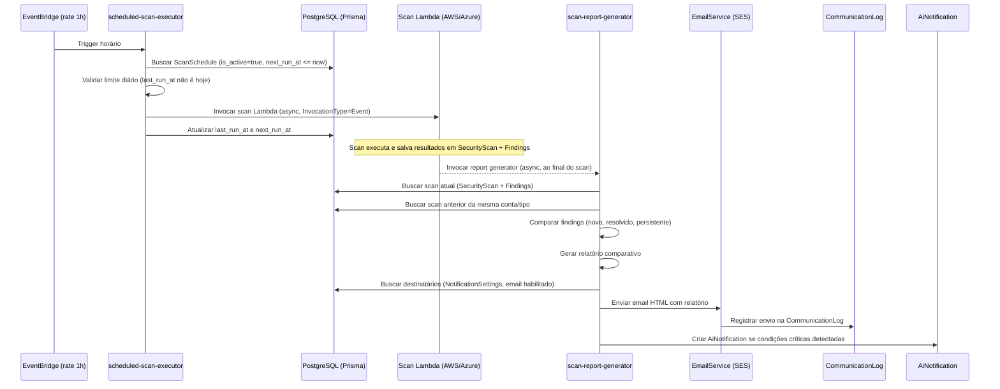
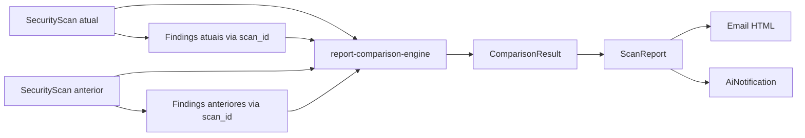

# Design: Relatórios Agendados de Serviços

## Visão Geral

Este design descreve a implementação do sistema de relatórios agendados para a plataforma EVO. O sistema aprimora o `scheduled-scan-executor` existente para, após a conclusão de cada scan agendado, gerar um relatório comparativo e enviar um email detalhado via `EmailService`, registrando tudo na `CommunicationLog`. Também integra com o sistema de alarmes inteligentes (`AiNotification`) para alertas proativos.

A arquitetura segue o padrão existente de Lambdas assíncronas com EventBridge, reutilizando o máximo possível da infraestrutura atual.

## Arquitetura

### Fluxo Principal



### Componentes Novos vs Existentes

| Componente | Status | Localização |
|-----------|--------|-------------|
| `scheduled-scan-executor` | Existente — aprimorar validação de limite diário | `handlers/jobs/` |
| `scan-report-generator` | **Novo** — Lambda para gerar relatório e enviar email | `handlers/jobs/` |
| `report-comparison-engine` | **Novo** — Lib para comparação de findings | `lib/` |
| `report-email-templates` | **Novo** — Templates HTML para emails de relatório | `lib/` |
| `manage-scan-schedules` | **Novo** — Handler CRUD para agendamentos | `handlers/jobs/` |
| `EmailService` | Existente — usar para envio | `lib/` |
| `CommunicationLog` | Existente — registrar envios | via Prisma |

## Componentes e Interfaces

### 1. manage-scan-schedules (Novo Handler)

Handler REST para CRUD de agendamentos. Segue o template padrão de handler Lambda.

```typescript
// POST /scan-schedules — Criar/atualizar agendamento
interface CreateScheduleRequest {
  accountId?: string;          // AWS account ID (uuid)
  azureCredentialId?: string;  // Azure credential ID (uuid)
  cloudProvider: 'AWS' | 'AZURE';
  scanType: string;            // 'security', 'cost', etc.
  scheduleType: 'daily' | 'weekly' | 'monthly';
  scheduleConfig?: {
    hour?: number;        // 0-23, default 2
    dayOfWeek?: number;   // 0-6 (domingo-sábado), para weekly
    dayOfMonth?: number;  // 1-28, para monthly
  };
}

interface ScheduleResponse {
  id: string;
  organizationId: string;
  cloudProvider: string;
  scanType: string;
  scheduleType: string;
  scheduleConfig: object;
  isActive: boolean;
  lastRunAt: string | null;
  nextRunAt: string | null;
}

// GET /scan-schedules?accountId=X — Listar agendamentos da conta
// PATCH /scan-schedules/:id — Atualizar frequência ou desativar
// DELETE /scan-schedules/:id — Remover agendamento
```

Validações:
- Unicidade: apenas um agendamento ativo por combinação (conta cloud + scan_type)
- schedule_type restrito a "daily", "weekly", "monthly"
- dayOfMonth restrito a 1-28 (evitar problemas com meses curtos)
- Multi-tenancy: todas queries filtram por organization_id

### 2. scan-report-generator (Nova Lambda)

Lambda invocada assincronamente ao final de cada scan agendado. Responsável por:
1. Buscar resultados do scan concluído
2. Buscar scan anterior para comparação
3. Gerar relatório comparativo via `report-comparison-engine`
4. Enviar email via `EmailService`
5. Registrar na `CommunicationLog`
6. Avaliar condições para alarmes inteligentes

```typescript
// Payload recebido (invocação async da Lambda de scan)
interface ReportGeneratorPayload {
  scanId: string;
  organizationId: string;
  accountId?: string;
  azureCredentialId?: string;
  cloudProvider: 'AWS' | 'AZURE';
  scanType: string;
  scheduledExecution: boolean;
  scheduleId?: string;
}

// Interface do relatório gerado
interface ScanReport {
  scanId: string;
  organizationName: string;
  accountName: string;
  cloudProvider: string;
  scanType: string;
  executedAt: Date;
  isFirstScan: boolean;
  summary: {
    total: number;
    critical: number;
    high: number;
    medium: number;
    low: number;
  };
  comparison: {
    newFindings: FindingSummary[];
    resolvedFindings: FindingSummary[];
    persistentCount: number;
    previousTotal: number;
    changePercentage: number;  // positivo = aumento, negativo = redução
  } | null;  // null quando isFirstScan=true
}

interface FindingSummary {
  title: string;
  severity: string;
  resourceId?: string;
  resourceType?: string;
  category?: string;
}
```

### 3. report-comparison-engine (Nova Lib)

Biblioteca pura (sem side effects) para comparação de findings entre scans.

```typescript
interface ComparisonInput {
  currentFindings: Finding[];
  previousFindings: Finding[];
}

interface ComparisonResult {
  newFindings: Finding[];       // fingerprint existe no atual mas não no anterior
  resolvedFindings: Finding[];  // fingerprint existe no anterior mas não no atual, ou resolved_at preenchido
  persistentFindings: Finding[];// fingerprint existe em ambos
  summary: {
    newCount: number;
    resolvedCount: number;
    persistentCount: number;
    previousTotal: number;
    currentTotal: number;
    changePercentage: number;
  };
}

function compareFindings(input: ComparisonInput): ComparisonResult;
```

Regras de comparação:
- Matching por `fingerprint` (campo existente na tabela Finding)
- Finding "novo": fingerprint presente no scan atual, ausente no anterior
- Finding "resolvido": fingerprint presente no anterior, ausente no atual OU com `resolved_at` preenchido
- Finding "persistente": fingerprint presente em ambos os scans
- `changePercentage`: `((currentTotal - previousTotal) / previousTotal) * 100`

### 4. report-email-templates (Nova Lib)

Templates HTML para emails de relatório. Usa o sistema de templates do `EmailService` existente.

```typescript
interface ReportEmailData {
  report: ScanReport;
  platformUrl: string;  // URL para acessar detalhes na plataforma
}

function generateSecurityReportHtml(data: ReportEmailData): string;
function generateReportSubject(report: ScanReport): string;
```

O template HTML inclui:
- Header com logo EVO e nome da organização
- Badge do cloud provider (AWS/Azure)
- Resumo visual com contadores por severidade (cores: critical=vermelho, high=laranja, medium=amarelo, low=azul)
- Seção "Novos Findings" com ícone de alerta
- Seção "Findings Resolvidos" com ícone de check verde
- Contagem de findings persistentes
- Botão CTA para acessar detalhes na plataforma
- Footer com informações de desinscrição

### 5. Integração com Alarmes Inteligentes

Lógica dentro do `scan-report-generator` que avalia condições e cria `AiNotification`:

```typescript
interface AlarmCondition {
  type: 'new_critical' | 'degradation' | 'improvement';
  priority: 'critical' | 'high' | 'low';
  threshold?: number;  // para degradation: 20%
}

function evaluateAlarmConditions(report: ScanReport): AlarmCondition[];
```

Condições:
1. `new_critical`: novos findings com severity="critical" → priority="critical"
2. `degradation`: changePercentage > 20% → priority="high"
3. `improvement`: todos critical do scan anterior resolvidos → priority="low"

## Modelos de Dados

### Modelos Existentes (sem alteração)

- **ScanSchedule**: Já possui todos os campos necessários (schedule_type, schedule_config, is_active, last_run_at, next_run_at)
- **Finding**: Já possui fingerprint, first_seen, last_seen, resolved_at para rastreamento de ciclo de vida
- **SecurityScan**: Já possui findings_count, critical_count, high_count, medium_count, low_count
- **CommunicationLog**: Já possui channel, recipient, subject, message, status, metadata
- **AiNotification**: Já possui priority, suggested_action, expires_at
- **NotificationSettings**: Já possui preferências de email por usuário

### Uso do schedule_config (JSON)

```typescript
// Daily
{ "hour": 2 }  // Executar às 02:00 UTC

// Weekly
{ "hour": 2, "dayOfWeek": 1 }  // Segunda-feira às 02:00 UTC

// Monthly
{ "hour": 2, "dayOfMonth": 15 }  // Dia 15 às 02:00 UTC
```

### Fluxo de Dados para Comparação



Para encontrar o scan anterior:
```sql
SELECT * FROM security_scans 
WHERE organization_id = ? 
  AND (aws_account_id = ? OR azure_credential_id = ?)
  AND scan_type = ?
  AND status = 'completed'
  AND id != ?  -- excluir scan atual
ORDER BY created_at DESC 
LIMIT 1
```


## Propriedades de Corretude

*Uma propriedade é uma característica ou comportamento que deve ser verdadeiro em todas as execuções válidas de um sistema — essencialmente, uma declaração formal sobre o que o sistema deve fazer. Propriedades servem como ponte entre especificações legíveis por humanos e garantias de corretude verificáveis por máquina.*

### Property 1: Round-trip de criação de agendamento

*Para qualquer* configuração válida de agendamento (schedule_type em {daily, weekly, monthly} com schedule_config válido), criar um agendamento e depois consultá-lo deve retornar os mesmos valores de schedule_type, schedule_config, cloud_provider e scan_type.

**Validates: Requirements 1.1**

### Property 2: Unicidade de agendamento por conta e tipo de scan

*Para qualquer* combinação de conta cloud (aws_account_id ou azure_credential_id) e scan_type, se já existe um agendamento ativo, tentar criar outro agendamento com a mesma combinação deve resultar em rejeição (erro).

**Validates: Requirements 1.2**

### Property 3: Desativação impede execução

*Para qualquer* agendamento que foi desativado (is_active=false), o executor de agendamento deve ignorá-lo ao buscar schedules pendentes, independentemente do valor de next_run_at.

**Validates: Requirements 1.3**

### Property 4: Validação de schedule_type

*Para qualquer* string que não seja "daily", "weekly" ou "monthly", a criação de agendamento deve ser rejeitada. Para qualquer string que seja uma dessas três, a criação deve ser aceita (dado que os demais campos são válidos).

**Validates: Requirements 1.6**

### Property 5: Limite de uma execução diária por conta

*Para qualquer* agendamento cujo last_run_at está no mesmo dia UTC que o horário atual, o executor de agendamento deve pular a execução e não invocar a Lambda de scan.

**Validates: Requirements 2.4, 7.1**

### Property 6: Cálculo correto de next_run_at

*Para qualquer* schedule_type (daily, weekly, monthly), schedule_config válido e horário atual, o calculateNextRun deve produzir uma data estritamente no futuro que respeite: para daily, o horário configurado no próximo dia; para weekly, o próximo dia da semana configurado; para monthly, o próximo dia do mês configurado.

**Validates: Requirements 2.2, 7.2, 7.3, 7.4**

### Property 7: Particionamento correto de findings na comparação

*Para quaisquer* dois conjuntos de findings (atual e anterior), o Motor_de_Comparação deve particionar os findings em exatamente três categorias disjuntas baseadas no fingerprint: "novos" (fingerprint apenas no atual), "resolvidos" (fingerprint apenas no anterior ou com resolved_at preenchido), e "persistentes" (fingerprint em ambos). A soma das contagens das três categorias deve ser consistente com os tamanhos dos conjuntos de entrada.

**Validates: Requirements 3.2, 3.3, 3.4**

### Property 8: Corretude do resumo do relatório

*Para qualquer* ComparisonResult, o resumo do relatório deve conter contagens por severidade (critical, high, medium, low) que somam ao total de findings do scan atual, e as contagens de novos, resolvidos e persistentes devem corresponder exatamente às listas do ComparisonResult.

**Validates: Requirements 3.5**

### Property 9: Email HTML contém todas as informações obrigatórias

*Para qualquer* ScanReport válido, o HTML gerado pelo template de email deve conter: nome da organização, nome da conta cloud, tipo de scan, data/hora da execução, contagens por severidade, títulos dos novos findings e títulos dos findings resolvidos.

**Validates: Requirements 4.1**

### Property 10: Findings críticos novos disparam alarme crítico

*Para qualquer* resultado de comparação que contenha pelo menos um finding novo com severidade "critical", a função evaluateAlarmConditions deve retornar uma condição do tipo "new_critical" com priority="critical".

**Validates: Requirements 5.1**

### Property 11: Degradação >20% dispara alarme high

*Para qualquer* resultado de comparação onde changePercentage > 20, a função evaluateAlarmConditions deve retornar uma condição do tipo "degradation" com priority="high".

**Validates: Requirements 5.2**

### Property 12: Resolução de todos os críticos dispara alarme positivo

*Para qualquer* resultado de comparação onde todos os findings com severidade "critical" do scan anterior foram resolvidos (aparecem em resolvedFindings), a função evaluateAlarmConditions deve retornar uma condição do tipo "improvement" com priority="low".

**Validates: Requirements 5.3**

## Tratamento de Erros

### Erros no Executor de Agendamento

| Cenário | Tratamento |
|---------|-----------|
| Credencial cloud inativa | Pular execução, registrar no log, manter next_run_at |
| scan_type desconhecido (getScanLambdaName retorna null) | Pular execução, registrar no log |
| Falha na invocação da Lambda de scan | Registrar erro, manter next_run_at para próxima execução, sem retry |
| last_run_at no mesmo dia UTC | Pular execução silenciosamente |
| Erro de banco de dados ao atualizar schedule | Registrar erro, continuar com próximo schedule |

### Erros no Gerador de Relatório

| Cenário | Tratamento |
|---------|-----------|
| Scan não encontrado (scanId inválido) | Registrar erro, abortar geração |
| Nenhum scan anterior encontrado | Gerar relatório sem comparação (isFirstScan=true) |
| Falha no envio de email (SES) | Registrar na CommunicationLog com status="failed", continuar com próximo destinatário |
| Nenhum destinatário com email habilitado | Registrar no log, não enviar email |
| Erro ao criar AiNotification | Registrar erro, não impedir envio do email |

### Erros no CRUD de Agendamentos

| Cenário | Tratamento |
|---------|-----------|
| schedule_type inválido | Retornar 400 Bad Request com mensagem descritiva |
| Agendamento duplicado (mesma conta + scan_type) | Retornar 409 Conflict |
| Conta cloud não encontrada ou de outra organização | Retornar 404 Not Found |
| dayOfMonth fora do range 1-28 | Retornar 400 Bad Request |
| dayOfWeek fora do range 0-6 | Retornar 400 Bad Request |

## Estratégia de Testes

### Biblioteca de Property-Based Testing

Usar **fast-check** com Vitest (já configurado no projeto via `vitest.config.ts`).

### Testes de Propriedade (Property-Based Tests)

Cada propriedade do design deve ser implementada como um teste property-based separado com mínimo de 100 iterações. Cada teste deve ser anotado com referência à propriedade do design:

```typescript
// Feature: scheduled-service-reports, Property 7: Particionamento correto de findings na comparação
// Validates: Requirements 3.2, 3.3, 3.4
```

Foco em funções puras que são ideais para PBT:
- `compareFindings()` — Properties 7, 8
- `calculateNextRun()` — Property 6
- `evaluateAlarmConditions()` — Properties 10, 11, 12
- `generateSecurityReportHtml()` — Property 9
- Validação de input do CRUD — Properties 2, 4

### Testes Unitários

Testes unitários complementam os property tests para cenários específicos:
- Edge cases: primeiro scan sem comparação, mês com 28 dias, virada de ano
- Integração: registro na CommunicationLog após envio de email
- Erros: credencial inativa, scan_type desconhecido, falha no SES
- Exemplos concretos: scan com 3 novos findings críticos, scan com 100% de resolução

### Organização dos Testes

```
backend/src/__tests__/
  report-comparison-engine.test.ts    — Properties 7, 8
  report-comparison-engine.prop.test.ts — PBT para Properties 7, 8
  calculate-next-run.test.ts          — Property 6
  calculate-next-run.prop.test.ts     — PBT para Property 6
  evaluate-alarm-conditions.test.ts   — Properties 10, 11, 12
  evaluate-alarm-conditions.prop.test.ts — PBT para Properties 10, 11, 12
  report-email-templates.test.ts      — Property 9
  report-email-templates.prop.test.ts — PBT para Property 9
  manage-scan-schedules.test.ts       — Properties 1, 2, 3, 4, 5
```
