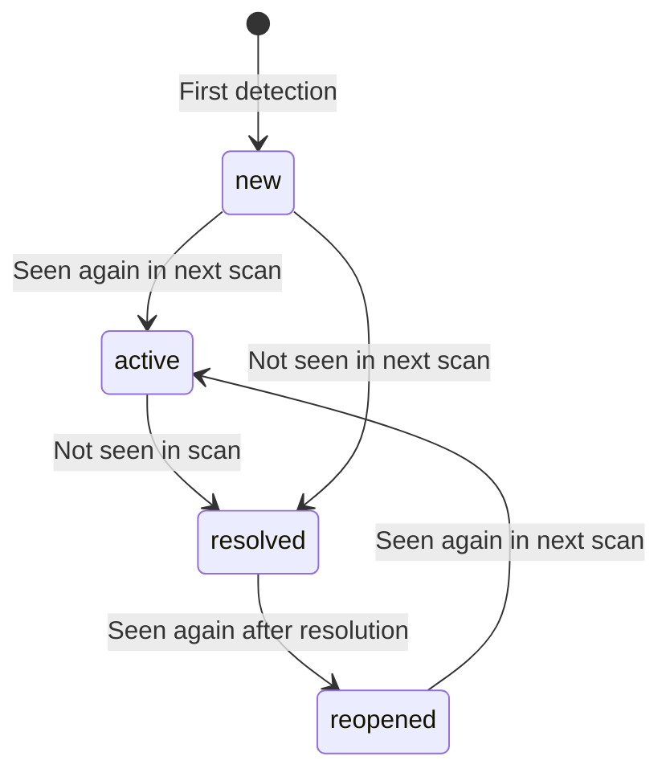

# Design Document: Security Scan Evolution

## Overview

This design transforms the security scanning pipeline from a destructive delete-and-recreate model into a stateful, lifecycle-aware system. The four improvements are tightly coupled: fingerprinting enables delta scanning, delta scanning enables lifecycle tracking, lifecycle tracking enables meaningful suppression, and all of these feed into an improved scoring algorithm.

The core change is in `security-scan.ts`: instead of `deleteMany` + `createMany`, the handler will compute a fingerprint for each finding, then perform upserts keyed on `(organization_id, aws_account_id, fingerprint)`. Findings not seen in the current scan get marked as `resolved`. A new suppress/unsuppress action is added to `get-findings.ts`. The posture calculator in `get-security-posture.ts` gets a richer scoring model.

## Architecture

```mermaid
flowchart TD
    SE[Security Engine<br/>38 Scanners] -->|Finding[]| FP[Fingerprint Generator]
    FP -->|Finding[] with fingerprints| DS[Delta Sync Logic]
    DS -->|Upsert new/active| DB[(PostgreSQL<br/>findings table)]
    DS -->|Mark resolved| DB
    DB -->|Query with filters| FA[Findings API]
    FA -->|Suppress/Unsuppress| DB
    DB -->|Exclude suppressed,<br/>calculate trend| PC[Posture Calculator]
    PC -->|Score + breakdown| Response

    subgraph Scan Handler
        FP
        DS
    end
```

The Security Engine remains unchanged — it produces `Finding[]` as before. All new logic lives in the Scan Handler (persistence layer) and the two query handlers.

## Components and Interfaces

### 1. Fingerprint Generator (`backend/src/lib/security-engine/fingerprint.ts`)

A pure utility module that computes a deterministic SHA-256 hash from finding attributes.

```typescript
import { createHash } from 'crypto';

export function computeFingerprint(
  resourceArn: string,
  scanType: string,
  title: string
): string {
  const input = `${resourceArn}|${scanType}|${title}`;
  return createHash('sha256').update(input).digest('hex');
}
```

This is a pure function with no side effects. The pipe-delimited concatenation ensures uniqueness even when individual fields share substrings.

### 2. Delta Sync Logic (in `security-scan.ts`)

Replaces the current `deleteMany` + `createMany` block. The algorithm:

```
1. Compute fingerprints for all new findings from the scan
2. Fetch existing active findings for this org+account (fingerprint set)
3. For each new finding:
   a. If fingerprint exists in DB → update last_seen, increment occurrence_count, apply lifecycle transition
   b. If fingerprint is new → create with status=new, first_seen=now, last_seen=now
4. For each existing finding whose fingerprint is NOT in the new scan:
   a. If status is new/active/reopened → transition to resolved, set resolved_at=now
5. Handle expired suppressions: clear suppression fields where suppression_expires_at < now
```

This runs inside a Prisma transaction to ensure atomicity.

### 3. Finding Lifecycle State Machine



Valid statuses: `new`, `active`, `resolved`, `reopened`

Transition logic in the upsert:
- `new` + seen again → `active`
- `active` + not seen → `resolved` (set `resolved_at`)
- `resolved` + seen again → `reopened` (clear `resolved_at`, update `last_seen`)
- `reopened` + seen again → `active`

### 4. Suppress/Unsuppress Actions (in `get-findings.ts`)

Two new POST actions added to the existing findings handler, distinguished by an `action` field in the request body:

```typescript
interface SuppressRequest {
  action: 'suppress';
  findingId: string;
  reason: string;
  expiresAt?: string; // ISO 8601 datetime, optional
}

interface UnsuppressRequest {
  action: 'unsuppress';
  findingId: string;
}
```

The handler checks the `action` field. If present, it routes to suppress/unsuppress logic. Otherwise, it falls through to the existing query logic.

### 5. Improved Posture Calculator (in `get-security-posture.ts`)

New scoring formula:

```
baseScore = 100 - severityPenalty
  where severityPenalty = (critical * 10 + high * 5 + medium * 2 + low * 0.5) capped at 100

timeExposurePenalty = sum of per-finding penalties:
  - critical open > 7 days: 2 points each (max 20)
  - high open > 14 days: 1 point each (max 10)
  - medium open > 30 days: 0.5 points each (max 5)

serviceCoverageBonus = (servicesWithScans / 38) * 10
  (up to 10 bonus points for full coverage)

trendAdjustment:
  - improving (fewer findings than previous scan): +5 max
  - stable: 0
  - degrading (more findings): -5 max

finalScore = clamp(baseScore - timeExposurePenalty + serviceCoverageBonus + trendAdjustment, 0, 100)
```

All suppressed findings are excluded from every component of this calculation.

The response includes a `breakdown` object with each component's contribution.

## Data Models

### Prisma Schema Changes to Finding Model

New fields added to the existing `Finding` model:

```prisma
model Finding {
  // ... existing fields ...

  // Fingerprinting
  fingerprint           String?   @db.VarChar(64)

  // Lifecycle tracking
  first_seen            DateTime? @db.Timestamptz(6)
  last_seen             DateTime? @db.Timestamptz(6)
  resolved_at           DateTime? @db.Timestamptz(6)
  occurrence_count      Int       @default(1)

  // Suppression
  suppressed            Boolean   @default(false)
  suppressed_by         String?   @db.VarChar(255)
  suppressed_at         DateTime? @db.Timestamptz(6)
  suppression_reason    String?
  suppression_expires_at DateTime? @db.Timestamptz(6)

  // New indexes
  @@unique([organization_id, aws_account_id, fingerprint], name: "uq_finding_fingerprint")
  @@index([fingerprint])
  @@index([suppressed])
  @@index([first_seen])
  @@index([last_seen])
}
```

All new fields are nullable or have defaults to maintain backward compatibility with existing records. The migration will backfill `first_seen` and `last_seen` from `created_at` for existing rows.

### Posture Calculator Response Shape

```typescript
interface SecurityPostureResponse {
  success: boolean;
  posture: {
    overallScore: number;       // 0-100
    riskLevel: string;          // critical | high | medium | low
    findings: {
      critical: number;
      high: number;
      medium: number;
      low: number;
      total: number;
      suppressed: number;       // NEW: count of suppressed findings
    };
    serviceCoverage: number;    // NEW: 0-100 percentage
    trend: {                    // NEW
      direction: 'improving' | 'stable' | 'degrading';
      previousTotal: number;
      currentTotal: number;
      delta: number;
    };
    breakdown: {                // NEW
      baseScore: number;
      timeExposurePenalty: number;
      serviceCoverageBonus: number;
      trendAdjustment: number;
    };
    calculatedAt: string;
    accountId: string;
  };
}
```


## Correctness Properties

*A property is a characteristic or behavior that should hold true across all valid executions of a system — essentially, a formal statement about what the system should do. Properties serve as the bridge between human-readable specifications and machine-verifiable correctness guarantees.*

### Property 1: Fingerprint determinism and format

*For any* `resource_arn`, `scan_type`, and `title` strings, `computeFingerprint(resource_arn, scan_type, title)` SHALL always return the same 64-character lowercase hexadecimal string, and calling it twice with the same inputs SHALL produce identical output.

**Validates: Requirements 1.1, 1.3**

### Property 2: New finding initialization

*For any* finding whose fingerprint does not exist in the database for the given organization and account, the delta sync SHALL create a record with `status = 'new'`, `first_seen = last_seen = now`, and `occurrence_count = 1`.

**Validates: Requirements 2.3, 3.1**

### Property 3: Existing finding update on re-detection

*For any* finding whose fingerprint already exists in the database, the delta sync SHALL increment `occurrence_count` by exactly 1 and update `last_seen` to the current scan time, while preserving the original `first_seen` value.

**Validates: Requirements 2.2**

### Property 4: Finding resolution on absence

*For any* finding with status `new`, `active`, or `reopened` whose fingerprint is NOT present in the current scan results, the delta sync SHALL transition the status to `resolved` and set `resolved_at` to the current time.

**Validates: Requirements 2.4, 3.3**

### Property 5: Lifecycle forward transitions

*For any* finding with status `new` or `reopened` that is detected again in a subsequent scan, the delta sync SHALL transition the status to `active`.

**Validates: Requirements 3.2, 3.5**

### Property 6: Reopening resolved findings

*For any* finding with status `resolved` that is detected again in a subsequent scan, the delta sync SHALL transition the status to `reopened`, clear `resolved_at` to null, and update `last_seen`.

**Validates: Requirements 3.4**

### Property 7: Suppress/unsuppress round trip

*For any* finding, suppressing it and then immediately unsuppressing it SHALL restore the finding to `suppressed = false` with all suppression fields (`suppressed_by`, `suppressed_at`, `suppression_reason`, `suppression_expires_at`) set to null.

**Validates: Requirements 4.1, 4.4**

### Property 8: Expired suppression clearance

*For any* suppressed finding whose `suppression_expires_at` is in the past, the next scan execution SHALL clear all suppression fields (`suppressed = false`, nullify `suppressed_by`, `suppressed_at`, `suppression_reason`, `suppression_expires_at`).

**Validates: Requirements 4.3**

### Property 9: Suppressed findings excluded from score

*For any* set of findings where some are suppressed, the posture score SHALL be identical to the score computed from only the non-suppressed findings. Equivalently, adding a suppressed finding to the set SHALL not change the score.

**Validates: Requirements 5.1**

### Property 10: Time exposure penalty monotonicity

*For any* set of findings, increasing the `first_seen` age of any critical/high/medium finding (making it older) SHALL result in a score that is less than or equal to the score with the younger finding, all else being equal.

**Validates: Requirements 5.2**

### Property 11: Trend direction correctness

*For any* two consecutive scan result counts, if `currentTotal < previousTotal` then trend SHALL be `improving`, if `currentTotal == previousTotal` then trend SHALL be `stable`, and if `currentTotal > previousTotal` then trend SHALL be `degrading`.

**Validates: Requirements 5.4**

### Property 12: Trend adjustment bounds

*For any* trend calculation, the trend adjustment value SHALL be in the range `[-5, 5]`. An `improving` trend SHALL produce a non-negative adjustment, and a `degrading` trend SHALL produce a non-positive adjustment.

**Validates: Requirements 5.6**

### Property 13: Score bounds invariant

*For any* combination of findings, service coverage, and trend data, the final `overallScore` SHALL always be in the range `[0, 100]`.

**Validates: Requirements 5.5**

### Property 14: Filtering correctness

*For any* set of findings with mixed statuses and suppression states, querying with a `status` filter SHALL return only findings matching that status, and querying with a `suppressed` filter SHALL return only findings matching that suppression state.

**Validates: Requirements 3.6, 4.6**

## Error Handling

| Scenario | Handling |
|----------|----------|
| Fingerprint computation fails (null resource_arn) | Use fallback fingerprint from `scan_type + title + resource_id`. Log warning. |
| Upsert transaction fails | Retry once. If still fails, fall back to the legacy `deleteMany + createMany` approach and log error. |
| Suppress action on non-existent finding | Return 404 with descriptive message. |
| Suppress action on already-suppressed finding | Idempotent — update suppression fields with new values. |
| Unsuppress action on non-suppressed finding | Idempotent — return success with no changes. |
| Posture calculation with zero findings | Return score of 100, risk level "low", empty trend. |
| Previous scan not found for trend calculation | Set trend to "stable" with `previousTotal = 0`. |
| Migration fails on existing data | All new fields are nullable or have defaults; migration is backward-compatible. |

## Testing Strategy

### Property-Based Testing

Library: **fast-check** with **vitest**

Each correctness property maps to a single property-based test with minimum 100 iterations. Tests are organized in a dedicated test file: `backend/src/__tests__/security-scan-evolution.property.test.ts`.

Test structure:
- Pure functions (fingerprint, scoring) are tested directly
- Delta sync logic is tested against an in-memory model of the finding store
- Lifecycle transitions are tested with a state machine model

Tag format for each test: `Feature: security-scan-evolution, Property N: <property_text>`

### Unit Testing

Unit tests complement property tests for specific examples and edge cases:
- Fingerprint with empty strings, special characters, very long ARNs
- Lifecycle transitions for each specific state pair
- Scoring edge cases: zero findings, all critical, all suppressed
- Suppress with and without expiration
- Expired suppression boundary (exactly at expiration time)
- Demo mode bypass (existing behavior preserved)

### Test File Organization

```
backend/src/__tests__/
  security-scan-evolution.property.test.ts   # All 14 property tests
  security-scan-evolution.unit.test.ts       # Edge cases and examples
```

### Configuration

```typescript
// vitest.config.ts addition
{
  test: {
    include: ['backend/src/__tests__/**/*.test.ts'],
  }
}
```

Each property test runs with `fc.assert(fc.property(...), { numRuns: 100 })`.
