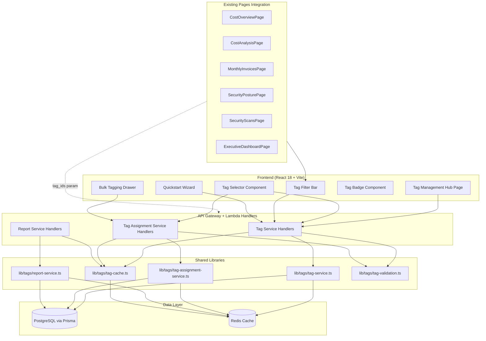
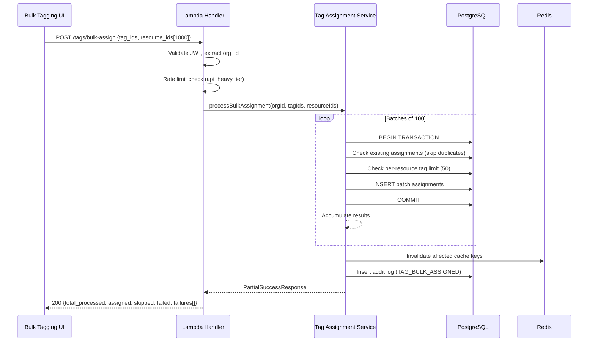
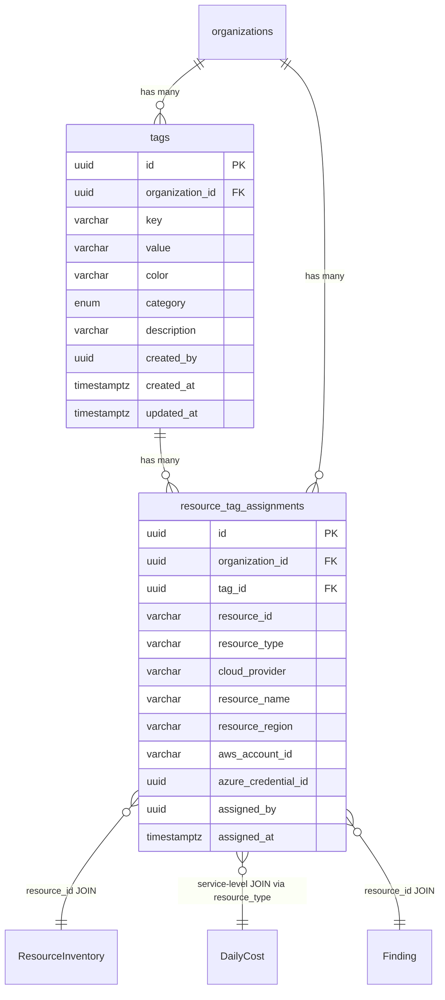

# Design Document — Smart Resource Tagging

## Overview

O Smart Resource Tagging é um sistema de classificação local de recursos cloud para a plataforma EVO. Tags são armazenadas exclusivamente no PostgreSQL (via Prisma) — sem write-back para AWS/Azure. O sistema adiciona duas tabelas centralizadas (`tags` e `resource_tag_assignments`) que se integram via JOINs com as tabelas existentes (`ResourceInventory`, `DailyCost`, `Finding`).

A arquitetura segue o padrão existente da plataforma: Lambda handlers individuais (Node.js 18.x, TypeScript CommonJS), Prisma ORM, Redis para cache, e multi-tenancy obrigatório via `organization_id` extraído do JWT.

### Decisões Arquiteturais Chave

1. **Tags EVO-local only**: Sem integração de escrita com AWS/Azure APIs — simplifica drasticamente a arquitetura e evita problemas de permissão/rate-limiting nos provedores cloud.
2. **Dados centralizados**: Todas as páginas existentes fazem JOIN contra `tags`/`resource_tag_assignments` — zero duplicação de dados de tags.
3. **AND-only filtering (v1)**: Simplifica queries e UX. OR-logic fica para v2.
4. **Partial Success para bulk**: Operações em lote não fazem rollback total — batches de 100 com commit independente.
5. **Service-level cost attribution**: Custos são agregados por serviço (não por recurso individual), pois `DailyCost` não tem `resource_id` granular.

## Architecture

### Diagrama de Componentes



### Diagrama de Fluxo — Bulk Tagging



### Lambda Handler Organization

Novos handlers ficam em `backend/src/handlers/admin/` (domínio operations, pois tags é uma funcionalidade administrativa cross-domain). Shared libs ficam em `backend/src/lib/tags/`.

| Handler File | Method | Route | Ref |
|---|---|---|---|
| `tag-crud.ts` | POST/GET/PATCH/DELETE | `/api/v1/tags`, `/api/v1/tags/:id` | R1-R5 |
| `tag-assign.ts` | POST | `/api/v1/tags/:id/assign`, `/api/v1/tags/:id/unassign` | R6-R7 |
| `tag-bulk-assign.ts` | POST | `/api/v1/tags/bulk-assign` | R8 |
| `tag-resources.ts` | GET | `/api/v1/resources/:id/tags`, `/api/v1/tags/:id/resources` | R9-R10 |
| `tag-suggestions.ts` | GET | `/api/v1/tags/suggestions` | R11 |
| `tag-templates.ts` | GET/POST | `/api/v1/tags/templates`, `/api/v1/tags/templates/apply` | R12 |
| `tag-cost-report.ts` | GET | `/api/v1/tags/:id/cost-report` | R13 |
| `tag-security-findings.ts` | GET | `/api/v1/tags/security-findings` | R14 |
| `tag-inventory-report.ts` | GET | `/api/v1/tags/:id/inventory` | R15 |
| `tag-coverage.ts` | GET | `/api/v1/tags/coverage` | R25 |
| `tag-untagged-resources.ts` | GET | `/api/v1/resources/untagged` | R26 |


## Components and Interfaces

### Backend Shared Libraries

#### `lib/tags/tag-validation.ts`

Validação centralizada reutilizada por todos os handlers.

```typescript
// Constantes
const TAG_KEY_REGEX = /^[a-z0-9\-_]+$/;
const TAG_KEY_MAX_LENGTH = 64;
const TAG_VALUE_MAX_LENGTH = 128;
const TAG_VALUE_REGEX = /^[a-z0-9 \-_.]+$/;
const TAG_DESCRIPTION_MAX_LENGTH = 256;
const MAX_TAGS_PER_ORG = 500;
const MAX_TAGS_PER_RESOURCE = 50;
const MAX_BULK_RESOURCES = 1000;
const BULK_BATCH_SIZE = 100;
const PREDEFINED_COLORS = [
  '#EF4444', '#F97316', '#F59E0B', '#84CC16',
  '#22C55E', '#14B8A6', '#06B6D4', '#3B82F6',
  '#6366F1', '#8B5CF6', '#EC4899', '#64748B'
];

type TagCategory = 'COST_CENTER' | 'ENVIRONMENT' | 'TEAM' | 'PROJECT' | 'COMPLIANCE' | 'CRITICALITY' | 'CUSTOM';

interface TagValidationResult {
  valid: boolean;
  errors: Array<{ field: string; message: string; code: string }>;
}

// Funções exportadas
function normalizeTagKey(key: string): string;       // trim + lowercase
function normalizeTagValue(value: string): string;    // trim + lowercase
function validateTagKey(key: string): TagValidationResult;
function validateTagValue(value: string): TagValidationResult;
function validateTagColor(color: string): TagValidationResult;
function validateTagCategory(category?: string): TagValidationResult;
function validateTagDescription(desc?: string): TagValidationResult;
function sanitizeHtml(input: string): string;         // XSS prevention
function validateCreateTagInput(input: CreateTagInput): TagValidationResult;
function validateUpdateTagInput(input: UpdateTagInput): TagValidationResult;
```

#### `lib/tags/tag-service.ts`

Lógica de negócio para CRUD de tags, suggestions e templates.

```typescript
interface CreateTagInput {
  key: string; value: string; color: string;
  category?: TagCategory; description?: string;
}

interface ListTagsParams {
  organizationId: string; category?: TagCategory;
  key?: string; search?: string;
  sortBy?: 'usage_count' | 'key' | 'created_at';
  limit?: number; cursor?: string;
}

interface TagSuggestionParams {
  organizationId: string; resourceType: string;
  resourceName: string; accountId: string; region: string;
}

// Funções exportadas
async function createTag(orgId: string, userId: string, input: CreateTagInput): Promise<Tag>;
async function listTags(params: ListTagsParams): Promise<PaginatedResult<TagWithUsage>>;
async function getTagDetails(orgId: string, tagId: string): Promise<TagDetails>;
async function updateTag(orgId: string, tagId: string, userId: string, input: UpdateTagInput): Promise<Tag>;
async function deleteTag(orgId: string, tagId: string, userId: string): Promise<{ assignmentsRemoved: number }>;
async function getSuggestions(params: TagSuggestionParams): Promise<TagSuggestion[]>;
async function getTemplates(): Promise<TagTemplate[]>;
async function applyTemplates(orgId: string, userId: string, templateIds: string[]): Promise<ApplyTemplateResult>;
async function getCoverage(orgId: string): Promise<CoverageMetrics>;
```

#### `lib/tags/tag-assignment-service.ts`

Lógica de negócio para assign/unassign/bulk.

```typescript
interface AssignTagInput {
  tagId: string;
  resources: Array<{
    resourceId: string; resourceType: string; cloudProvider: 'aws' | 'azure';
    resourceName?: string; resourceRegion?: string;
    awsAccountId?: string; azureCredentialId?: string;
  }>;
}

interface PartialSuccessResponse {
  totalProcessed: number; assignedCount: number;
  skippedCount: number; failedCount: number;
  failures: Array<{ resourceId: string; error: string; code: string }>;
}

// Funções exportadas
async function assignTag(orgId: string, userId: string, input: AssignTagInput): Promise<PartialSuccessResponse>;
async function unassignTag(orgId: string, userId: string, tagId: string, resourceIds: string[]): Promise<UnassignResponse>;
async function bulkAssign(orgId: string, userId: string, tagIds: string[], resourceIds: string[]): Promise<PartialSuccessResponse>;
async function getTagsForResource(orgId: string, resourceId: string): Promise<Tag[]>;
async function getResourcesByTag(orgId: string, tagId: string, params: PaginationParams): Promise<PaginatedResult<ResourceAssignment>>;
async function getUntaggedResources(orgId: string, params: UntaggedParams): Promise<PaginatedResult<Resource>>;
```

#### `lib/tags/report-service.ts`

Lógica de negócio para relatórios de custo, segurança e inventário.

```typescript
interface CostReportParams {
  organizationId: string; tagId: string;
  startDate: string; endDate: string;
  cloudProvider?: string; accountId?: string;
  format?: 'json' | 'csv' | 'pdf';
}

interface CostReportResult {
  totalCost: number; costByService: Record<string, number>;
  costByProvider: Record<string, number>;
  timeSeries: Array<{ date: string; cost: number }>;
  resourceCount: number;
  disclaimer: string; // "Costs are service-aggregated, not per-resource"
}

// Funções exportadas
async function getCostReport(params: CostReportParams): Promise<CostReportResult>;
async function getSecurityFindings(orgId: string, tagIds: string[], params: FindingsParams): Promise<PaginatedResult<FindingWithTags>>;
async function getInventoryReport(orgId: string, tagId: string, params: InventoryParams): Promise<InventoryReport>;
```

#### `lib/tags/tag-cache.ts`

Cache manager específico para tags, seguindo o padrão `RedisCacheManager` existente.

```typescript
class TagCacheManager {
  constructor(cache: RedisCacheManager);

  // Cache keys seguem NFR-6
  async getTagList(orgId: string, hash: string): Promise<Tag[] | null>;
  async setTagList(orgId: string, hash: string, tags: Tag[]): Promise<void>;  // TTL: 5min
  async getUsageCount(orgId: string, tagId: string): Promise<number | null>;
  async setUsageCount(orgId: string, tagId: string, count: number): Promise<void>;  // TTL: 5min
  async getSuggestions(orgId: string, resourceType: string, account: string): Promise<TagSuggestion[] | null>;
  async setSuggestions(orgId: string, resourceType: string, account: string, suggestions: TagSuggestion[]): Promise<void>;  // TTL: 2min
  async getCoverage(orgId: string): Promise<CoverageMetrics | null>;
  async setCoverage(orgId: string, metrics: CoverageMetrics): Promise<void>;  // TTL: 10min
  async getCostReport(orgId: string, tagId: string, dateRange: string): Promise<CostReportResult | null>;
  async setCostReport(orgId: string, tagId: string, dateRange: string, report: CostReportResult): Promise<void>;  // TTL: 1h
  async getSecurityReport(orgId: string, hash: string): Promise<any | null>;
  async setSecurityReport(orgId: string, hash: string, data: any): Promise<void>;  // TTL: 15min

  // Invalidation
  async invalidateTagList(orgId: string): Promise<void>;
  async invalidateUsageCount(orgId: string, tagId: string): Promise<void>;
  async invalidateSuggestions(orgId: string): Promise<void>;
  async invalidateCoverage(orgId: string): Promise<void>;
  async invalidateOnAssignmentChange(orgId: string, tagId: string): Promise<void>;  // Invalida usage, suggestions, coverage, reports
}
```

### Frontend Components

#### `TagBadge` Component

```typescript
// Props
interface TagBadgeProps {
  tag: { key: string; value: string; color: string };
  variant?: 'evo-local' | 'native-cloud';
  cloudProvider?: 'aws' | 'azure';
  onRemove?: () => void;
}

// Lógica de contraste WCAG AA:
// 1. Calcular luminância relativa do hex color
// 2. Se luminância > 0.179 → texto escuro (#0F172A), senão → texto claro (#FFFFFF)
// 3. Background = hex color @ 13% opacity
// 4. Border = hex color @ 27% opacity
```

#### `TagSelector` Component (Combobox)

```typescript
interface TagSelectorProps {
  resourceId: string;
  assignedTags: Tag[];
  onAssign: (tagId: string) => void;
  onUnassign: (tagId: string) => void;
  onCreateTag?: (input: CreateTagInput) => void;
}

// Comportamento:
// - Debounce 150ms no search
// - Filtragem por category e free-text
// - Tags já atribuídas aparecem como checked
// - "Create '{text}'" option quando sem match
// - Optimistic UI com rollback em caso de erro
// - Keyboard navigation completa (arrow keys, Enter, Escape)
```

#### `TagFilterBar` Component

```typescript
interface TagFilterBarProps {
  onFilterChange: (tagIds: string[]) => void;
  syncWithUrl?: boolean;  // default: true — persiste em ?tags=uuid1,uuid2
}

// Comportamento:
// - AND logic only (v1)
// - Chips removíveis para cada tag ativo
// - "Clear all" action
// - Re-fetch < 500ms após mudança
// - Tooltip: "Showing resources matching ALL selected tags"
```

#### `BulkTaggingDrawer` Component

```typescript
interface BulkTaggingDrawerProps {
  trigger: 'tag-management' | 'resource-list';
  preFilter?: { tagStatus?: 'untagged' };
}

// 3-step wizard:
// Step 1: Select Resources (virtual scrolling, multi-select, filters)
// Step 2: Select Tags (grouped by category, smart suggestions, inline create)
// Step 3: Review & Confirm (summary, duplicate warnings, progress bar)
// Desktop: 3-column side-by-side | Mobile: sequential stepper
```

#### `TagManagementPage` (5 tabs)

```typescript
// Route: /tag-management
// Tabs: Overview | Tags Library | Cost Reports | Security | Settings
// 
// Overview: coverage %, total tags, total assignments, untagged count, top-5 cost chart
// Tags Library: searchable table, inline edit/delete, confirmation dialog
// Cost Reports: tag selector → cost breakdown chart + table
// Security: tag selector → findings filtered by tags
// Settings: (future — placeholder)
//
// Zero-state: auto-display Quickstart Wizard (R21)
```


## Data Models

### Prisma Schema Additions

```prisma
// ==================== TAG SYSTEM ====================

enum TagCategory {
  COST_CENTER
  ENVIRONMENT
  TEAM
  PROJECT
  COMPLIANCE
  CRITICALITY
  CUSTOM

  @@map("tag_category")
}

model Tag {
  id              String      @id @default(dbgenerated("gen_random_uuid()")) @db.Uuid
  organization_id String      @db.Uuid
  key             String      @db.VarChar(64)
  value           String      @db.VarChar(128)
  color           String      @db.VarChar(7)
  category        TagCategory @default(CUSTOM)
  description     String?     @db.VarChar(256)
  created_by      String      @db.Uuid
  created_at      DateTime    @default(now()) @db.Timestamptz(6)
  updated_at      DateTime    @updatedAt @db.Timestamptz(6)

  organization    Organization @relation(fields: [organization_id], references: [id], onDelete: Cascade)
  assignments     ResourceTagAssignment[]

  @@unique([organization_id, key, value], name: "uq_tag_org_key_value")
  @@index([organization_id, category])
  @@index([organization_id, key])
  @@map("tags")
}

model ResourceTagAssignment {
  id                  String   @id @default(dbgenerated("gen_random_uuid()")) @db.Uuid
  organization_id     String   @db.Uuid
  tag_id              String   @db.Uuid
  resource_id         String   @db.VarChar(512)
  resource_type       String   @db.VarChar(128)
  cloud_provider      String   @db.VarChar(10)
  resource_name       String?  @db.VarChar(256)
  resource_region     String?  @db.VarChar(64)
  aws_account_id      String?  @db.VarChar(12)
  azure_credential_id String?  @db.Uuid
  assigned_by         String   @db.Uuid
  assigned_at         DateTime @default(now()) @db.Timestamptz(6)

  organization        Organization @relation(fields: [organization_id], references: [id], onDelete: Cascade)
  tag                 Tag          @relation(fields: [tag_id], references: [id], onDelete: Cascade)

  @@unique([organization_id, tag_id, resource_id], name: "uq_assignment_org_tag_resource")
  @@index([organization_id, resource_id])
  @@index([organization_id, tag_id])
  @@index([organization_id, resource_type, cloud_provider])
  @@index([resource_id])
  @@map("resource_tag_assignments")
}
```

### Relação com Tabelas Existentes

As tabelas `tags` e `resource_tag_assignments` se conectam com as tabelas existentes via JOINs em tempo de query:



### Query Patterns para Integração com Páginas Existentes

**Filtro por tags em endpoints existentes** (quando `tag_ids` é fornecido):

```sql
-- Exemplo: Cost Analysis filtrado por tags (AND logic)
SELECT dc.*
FROM daily_costs dc
WHERE dc.organization_id = $1
  AND dc.service IN (
    SELECT DISTINCT rta.resource_type
    FROM resource_tag_assignments rta
    WHERE rta.organization_id = $1
      AND rta.tag_id = ALL($2::uuid[])  -- AND logic: resource must have ALL tags
  )
  AND dc.date BETWEEN $3 AND $4;

-- Exemplo: Security Findings filtrado por tags (AND logic)
SELECT f.*
FROM findings f
WHERE f.organization_id = $1
  AND f.resource_id IN (
    SELECT rta.resource_id
    FROM resource_tag_assignments rta
    WHERE rta.organization_id = $1
      AND rta.tag_id IN ($2::uuid[])
    GROUP BY rta.resource_id
    HAVING COUNT(DISTINCT rta.tag_id) = $3  -- must match ALL tag_ids
  );

-- Exemplo: Untagged resources
SELECT ri.*
FROM resource_inventory ri
WHERE ri.organization_id = $1
  AND NOT EXISTS (
    SELECT 1 FROM resource_tag_assignments rta
    WHERE rta.resource_id = ri.resource_id
      AND rta.organization_id = $1
  );
```

### Smart Suggestions Scoring Model

```
Score 3 (Type Match):    COUNT(assignments WHERE resource_type = input.resource_type) / total_assignments_for_tag
Score 2 (Account+Region): COUNT(assignments WHERE account = input.account AND region = input.region) / total
Score 1 (Name Match):    Substring match of tag key/value against resource_name tokens

Final Score = max(score across strategies)
Tiebreaker = usage_count DESC
Limit = 10 results
Deduplication = by tag_id (keep highest score)
```


## Correctness Properties

*A property is a characteristic or behavior that should hold true across all valid executions of a system — essentially, a formal statement about what the system should do. Properties serve as the bridge between human-readable specifications and machine-verifiable correctness guarantees.*

### Property 1: Tag key/value normalization is idempotent

*For any* string input, applying `normalizeTagKey` (or `normalizeTagValue`) twice should produce the same result as applying it once. Additionally, the output should always be lowercase and trimmed: `normalize(s) === normalize(normalize(s))` and `normalize(s) === normalize(s).toLowerCase().trim()`.

**Validates: Requirements 1.2, 1.4**

### Property 2: Validation accepts only conforming inputs

*For any* string, `validateTagKey` returns valid if and only if the normalized string matches `/^[a-z0-9\-_]+$/` and has length 1–64. `validateTagValue` returns valid if and only if the normalized string matches `/^[a-z0-9 \-_.]+$/` and has length 1–128. `validateTagColor` returns valid if and only if the input is one of the 12 predefined hex values. `validateTagCategory` returns valid if and only if the input is a valid `TagCategory` enum value or is omitted (defaulting to `CUSTOM`). `validateTagDescription` returns valid if and only if the input is absent or has length ≤ 256.

**Validates: Requirements 1.3, 1.5, 1.6, 1.7, 1.8**

### Property 3: Duplicate tag detection by normalized key+value

*For any* organization and any two tag creation requests with the same normalized key and normalized value, the second request should return a 409 Conflict. Conversely, if the normalized key+value pair differs, both should succeed (assuming other validations pass).

**Validates: Requirements 1.9**

### Property 4: Tenant isolation invariant

*For any* API request, all data returned by the system belongs exclusively to the requesting user's `organization_id` (extracted from JWT). No endpoint ever returns, modifies, or deletes data belonging to a different organization. Requests targeting resources in other organizations receive 404 (not 403) to prevent enumeration.

**Validates: Requirements 1.11, 2.5, 3.2, 3.3, 5.3, 6.6, 7.3, 9.2, 10.4, 11.6, 14.5, 15.3, 23.1, 25.5, 26.6**

### Property 5: Audit log completeness for mutations

*For any* successful mutation operation (create, update, delete, assign, unassign, bulk-assign), an audit log entry is recorded with the correct `AuditAction` value, `userId`, `organizationId`, `resourceType: 'tag'`, `resourceId`, operation-specific `details`, `ipAddress`, and `userAgent`.

**Validates: Requirements 1.12, 4.4, 5.6, 6.7, 7.4, 8.7, 23.3**

### Property 6: Cursor-based pagination completeness

*For any* paginated endpoint and any dataset, iterating through all pages using the returned cursor should yield every record exactly once, with no duplicates and no omissions. The total count of records across all pages should equal the total matching records in the database.

**Validates: Requirements 2.3, 10.2, 14.2, 26.2**

### Property 7: Filter correctness

*For any* list/query endpoint and any combination of filter parameters (category, key prefix, search, resource_type, cloud_provider, severity, status, region, account), every returned record satisfies all applied filter predicates. No record satisfying all predicates is excluded from the result set (modulo pagination).

**Validates: Requirements 2.2, 10.3, 13.2, 14.4, 15.2, 26.3**

### Property 8: Sort order preservation

*For any* list endpoint with a `sort_by` parameter, the returned records are ordered according to the specified sort criterion: `usage_count` (descending), `key` (ascending), or `created_at` (descending). Adjacent records with equal sort keys maintain stable relative order.

**Validates: Requirements 2.6**

### Property 9: Usage count accuracy

*For any* tag, the `usage_count` returned by the list endpoint equals the actual count of `ResourceTagAssignment` records for that tag within the organization. After any assignment or removal, the eventually-consistent cached value converges to the true count within the cache TTL (5 minutes).

**Validates: Requirements 2.4**

### Property 10: Tag details breakdown consistency

*For any* tag, the usage breakdown returned by the details endpoint (total count, breakdown by resource_type top 10, breakdown by cloud_provider) is consistent: the sum of the resource_type breakdown ≤ total count (top 10 only), and the sum of the cloud_provider breakdown = total count.

**Validates: Requirements 3.1**

### Property 11: Key and value immutability after creation

*For any* tag update request that attempts to change the `key` or `value` fields, the system either rejects the request or ignores those fields. After any successful update, the tag's `key` and `value` remain identical to their values at creation time.

**Validates: Requirements 4.2**

### Property 12: Delete cascades all assignments atomically

*For any* tag deletion, the count of removed assignments returned in the response equals the actual number of `ResourceTagAssignment` records that existed for that tag before deletion. After deletion, zero records exist in both `tags` and `resource_tag_assignments` for that tag ID.

**Validates: Requirements 5.1, 5.2**

### Property 13: RBAC permission enforcement

*For any* user role and operation combination, the system enforces the permission matrix: viewers can only read, editors can read/create/update/assign, admins can do everything including delete. Any operation attempted without the required permission returns 403 Forbidden.

**Validates: Requirements 5.5, 23.2, 23.4**

### Property 14: Partial success count invariant

*For any* assign, unassign, or bulk-assign operation, the sum of success counts and failure counts equals the total input count. Specifically: for assign, `assigned_count + skipped_count + failed_count = len(resource_ids)`; for unassign, `removed_count + not_found_count = len(resource_ids)`; for bulk, `assigned_count + skipped_count + failed_count = total_processed`.

**Validates: Requirements 6.1, 7.1, 7.2, 8.1**

### Property 15: Idempotent assignment (skip on duplicate)

*For any* tag and resource pair, if the assignment already exists, re-assigning increments `skipped_count` (not `assigned_count`) and does not create a duplicate record. The total number of `ResourceTagAssignment` records for that pair remains exactly 1.

**Validates: Requirements 6.3**

### Property 16: Batch independence in bulk operations

*For any* bulk operation processed in batches of 100, if batch N fails, all records committed in batches 1..N-1 remain persisted in the database. The response accurately reports which resources succeeded and which failed.

**Validates: Requirements 8.4, 8.5**

### Property 17: Tags-for-resource round trip

*For any* resource, if tags T1..Tn are assigned to it, then querying tags for that resource returns exactly {T1..Tn}. If a tag is then unassigned, the subsequent query returns the updated set minus the removed tag.

**Validates: Requirements 9.1, 9.3**

### Property 18: Suggestion scoring and output invariants

*For any* suggestion request, the returned list has at most 10 items, contains no duplicate tag IDs, and is sorted by score descending then usage_count descending. Each suggestion's score is 3 (type match), 2 (account+region match), or 1 (name substring match), computed according to the three-strategy model.

**Validates: Requirements 11.1, 11.2, 11.3, 11.4**

### Property 19: Template application correctness

*For any* set of selected templates, applying them creates exactly the tags that don't already exist (by normalized key+value) and skips those that do. The response satisfies: `created_count + skipped_count = total_template_tags`. No duplicate tags are created.

**Validates: Requirements 12.2, 12.3, 12.5**

### Property 20: AND-logic tag filtering

*For any* set of tag IDs used as a filter, every returned resource/finding/cost record is associated with ALL of the specified tags (not just some). A resource missing even one of the specified tags is excluded from results.

**Validates: Requirements 14.1, 20.2, 24.2**

### Property 21: Resource type normalization

*For any* valid AWS ARN, the extracted `resource_type` follows the format `aws:{service}:{resource-type}`. *For any* valid Azure Resource ID, the extracted `resource_type` follows the format `azure:{provider-namespace}:{type}`. Unrecognized formats are stored as-is with `type_normalized: false`.

**Validates: Requirements 22.1, 22.2**

### Property 22: WCAG AA contrast ratio for tag badges

*For any* hex color from the 12 predefined values, the computed text color (dark `#0F172A` or light `#FFFFFF`) maintains a contrast ratio ≥ 4.5:1 against the badge background (hex color at 13% opacity on white). The luminance threshold for switching text color is 0.179.

**Validates: Requirements 17.3**

### Property 23: Tag badge rendering correctness

*For any* tag, the rendered badge displays the text `{key}: {value}`. *For any* resource with N > 3 tags, exactly 3 badges are visible plus a `+{N-3}` overflow indicator. The background uses the tag's hex color at 13% opacity, and the border uses 27% opacity.

**Validates: Requirements 17.1, 17.2, 17.4**

### Property 24: Coverage calculation accuracy

*For any* organization, `coverage_percentage = (tagged_resources / total_resources) × 100` rounded to 1 decimal. `untagged_resources = total_resources - tagged_resources`. The color coding is: green if ≥ 80%, yellow if 50–79%, red if < 50%. The breakdown_by_provider sums to the organization totals.

**Validates: Requirements 25.1, 25.4**

### Property 25: Untagged resource discovery correctness

*For any* organization, the untagged resources endpoint returns exactly those `ResourceInventory` records for which no `ResourceTagAssignment` exists. After assigning a tag to a previously untagged resource, that resource no longer appears in the untagged list.

**Validates: Requirements 26.1**

### Property 26: Cache invalidation on mutation

*For any* tag assignment, removal, or bulk operation, the affected cache keys (usage counts, suggestions, coverage, reports) are invalidated synchronously before the API response is sent. Subsequent reads reflect the updated data (either from DB fallthrough or refreshed cache).

**Validates: Requirements 25.3**

### Property 27: URL-synced tag filters

*For any* set of active tag filters in the Tag Filter Bar, the URL query parameter `?tags=uuid1,uuid2` reflects exactly the active filters. Parsing the URL and applying the filters produces the same filter state. "Clear all" results in the `tags` parameter being removed from the URL.

**Validates: Requirements 20.5, 20.7**

### Property 28: Cost report structure consistency

*For any* cost report, `totalCost` equals the sum of all values in `costByService`, which also equals the sum of all values in `costByProvider`, which also equals the sum of all `cost` values in `timeSeries`. The `resourceCount` reflects the number of distinct resources with the tag in the queried period.

**Validates: Requirements 13.1, 13.3**

### Property 29: Tag selector search filtering

*For any* search input in the Tag Selector, the filtered results contain only tags whose key or value matches the search term (substring). When the search term contains a colon (e.g., `env:prod`), the inline creation form auto-populates the key from the prefix and value from the suffix.

**Validates: Requirements 18.2, 18.6**


## Error Handling

### HTTP Error Codes

| Code | Scenario | Response Body |
|------|----------|---------------|
| 400 | Malformed JSON, missing required fields | `{ error: "Bad Request", message: "...", details: [...] }` |
| 403 | Insufficient permissions (RBAC) | `{ error: "Forbidden", message: "Required permission: tags:{action}" }` |
| 404 | Tag/resource not found OR cross-org access | `{ error: "Not Found", message: "Tag not found" }` — never reveals cross-org existence |
| 409 | Duplicate tag (org_id + key + value) | `{ error: "Conflict", message: "Tag with key '{key}' and value '{value}' already exists", existingTagId: "..." }` |
| 422 | Validation failure | `{ error: "Unprocessable Entity", errors: [{ field: "key", message: "...", code: "INVALID_FORMAT" }] }` |
| 429 | Rate limit exceeded (bulk endpoints) | `{ error: "Too Many Requests", retryAfter: 60 }` |
| 500 | Unexpected server error | `{ error: "Internal Server Error", requestId: "..." }` |

### Partial Success Handling

Operações de assign/unassign/bulk nunca fazem rollback total. O response sempre inclui:

```typescript
interface PartialSuccessResponse {
  totalProcessed: number;
  assignedCount: number;   // ou removedCount
  skippedCount: number;    // duplicatas ou não encontrados
  failedCount: number;
  failures: Array<{
    resourceId: string;
    error: string;
    code: 'RESOURCE_TAG_LIMIT_EXCEEDED' | 'ACCOUNT_MISMATCH' | 'INVALID_RESOURCE' | 'DB_ERROR';
  }>;
}
```

HTTP status é sempre 200 para partial success (mesmo com falhas parciais). O caller deve inspecionar `failedCount` para determinar se houve erros.

### Redis Graceful Degradation

Quando Redis está indisponível (NFR-3 AC4, NFR-6 AC3):

1. Todas as operações de cache (`get`, `set`, `delete`) são wrapped em try/catch
2. Cache miss → fallthrough para query direta no PostgreSQL
3. Cache set failure → operação continua normalmente, apenas sem cache
4. Nenhum erro é propagado ao cliente
5. Logger registra warning para monitoramento

```typescript
// Padrão usado em tag-cache.ts
async getTagList(orgId: string, hash: string): Promise<Tag[] | null> {
  try {
    return await this.cache.get(`tags:list:${orgId}:${hash}`);
  } catch (err) {
    logger.warn('Redis unavailable for tag list cache', { orgId, error: err.message });
    return null; // fallthrough to DB
  }
}
```

### Input Sanitization (XSS Prevention)

Todos os campos de texto (key, value, description) passam por `sanitizeHtml()` antes do storage:

- Escapa `<`, `>`, `&`, `"`, `'` para entidades HTML
- Aplicado após normalization, antes de validation
- Garante que valores armazenados são seguros para renderização no frontend

### Bulk Operation Error Isolation

- Batches de 100 records com transações independentes
- Falha em batch N não afeta batches 1..N-1 (já commitados)
- Cada falha individual é registrada no array `failures` com `resourceId` e `code`
- O audit log registra o resultado agregado (total, success, failed)

## Testing Strategy

### Abordagem Dual: Unit Tests + Property-Based Tests

O sistema usa duas abordagens complementares de teste:

- **Unit tests**: Verificam exemplos específicos, edge cases, e condições de erro
- **Property-based tests (PBT)**: Verificam propriedades universais com inputs gerados aleatoriamente

### Property-Based Testing Configuration

- **Library**: `fast-check` (TypeScript, compatível com Jest/Vitest)
- **Minimum iterations**: 100 por property test
- **Tag format**: `Feature: smart-resource-tagging, Property {N}: {title}`
- **Cada correctness property é implementada por UM ÚNICO property-based test**

### Test Organization

```
backend/src/__tests__/tags/
├── tag-validation.test.ts          # Unit + PBT para validação
├── tag-validation.property.test.ts # PBT Properties 1, 2
├── tag-service.test.ts             # Unit tests para CRUD
├── tag-service.property.test.ts    # PBT Properties 3, 9, 10, 11, 19
├── tag-assignment.test.ts          # Unit tests para assign/unassign
├── tag-assignment.property.test.ts # PBT Properties 14, 15, 16, 17
├── tag-bulk.test.ts                # Unit tests para bulk operations
├── tag-reports.property.test.ts    # PBT Properties 20, 28
├── tag-suggestions.property.test.ts# PBT Property 18
├── tag-coverage.property.test.ts   # PBT Properties 24, 25
├── tag-rbac.property.test.ts       # PBT Properties 4, 5, 13
├── tag-cache.test.ts               # Unit tests para cache + degradation
├── tag-cache.property.test.ts      # PBT Property 26
├── tag-pagination.property.test.ts # PBT Properties 6, 7, 8
├── resource-type.property.test.ts  # PBT Property 21

src/__tests__/tags/
├── TagBadge.test.tsx               # Unit + PBT para badge rendering
├── TagBadge.property.test.ts       # PBT Properties 22, 23
├── TagSelector.test.tsx            # Unit tests para combobox
├── TagSelector.property.test.ts    # PBT Property 29
├── TagFilterBar.test.tsx           # Unit tests para filter bar
├── TagFilterBar.property.test.ts   # PBT Property 27
├── BulkTaggingDrawer.test.tsx      # Unit tests para wizard
├── TagManagementPage.test.tsx      # Unit tests para page structure
```

### Unit Test Focus Areas

- **Edge cases**: Tag limit (500/org, 50/resource), empty inputs, max-length strings, bulk limit (1000)
- **Error conditions**: 409 duplicates, 404 cross-org, 403 RBAC, 422 validation, Redis unavailable
- **Integration points**: Existing page endpoints with `tag_ids` parameter, audit log recording
- **Specific examples**: Template application with pre-existing tags, cost report with mixed providers

### Property Test Examples

```typescript
// Property 1: Normalization idempotence
// Feature: smart-resource-tagging, Property 1: Tag key/value normalization is idempotent
fc.assert(
  fc.property(fc.string(), (input) => {
    const once = normalizeTagKey(input);
    const twice = normalizeTagKey(once);
    expect(twice).toBe(once);
    expect(once).toBe(input.toLowerCase().trim());
  }),
  { numRuns: 100 }
);

// Property 14: Partial success count invariant
// Feature: smart-resource-tagging, Property 14: Partial success count invariant
fc.assert(
  fc.property(
    fc.array(fc.uuid(), { minLength: 1, maxLength: 100 }),
    async (resourceIds) => {
      const result = await assignTag(orgId, userId, { tagId, resources: resourceIds.map(toResource) });
      expect(result.assignedCount + result.skippedCount + result.failedCount).toBe(resourceIds.length);
    }
  ),
  { numRuns: 100 }
);

// Property 22: WCAG AA contrast ratio
// Feature: smart-resource-tagging, Property 22: WCAG AA contrast ratio for tag badges
fc.assert(
  fc.property(
    fc.constantFrom(...PREDEFINED_COLORS),
    (hexColor) => {
      const textColor = computeTextColor(hexColor);
      const bgColor = applyOpacity(hexColor, 0.13, '#FFFFFF');
      const ratio = getContrastRatio(textColor, bgColor);
      expect(ratio).toBeGreaterThanOrEqual(4.5);
    }
  ),
  { numRuns: 100 }
);
```
