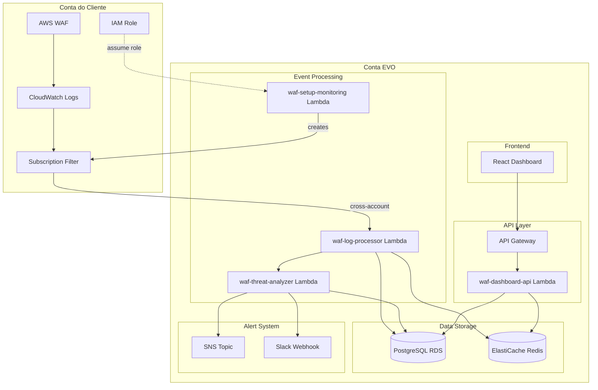

# Design Document: WAF Real-Time Monitoring

## Overview

Sistema de monitoramento em tempo real de logs do AWS WAF para detecção proativa de tentativas de invasão. A arquitetura utiliza serviços AWS nativos integrados com a stack existente (Node.js/TypeScript Lambda, PostgreSQL RDS, React frontend).

### Fluxo de Dados Principal (Arquitetura Híbrida Multi-Tenant)

```
┌─────────────────────────────────────┐     ┌─────────────────────────────────────┐
│      CONTA DO CLIENTE               │     │           CONTA EVO                 │
│                                     │     │                                     │
│  WAF → CloudWatch Logs ─────────────┼─────┼──► Lambda (waf-log-processor)       │
│         (subscription filter)       │     │              ↓                      │
│                                     │     │     PostgreSQL (org_id) / Redis     │
│  IAM Role (já existe para scans)    │     │              ↓                      │
└─────────────────────────────────────┘     │     Lambda (waf-threat-analyzer)    │
                                            │              ↓                      │
                                            │     SNS/Slack (Alerts)              │
                                            │              ↓                      │
                                            │     API Gateway → Dashboard         │
                                            └─────────────────────────────────────┘
```

**Vantagens desta arquitetura:**
- Usa IAM Role que clientes já configuraram para security scans
- Logs permanecem na conta do cliente (compliance)
- Sem custo de Kinesis (CloudWatch Subscription Filter é mais barato)
- Isolamento por organization_id no PostgreSQL

## Architecture

### Componentes AWS

**Na Conta do Cliente:**
1. **WAF Logging**: WAF envia logs para CloudWatch Logs (log group: `aws-waf-logs-*`)
2. **CloudWatch Subscription Filter**: Envia logs cross-account para Lambda da EVO
3. **IAM Role**: Role existente (usada para security scans) com permissão adicional para logs:PutSubscriptionFilter

**Na Conta EVO:**
1. **Lambda Functions** (Node.js 18.x):
   - `waf-log-processor`: Recebe eventos do CloudWatch Subscription Filter
   - `waf-threat-analyzer`: Analisa padrões de ataque
   - `waf-dashboard-api`: API para o dashboard
   - `waf-setup-monitoring`: Configura subscription filter na conta do cliente
2. **PostgreSQL (RDS)**: Persistência de eventos e análises (isolado por organization_id)
3. **ElastiCache Redis**: Cache de agregações e rate limiting
4. **SNS**: Notificações de alertas críticos
5. **API Gateway**: Endpoints REST para o dashboard
6. **Lambda Resource Policy**: Permite invocação cross-account do subscription filter

### Diagrama de Arquitetura



## Components and Interfaces

### 1. WAF Setup Monitoring Lambda (Novo)

**Arquivo**: `backend/src/handlers/security/waf-setup-monitoring.ts`

Este Lambda configura o monitoramento WAF na conta do cliente usando a IAM Role existente.

```typescript
type LogFilterMode = 'block_only' | 'all_requests' | 'hybrid';

interface SetupWafMonitoringRequest {
  accountId: string;      // ID da credencial AWS no banco
  webAclArn: string;      // ARN do WAF Web ACL a monitorar
  enabled: boolean;       // Habilitar ou desabilitar
  filterMode: LogFilterMode; // Modo de filtragem de logs
}

interface SetupResult {
  success: boolean;
  logGroupName: string;
  subscriptionFilterName: string;
  filterMode: LogFilterMode;
  message: string;
}

// Modos de filtragem disponíveis:
// 1. block_only: Apenas BLOCK/COUNT - menor custo, foco em segurança
// 2. all_requests: ALLOW + BLOCK + COUNT - análise completa, maior custo
// 3. hybrid: BLOCK/COUNT detalhado + métricas agregadas de ALLOW via CloudWatch Metrics
```

**Fluxo de Setup:**
1. Assume IAM Role na conta do cliente
2. Verifica se WAF logging está habilitado
3. Se não, habilita logging para CloudWatch Logs
4. Cria Subscription Filter apontando para Lambda da EVO
5. Salva configuração no banco (WafMonitoringConfig)

### 2. WAF Log Processor Lambda

**Arquivo**: `backend/src/handlers/security/waf-log-processor.ts`

Este Lambda recebe eventos do CloudWatch Subscription Filter (cross-account).

```typescript
// Evento do CloudWatch Logs Subscription Filter
interface CloudWatchLogsEvent {
  awslogs: {
    data: string; // Base64 + gzip encoded
  };
}

// Após decode/decompress
interface CloudWatchLogsData {
  messageType: string;
  owner: string;        // AWS Account ID do cliente
  logGroup: string;
  logStream: string;
  subscriptionFilters: string[];
  logEvents: Array<{
    id: string;
    timestamp: number;
    message: string;    // JSON do WAF log
  }>;
}

interface WafLogEvent {
  timestamp: number;
  formatVersion: number;
  webaclId: string;
  terminatingRuleId: string;
  terminatingRuleType: string;
  action: 'ALLOW' | 'BLOCK' | 'COUNT';
  httpSourceName: string;
  httpSourceId: string;
  ruleGroupList: RuleGroupMatch[];
  httpRequest: {
    clientIp: string;
    country: string;
    headers: Header[];
    uri: string;
    args: string;
    httpVersion: string;
    httpMethod: string;
  };
}

interface ProcessedWafEvent {
  id: string;
  organizationId: string;
  awsAccountId: string;
  timestamp: Date;
  action: string;
  sourceIp: string;
  country: string;
  userAgent: string;
  uri: string;
  httpMethod: string;
  ruleMatched: string;
  threatType: string | null;
  severity: string;
  rawLog: object;
}
```

**Responsabilidades**:
- Receber batch de eventos do Kinesis Firehose
- Parsear e validar formato JSON do WAF
- Extrair campos relevantes
- Enriquecer com geolocalização (já vem do WAF)
- Identificar organization_id baseado no webaclId
- Persistir no PostgreSQL
- Enviar para análise de ameaças

### 2. Threat Analyzer Lambda

**Arquivo**: `backend/src/handlers/security/waf-threat-analyzer.ts`

```typescript
interface ThreatAnalysis {
  eventId: string;
  threatType: ThreatType;
  severity: 'critical' | 'high' | 'medium' | 'low';
  confidence: number;
  indicators: string[];
  isCampaign: boolean;
  campaignId?: string;
  recommendedAction: 'monitor' | 'alert' | 'block';
}

type ThreatType = 
  | 'sql_injection'
  | 'xss'
  | 'path_traversal'
  | 'command_injection'
  | 'scanner_detected'
  | 'sensitive_path_access'
  | 'rate_limit_exceeded'
  | 'suspicious_user_agent'
  | 'unknown';
```

**Padrões de Detecção**:

```typescript
const SUSPICIOUS_USER_AGENTS = [
  /sqlmap/i, /nikto/i, /nmap/i, /masscan/i,
  /^$/,  // empty user-agent
  /python-requests/i, /curl/i, /wget/i,
  /gobuster/i, /dirbuster/i, /burp/i
];

const SENSITIVE_PATHS = [
  '/swagger', '/api-docs', '/openapi',
  '/.env', '/.git', '/.svn',
  '/admin', '/wp-admin', '/wp-login',
  '/phpmyadmin', '/adminer',
  '/actuator', '/health', '/metrics',
  '/graphql', '/graphiql',
  '/console', '/debug'
];

const ATTACK_SIGNATURES = {
  sql_injection: [/union\s+select/i, /or\s+1\s*=\s*1/i, /'\s*or\s*'/i],
  xss: [/<script/i, /javascript:/i, /onerror\s*=/i],
  path_traversal: [/\.\.\//g, /%2e%2e/i],
  command_injection: [/;\s*cat\s/i, /\|\s*ls/i, /`.*`/]
};
```

### 3. Dashboard API Lambda

**Arquivo**: `backend/src/handlers/security/waf-dashboard-api.ts`

**Endpoints**:
- `GET /api/functions/waf-events` - Lista eventos com filtros
- `GET /api/functions/waf-metrics` - Métricas agregadas
- `GET /api/functions/waf-top-attackers` - Top IPs atacantes
- `GET /api/functions/waf-attack-types` - Distribuição por tipo
- `GET /api/functions/waf-geo-distribution` - Distribuição geográfica
- `POST /api/functions/waf-block-ip` - Bloquear IP manualmente
- `DELETE /api/functions/waf-unblock-ip` - Desbloquear IP

### 4. Alert Engine

**Integrado no Threat Analyzer**

```typescript
interface AlertConfig {
  organizationId: string;
  channels: {
    sns: boolean;
    slack: boolean;
    inApp: boolean;
  };
  thresholds: {
    criticalAlertDelay: number; // seconds
    campaignThreshold: number;  // events per IP
    campaignWindow: number;     // minutes
  };
}
```

## Data Models

### Novas Tabelas PostgreSQL (Prisma Schema)

```prisma
model WafMonitoringConfig {
  id                    String   @id @default(uuid()) @db.Uuid
  organization_id       String   @db.Uuid
  aws_account_id        String   @db.Uuid  // Referência para aws_credentials
  web_acl_arn           String
  web_acl_name          String
  log_group_name        String
  subscription_filter   String?
  filter_mode           String   @default("block_only") // block_only, all_requests, hybrid
  is_active             Boolean  @default(true)
  last_event_at         DateTime? @db.Timestamptz(6)
  events_today          Int      @default(0)
  blocked_today         Int      @default(0)
  created_at            DateTime @default(now()) @db.Timestamptz(6)
  updated_at            DateTime @updatedAt @db.Timestamptz(6)
  
  @@unique([organization_id, web_acl_arn])
  @@index([organization_id])
  @@index([aws_account_id])
  @@map("waf_monitoring_configs")
}

model WafEvent {
  id                String   @id @default(uuid()) @db.Uuid
  organization_id   String   @db.Uuid
  aws_account_id    String   @db.Uuid
  timestamp         DateTime @db.Timestamptz(6)
  action            String   // ALLOW, BLOCK, COUNT
  source_ip         String
  country           String?
  region            String?
  user_agent        String?
  uri               String
  http_method       String
  rule_matched      String?
  threat_type       String?
  severity          String   @default("low")
  is_campaign       Boolean  @default(false)
  campaign_id       String?  @db.Uuid
  raw_log           Json
  created_at        DateTime @default(now()) @db.Timestamptz(6)
  
  @@index([organization_id])
  @@index([timestamp])
  @@index([source_ip])
  @@index([threat_type])
  @@index([severity])
  @@index([organization_id, timestamp])
  @@map("waf_events")
}

model WafAttackCampaign {
  id                String   @id @default(uuid()) @db.Uuid
  organization_id   String   @db.Uuid
  source_ip         String
  start_time        DateTime @db.Timestamptz(6)
  end_time          DateTime? @db.Timestamptz(6)
  event_count       Int      @default(1)
  attack_types      String[]
  severity          String
  status            String   @default("active") // active, resolved, blocked
  auto_blocked      Boolean  @default(false)
  blocked_at        DateTime? @db.Timestamptz(6)
  unblocked_at      DateTime? @db.Timestamptz(6)
  created_at        DateTime @default(now()) @db.Timestamptz(6)
  
  @@index([organization_id])
  @@index([source_ip])
  @@index([status])
  @@map("waf_attack_campaigns")
}

model WafBlockedIp {
  id                String   @id @default(uuid()) @db.Uuid
  organization_id   String   @db.Uuid
  ip_address        String
  reason            String
  blocked_by        String   // auto, manual
  blocked_at        DateTime @default(now()) @db.Timestamptz(6)
  expires_at        DateTime @db.Timestamptz(6)
  waf_ip_set_id     String?  // AWS WAF IP Set ID
  is_active         Boolean  @default(true)
  
  @@unique([organization_id, ip_address])
  @@index([organization_id])
  @@index([expires_at])
  @@map("waf_blocked_ips")
}

model WafAlertConfig {
  id                    String   @id @default(uuid()) @db.Uuid
  organization_id       String   @unique @db.Uuid
  sns_enabled           Boolean  @default(true)
  sns_topic_arn         String?
  slack_enabled         Boolean  @default(false)
  slack_webhook_url     String?
  in_app_enabled        Boolean  @default(true)
  campaign_threshold    Int      @default(10)
  campaign_window_mins  Int      @default(5)
  auto_block_enabled    Boolean  @default(false)
  auto_block_threshold  Int      @default(50)
  block_duration_hours  Int      @default(24)
  created_at            DateTime @default(now()) @db.Timestamptz(6)
  updated_at            DateTime @updatedAt @db.Timestamptz(6)
  
  @@map("waf_alert_configs")
}
```

### Redis Cache Schema

```typescript
// Agregações em tempo real (TTL: 5 minutos)
`waf:metrics:${orgId}:${hour}` -> {
  totalRequests: number,
  blockedRequests: number,
  allowedRequests: number,
  byAttackType: Record<string, number>,
  byCountry: Record<string, number>
}

// Rate limiting por IP (TTL: 5 minutos)
`waf:rate:${orgId}:${ip}` -> number (count)

// Top attackers (TTL: 1 hora)
`waf:top-attackers:${orgId}` -> Array<{ip: string, count: number}>

// Campaign tracking (TTL: 30 minutos)
`waf:campaign:${orgId}:${ip}` -> {
  eventCount: number,
  firstSeen: timestamp,
  lastSeen: timestamp,
  attackTypes: string[]
}
```

## Correctness Properties

*A property is a characteristic or behavior that should hold true across all valid executions of a system—essentially, a formal statement about what the system should do. Properties serve as the bridge between human-readable specifications and machine-verifiable correctness guarantees.*

### Property 1: WAF Log Parsing Round-Trip

*For any* valid WAF log event JSON, parsing it into a ProcessedWafEvent and then serializing back to JSON should preserve all essential fields (timestamp, action, sourceIp, uri, httpMethod).

**Validates: Requirements 1.2, 1.3**

### Property 2: Multi-Tenant Isolation

*For any* WAF event processed, the resulting database record must have a valid organization_id that matches the AWS account's organization, and queries for one organization must never return events from another organization.

**Validates: Requirements 1.5, 4.2**

### Property 3: Threat Classification Consistency

*For any* blocked WAF request containing known attack signatures (SQL injection patterns, XSS patterns, etc.), the Threat_Detector must classify it with the correct threat type and a severity of at least "medium".

**Validates: Requirements 2.1, 2.6**

### Property 4: Suspicious Pattern Detection

*For any* request with a user-agent matching known scanner tools (sqlmap, nikto, nmap) OR targeting sensitive paths (/swagger, /.env, /.git), the Threat_Detector must flag it as suspicious with appropriate threat type.

**Validates: Requirements 2.2, 2.3**

### Property 5: Campaign Detection Threshold

*For any* IP address that generates more than N blocked requests within a 5-minute window (where N is the configured threshold), the system must identify and group these events as an attack campaign.

**Validates: Requirements 2.4, 3.4, 3.5**

### Property 6: Alert Structure Completeness

*For any* alert generated by the Alert_Engine, it must contain all required fields: threat type, source IP, target URI, timestamp, severity, and recommended action.

**Validates: Requirements 3.3**

### Property 7: Event Persistence with Geolocation

*For any* WAF event with a valid source IP, after persistence the stored record must include geolocation data (at minimum: country code) derived from the IP address.

**Validates: Requirements 4.1, 4.3**

### Property 8: Query Filter Correctness

*For any* filter combination (date range, severity, attack type, source IP), the Dashboard_Service query results must only include events that match ALL specified filter criteria.

**Validates: Requirements 4.5**

### Property 9: Auto-Block Threshold Enforcement

*For any* IP address that exceeds the configured auto-block threshold of blocked requests, if auto-blocking is enabled, the IP must be added to the block list within the processing cycle.

**Validates: Requirements 6.1, 6.4**

## Error Handling

### Log Processing Errors

```typescript
// Estratégia: Log and Continue
try {
  const event = parseWafLog(rawLog);
  await processEvent(event);
} catch (error) {
  logger.error('Failed to process WAF log', error, { rawLog });
  // Não interrompe o batch - continua processando outros eventos
  metrics.increment('waf.parse_errors');
}
```

### AWS API Errors

```typescript
// Estratégia: Retry with Exponential Backoff
const wafClient = new WAFV2Client({ 
  region,
  retryStrategy: new StandardRetryStrategy(3) // 3 retries
});
```

### Database Errors

```typescript
// Estratégia: Batch Insert with Conflict Resolution
await prisma.wafEvent.createMany({
  data: events,
  skipDuplicates: true // Ignora duplicatas
});
```

### Alert Delivery Errors

```typescript
// Estratégia: Multi-channel Fallback
try {
  await sendSlackAlert(alert);
} catch {
  logger.warn('Slack alert failed, falling back to SNS');
  await sendSnsAlert(alert);
}
```

## Testing Strategy

### Unit Tests

- Parser de logs WAF com diferentes formatos
- Classificador de ameaças com assinaturas conhecidas
- Detector de user-agents suspeitos
- Lógica de agregação de campanhas
- Filtros de query do dashboard

### Property-Based Tests (fast-check)

Usar a biblioteca `fast-check` para TypeScript:

```typescript
import fc from 'fast-check';

// Property 1: Round-trip parsing
fc.assert(
  fc.property(wafLogArbitrary, (log) => {
    const parsed = parseWafLog(log);
    const serialized = serializeWafEvent(parsed);
    return parsed.sourceIp === log.httpRequest.clientIp &&
           parsed.uri === log.httpRequest.uri;
  })
);

// Property 4: Suspicious pattern detection
fc.assert(
  fc.property(suspiciousUserAgentArbitrary, (userAgent) => {
    const result = detectSuspiciousUserAgent(userAgent);
    return result.isSuspicious === true;
  })
);
```

### Integration Tests

- Fluxo completo: Kinesis → Lambda → PostgreSQL
- Alertas: Detecção → SNS/Slack
- Dashboard API: Queries com filtros
- Auto-block: Threshold → WAF IP Set

### Configuração de Testes

- Mínimo 100 iterações por property test
- Tag format: **Feature: waf-realtime-monitoring, Property N: description**

## Infrastructure Setup (CloudFormation)

### Lambda Resource Policy (Permite Cross-Account)

```yaml
# Permite que CloudWatch Logs de qualquer conta cliente invoque a Lambda
WafLogProcessorResourcePolicy:
  Type: AWS::Lambda::Permission
  Properties:
    FunctionName: !Ref WafLogProcessorFunction
    Action: lambda:InvokeFunction
    Principal: logs.amazonaws.com
    # SourceArn não especificado para permitir qualquer conta
    # A validação é feita no código via organization_id

WafLogProcessorFunction:
  Type: AWS::Lambda::Function
  Properties:
    FunctionName: !Sub '${ProjectName}-waf-log-processor'
    Runtime: nodejs18.x
    Handler: waf-log-processor.handler
    # ... outras configs
```

### Setup na Conta do Cliente (via Lambda)

O Lambda `waf-setup-monitoring` executa na conta do cliente:

```typescript
// 1. Habilitar WAF Logging (se não estiver)
await wafv2.putLoggingConfiguration({
  LoggingConfiguration: {
    ResourceArn: webAclArn,
    LogDestinationConfigs: [
      `arn:aws:logs:${region}:${clientAccountId}:log-group:aws-waf-logs-${webAclName}`
    ]
  }
});

// 2. Criar Subscription Filter cross-account
await logs.putSubscriptionFilter({
  logGroupName: `aws-waf-logs-${webAclName}`,
  filterName: 'evo-waf-monitoring',
  filterPattern: '', // Todos os logs
  destinationArn: EVO_WAF_PROCESSOR_LAMBDA_ARN,
  // Cross-account requer que a Lambda tenha resource policy
});
```

### SNS Topic para Alertas

```yaml
WafAlertsTopic:
  Type: AWS::SNS::Topic
  Properties:
    TopicName: !Sub '${ProjectName}-waf-alerts'
    DisplayName: 'WAF Security Alerts'

WafAlertsSubscription:
  Type: AWS::SNS::Subscription
  Properties:
    TopicArn: !Ref WafAlertsTopic
    Protocol: email
    Endpoint: !Ref SecurityTeamEmail
```

### Permissões IAM Adicionais para Clientes

Adicionar ao template de IAM Role que clientes criam:

```json
{
  "Effect": "Allow",
  "Action": [
    "wafv2:GetLoggingConfiguration",
    "wafv2:PutLoggingConfiguration",
    "wafv2:DeleteLoggingConfiguration",
    "logs:CreateLogGroup",
    "logs:PutSubscriptionFilter",
    "logs:DeleteSubscriptionFilter",
    "logs:DescribeSubscriptionFilters"
  ],
  "Resource": "*"
}
```

## Frontend Components

### Nova Página: WAF Monitoring Dashboard

**Arquivo**: `src/pages/WafMonitoring.tsx`

Componentes:
- `WafMetricsCards`: Cards com métricas em tempo real
- `WafAttackMap`: Mapa geográfico de ataques (usando react-simple-maps)
- `WafEventsFeed`: Feed ao vivo de eventos bloqueados
- `WafAttackTypesChart`: Gráfico de pizza por tipo de ataque
- `WafTimeSeriesChart`: Gráfico de linha temporal
- `WafTopAttackers`: Tabela de top IPs atacantes
- `WafBlockedIpsList`: Lista de IPs bloqueados com ações

### Integração com Menu Existente

Adicionar em `src/components/AppSidebar.tsx`:
```typescript
{ titleKey: "sidebar.wafMonitoring", value: "waf-monitoring" }
```

Adicionar traduções em `src/i18n/locales/*.json`:
```json
"wafMonitoring": "WAF Monitoring"
```
