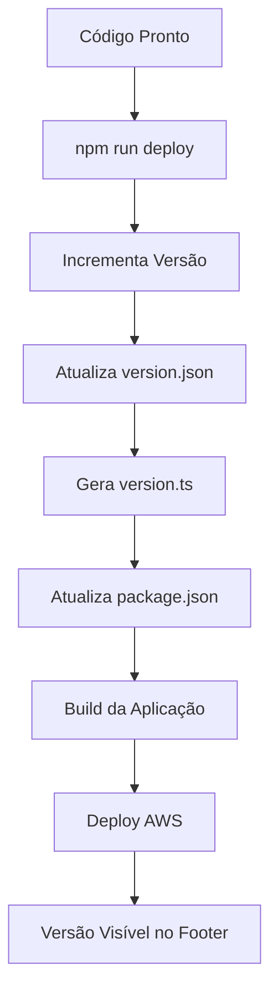

# 🔄 Sistema de Versionamento Automático

## 📋 Visão Geral

O EVO UDS Platform possui um sistema de versionamento automático que incrementa a versão a cada deploy, garantindo rastreabilidade completa das releases.

## 🏗️ Arquitetura do Sistema

### Componentes Principais

1. **`src/lib/version.ts`** - Configuração central de versão (auto-gerado)
2. **`scripts/increment-version.ts`** - Script de incremento automático
3. **`version.json`** - Arquivo de controle de versão
4. **`src/components/ui/footer.tsx`** - Componente de footer com versioning
5. **`package.json`** - Versão do npm package

### Estrutura de Versão

```
v{major}.{minor}.{patch}-{environment}.{build}
```

- **Major**: Mudanças breaking (incremento manual)
- **Minor**: Novas features (incremento manual)  
- **Patch**: Bug fixes e deploys (incremento automático)
- **Environment**: development, staging, production
- **Build**: Timestamp único de 6 dígitos

## 🚀 Como Funciona

### Incremento Automático

O sistema incrementa automaticamente a versão **patch** a cada deploy:

```bash
# Deploy normal (incrementa patch)
npm run deploy

# Deploy staging (incrementa patch)
npm run deploy:staging

# Deploy produção (incrementa patch)
npm run deploy:prod
```

### Incremento Manual

Para mudanças maiores, use os comandos específicos:

```bash
# Incrementa minor version (nova feature)
npm run version:increment:minor

# Incrementa major version (breaking change)
npm run version:increment:major

# Incrementa apenas patch (padrão)
npm run version:increment
```

## 📊 Informações Rastreadas

### Arquivo `version.json`
```json
{
  "major": 2,
  "minor": 1,
  "patch": 15,
  "deployCount": 15,
  "lastDeploy": "2025-12-12T15:31:33.036Z"
}
```

### Dados Disponíveis no Frontend
- Versão atual (v2.1.15)
- Versão completa (v2.1.15-production.493036)
- Número do deploy (15)
- Data/hora do último deploy
- Ambiente atual
- Build number único

## 🎨 Interface do Usuário

### Footer Minimalista
Todas as páginas internas mostram versão no footer:
```
EVO UDS Platform    v2.1.15
```

### Footer Detalhado
A página principal mostra informações completas:
- Versão atual com badge
- Ambiente (production/staging/development)
- Data do último deploy
- Modal com detalhes técnicos

### Modal de Informações
Clique no ícone (ℹ️) para ver:
- Versão completa
- Número do build
- Contador de deploys
- Data/hora exata do deploy
- Ambiente de execução

## 🔧 Scripts Disponíveis

### Versionamento
```bash
npm run version:increment        # Incrementa patch
npm run version:increment:minor  # Incrementa minor
npm run version:increment:major  # Incrementa major
```

### Deploy com Versionamento
```bash
npm run deploy          # Auto-incrementa + deploy
npm run deploy:staging  # Auto-incrementa + deploy staging
npm run deploy:prod     # Auto-incrementa + deploy produção
```

## 📁 Arquivos Gerados

### `version.json` (Controle)
Arquivo de controle com contadores e timestamps.

### `src/lib/version.ts` (Auto-gerado)
```typescript
export const APP_VERSION = {
  major: 2,
  minor: 1,
  patch: 15,
  deployCount: 15,
  build: "493036",
  environment: import.meta.env.MODE || 'development',
  deployDate: "2025-12-12T15:31:33.036Z",
} as const;
```

## 🎯 Benefícios

### Para Desenvolvedores
- ✅ Versionamento automático sem intervenção manual
- ✅ Rastreabilidade completa de deploys
- ✅ Identificação rápida de versões em produção
- ✅ Histórico de deploys com timestamps

### Para Usuários
- ✅ Visibilidade da versão atual no sistema
- ✅ Informações técnicas acessíveis
- ✅ Confirmação de atualizações

### Para Suporte
- ✅ Identificação rápida de versões
- ✅ Correlação entre bugs e deploys
- ✅ Histórico completo de releases

## 🔄 Fluxo de Deploy



## 📝 Exemplo de Uso

### Cenário: Deploy de Bug Fix
```bash
# 1. Código corrigido
git commit -m "fix: corrige bug no cálculo de custos"

# 2. Deploy automático (incrementa de v2.1.14 para v2.1.15)
npm run deploy:prod

# 3. Versão v2.1.15 aparece no footer
# 4. Deploy count incrementa para 15
# 5. Timestamp atualizado
```

### Cenário: Nova Feature
```bash
# 1. Feature implementada
git commit -m "feat: adiciona dashboard de compliance"

# 2. Incremento manual de minor version
npm run version:increment:minor  # v2.1.15 -> v2.2.0

# 3. Deploy
npm run deploy:prod

# 4. Versão v2.2.0 aparece no sistema
```

## 🛠️ Manutenção

### Resetar Contador (se necessário)
Edite manualmente o `version.json`:
```json
{
  "major": 2,
  "minor": 2,
  "patch": 0,
  "deployCount": 1,
  "lastDeploy": "2025-12-12T15:31:33.036Z"
}
```

### Backup de Versões
O arquivo `version.json` deve ser commitado no git para manter histórico.

## 🎉 Resultado Final

O sistema agora possui:
- ✅ Versionamento automático a cada deploy
- ✅ Footer com versão em todas as páginas
- ✅ Modal com informações técnicas detalhadas
- ✅ Rastreabilidade completa de releases
- ✅ Interface elegante com glass morphism
- ✅ Integração total com pipeline de deploy

**Versão atual**: v2.1.1 (Deploy #1)
**Última atualização**: 12/12/2025 15:31:33